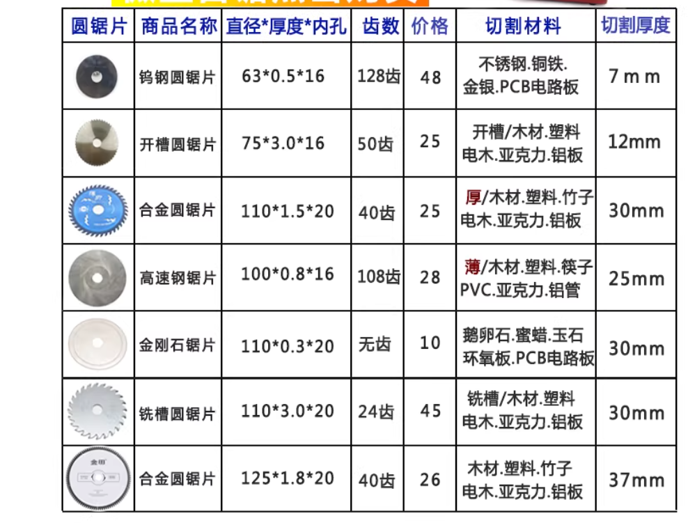
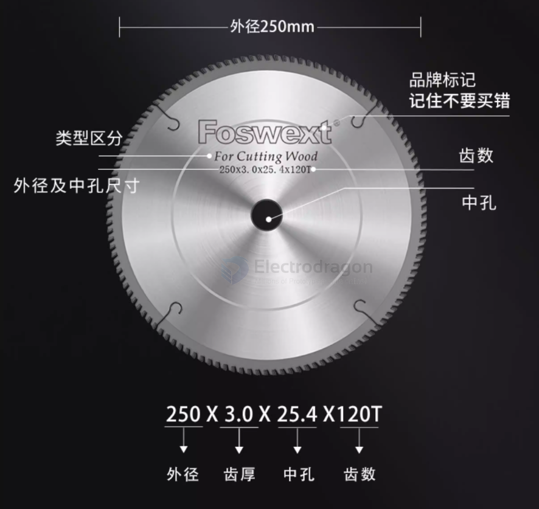

# saw-blade-dat

- [[saw-blade]] - [[saw]]

高速钢锯片只能安装在机床/台锯上使用转速要求3000-4500prm，而不能安装在角磨机/切割机上使用，因角磨机转速太高工作不稳定操作不安全容易断锯片，请勿强行安装。

| 序号 | 锯片 / 切割方式名称                 | 适合切 2–6 mm 塑料？  | 主要适合目标（推荐用途）                | 关键备注（使用建议）                                                                      |
| ---- | ----------------------------------- | --------------------- | --------------------------------------- | ----------------------------------------------------------------------------------------- |
| 1    | 平齿高速钢锯片 (HSS flat-tooth)     | ✅ 非常适合            | 亚克力（PMMA）、ABS、PVC、PC（薄/中厚） | 最优选。细齿或中细齿，切割平滑，热量低。配合电动线锯或台锯效果最好。                      |
| 2    | 切木头的锯条 / 木工细齿锯条         | ✅ 适合                | 木材、塑料（一般细齿木工条可切塑料）    | 选择**24–32 TPI**（或标为 fine）；摆动关或低；中低速。                                    |
| 3    | 切金属的锯条（HSS / Bi-metal）      | ⚠️ 可用（次优）        | 钢材、薄金属；可勉强切塑料但表面较粗    | 刚性大、易发热；塑料可能有轻微融边或毛刺，后打磨。                                        |
| 4    | 分赤合金锯片（双金属 / 合金）       | ⚠️ 可用（一般）        | 耐磨场合、金属切割                      | 耐用但对塑料不是理想切削面，容易产生热与粗糙边。适合非最终表面要求的情况。                |
| 5    | 树脂切割片 (Resin / bakelite)       | ❌ 不推荐              | 早期通用片 / 某些薄材                   | 属“磨削”类，切塑料会拉丝、融边、毛刺大。仅应急或雕刻用。                                  |
| 6    | 砂轮切割片 (Abrasive cut-off wheel) | ❌ 不推荐              | 金属切断、钢筋、粗切                    | 高摩擦→高热，塑料会熔化/拉丝/冒烟。危险且切口差。                                         |
| 7    | 金刚石锯片 (Diamond blade)          | ❌/⚠️ 不推荐            | 石材、瓷砖、硬脆材料；干切湿切石材      | 对软塑料是磨而非锯，易融边、拉丝。仅极少数特殊场合可勉强用并强制冷却，但通常不合适。      |
| 8    | 瓷砖切割片 / 石材片                 | ❌ 不推荐              | 瓷砖、陶瓷、石材                        | 与金刚石片类似，不适合塑料。                                                              |
| 9    | 往复锯用粗齿（建筑用）锯条          | ❌ 不推荐              | 粗拆、管道、木材、建筑拆除              | 行程长、齿粗，塑料容易崩边、跑偏，表面粗糙。只作应急粗切。                                |
| 10   | 电烙铁（烧切）                      | ❌ 不推荐（应急/雕刻） | 塑料局部雕刻、打孔、微调                | 会释放气味/有毒烟（PVC 尤其危险）；切口熔融、毛刺多。仅在良好通风且不要求美观时用于微调。 |

## target sheet plastic 

📌 最佳切塑料实践（回顾）

- 平齿高速钢锯片（HSS）
- 细齿木工/塑料专用锯片（24~32 TPI）

- ✔ 用 电动线锯 + 细齿 HSS 锯片
- ✔ 关闭摆动，低速切割
- ✔ 夹紧材料 + 导向
- ✔ 事后砂纸打磨（400→800）

## specs example 

12 inch

## specs 2 

- [[grinder-angle-dat]]

## 是否适合切割 4 mm ABS 板材？
**结论：✅ 适合，而且非常合适**

规格：**高速钢锯片 110 × 0.8 × 20 孔 × 180 齿**  
用途：**切割 4 mm ABS 板材**

---

## 为什么这片锯片适合 ABS

### 1️⃣ 齿数高（180T）
- 单齿切削量小
- 切口平整、毛刺少
- 不容易咬料或崩边
- 对 ABS 这种易软化塑料非常友好

---

### 2️⃣ 锯片薄（0.8 mm）
- 切削阻力小
- 发热低
- 适合 2–6 mm 塑料薄板

⚠️ 注意：  
锯片薄 → **必须夹紧工件**，避免振动导致跑偏

---

### 3️⃣ 高速钢（HSS）
- 属于“锋利切削”，不是磨削
- 比砂轮片、金刚石片、树脂切割片**更适合塑料**
- 不会撕裂 ABS 边缘

---

## 适合搭配的设备

| 设备 | 是否推荐 | 说明 |
|---|---|---|
| 小型台锯 / 精密切割机 | ✅ 强烈推荐 | 最稳、最直 |
| 迷你台锯 / 模型锯 | ✅ 推荐 | 适合薄板 |
| 电动线锯 | ⚠️ 勉强 | 锯片形式不同，不是最佳 |
| 角磨机 | ❌ 不推荐 | 转速过高，危险且易融边 |

---

## 推荐切割参数（实用）

### 🔧 转速
- **中低速最佳**
- 若设备可调速：  
  **≈ 3000–6000 RPM（110 mm 锯片）**

⚠️ 转速过高 → ABS 会融边、粘齿

---

### 🔧 进给方式
- 匀速、连续推进
- 不要停在同一点
- 让锯片自己吃料，不要硬推

---

### 🔧 固定与导向
- 工件必须 **完全夹紧**
- 使用靠山 / 导轨
- 底下垫一块废板可明显提升稳定性

---

## 常见问题与解决方法

| 问题 | 原因 | 对策 |
|---|---|---|
| 边缘轻微融化 | 转速偏高 | 降低转速或稍加快进给 |
| 锯屑粘在锯齿上 | 热量积累 | 吹风散热 / 暂停冷却 |
| 切割抖动 | 锯片薄 + 固定不足 | 增加夹具、垫板 |

---

## 一句话总结

**110 × 0.8 × 180T 的高速钢锯片，非常适合切割 4 mm ABS 板材**  
前提是：  
👉 使用台锯类设备  
👉 中低转速  
👉 工件夹紧并有导向

## ref 

- [[saw-dat]]