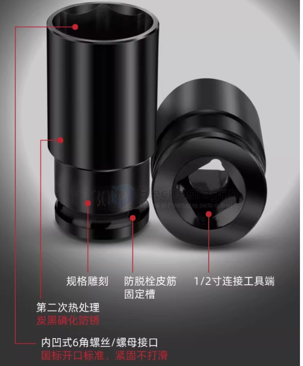

# tools-power-socket-dat

## hex 

- [[hex-key-dat]] - [[tools-power-socket-dat]]

50MM*H1.5 - 50MM*H2 - 50MM*H2.5 - 50MM*H3 - 50MM*H4 - 50MM*H5 - 50MM*H6 - 50MM*H8 - 50MM*H10 - 50MM*H12 - 65MM*H1.5 - 65MM*H2 - 65MM*H2.5 - 65MM*H3 - 65MM*H4 - 65MM*H5 - 65MM*H6 - 65MM*H8 - 65MM*H10 - 65MM*H12 - 100MM*H2.5 - 100MM*H3 - 100MM*H4 - 100MM*H5 - 100MM*H6 - 100MM*H8 - 100MM*H10 - 100MM*H12 - 150MM*H3 - 150MM*H4 - 150MM*H5 - 150MM*H6 - 150MM*H8 - 150MM*H10

