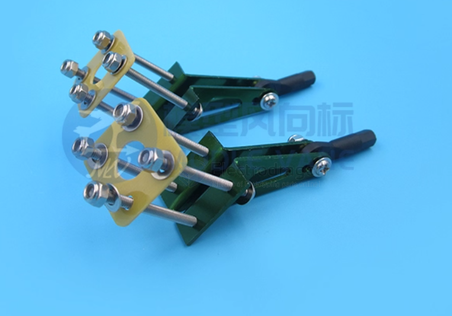

# arm-level-dat

- In RC models, robotics, or mechanical assemblies, a **摇臂** can refer to any **pivoting link** that transmits motion.  
- Key characteristics: pivot point, arm length, and connection points for input/output motion.  

