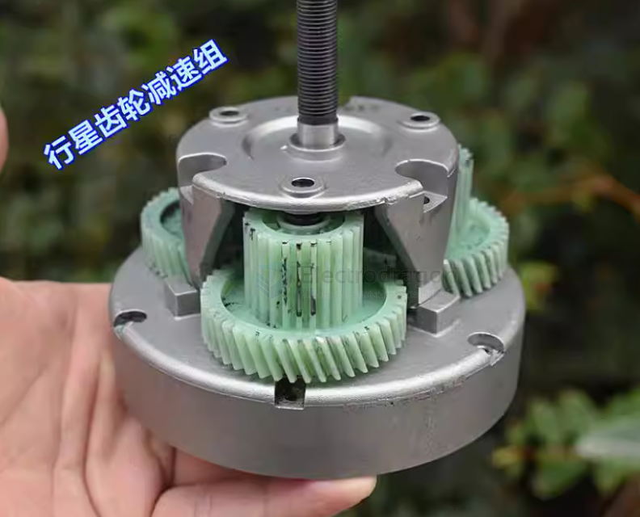
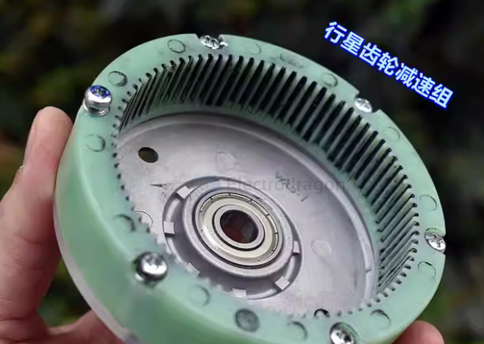
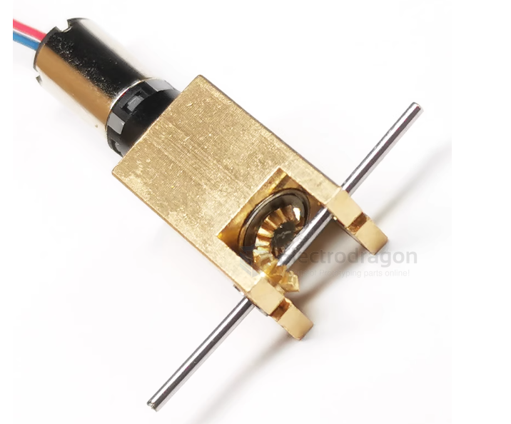
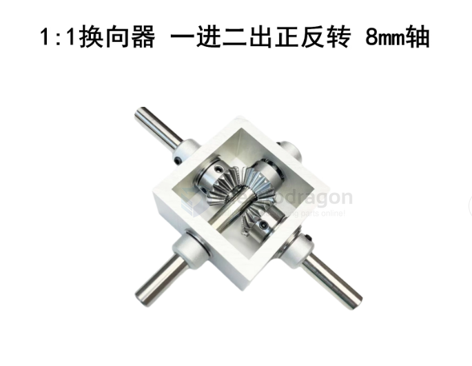
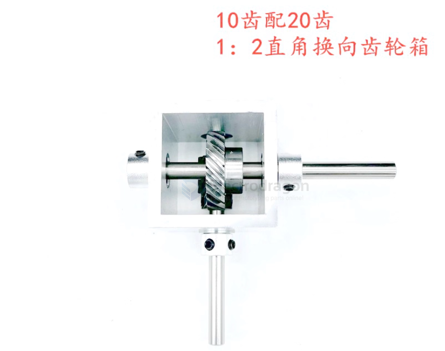
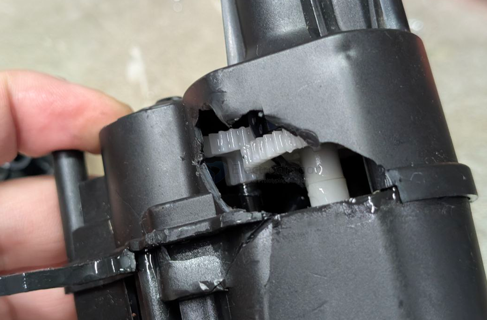
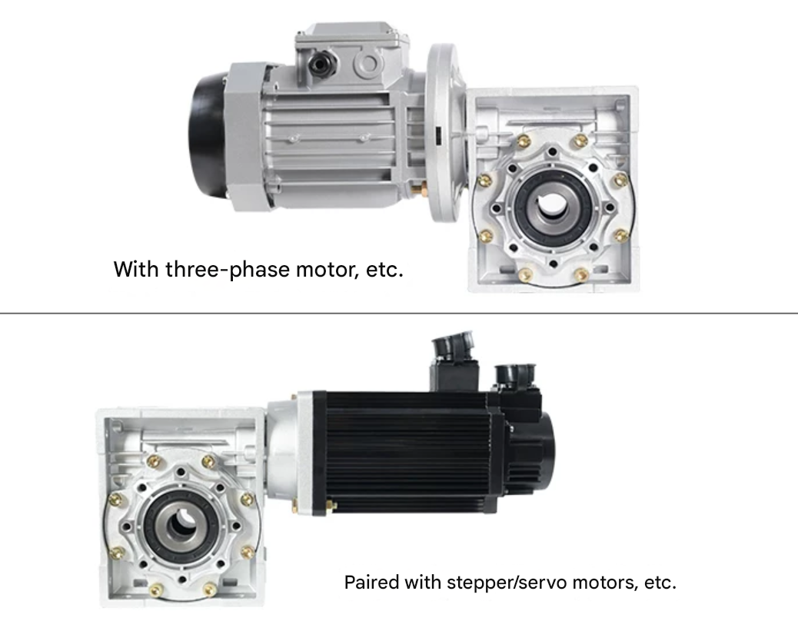

# gearbox-dat

- [[gear-dat]] - [[gear-worm-dat]] - [[gearbox-dat]]

- [[gear-dat]] - [[gearbox-dat]]

## type of gearbox 

### Planetary Gearbox: 

These are highly efficient and keep the output shaft in line with the motor shaft. They are great for high-torque applications like robotics or electric vehicles.

### Worm Gearbox: 

These provide massive reduction in a small space (e.g., 60:1) and have a "self-locking" feature, meaning the output shaft won't turn unless the motor is spinning.

## common gearbox 

small size 

ratio 1:1 dimension 50x50x25mm 

- [[gearbox-differential-dat]]

## apps

RC clawer gearbox 

work with [[motor-stepper-dat]] - [[motor-brushless-dat]] - [[motor-servo-dat]]

## ref 

- [[gearbox]] - [[mechanism]]