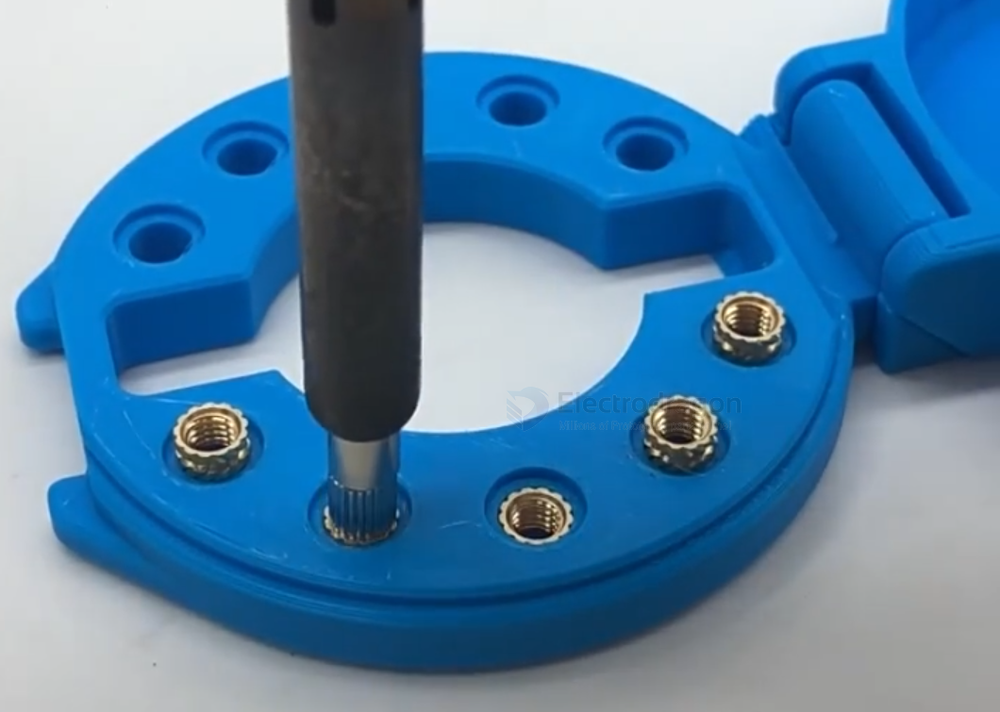
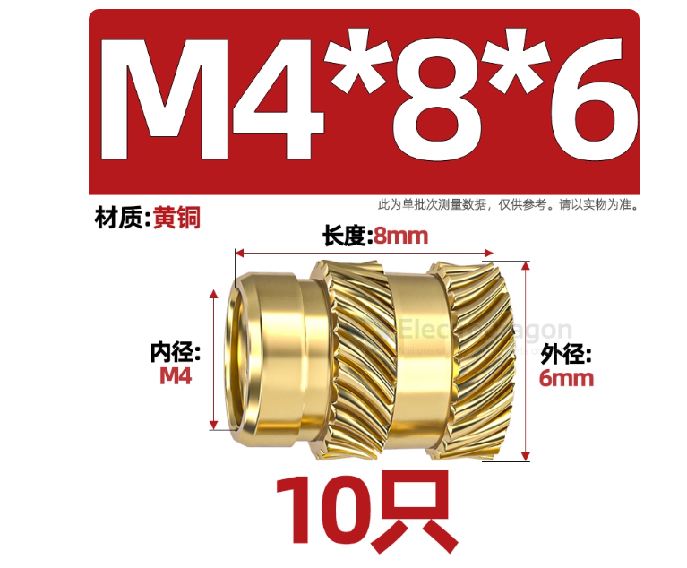

# Heat-Set-Insert-dat

- [[nut-dat]]

## specs 

M1*1.5*2【50个】

M1*1.8*2【50个】

M1*2*2【50个】

M1*2.5*2【50个】

M1.2*1.5*2【50个】

M1.2*1.8*2【50个】

M1.2*2*2【50个】

M1.2*2.5*2【50个】

M1.2*3*2【50个】

M1.4*1.5*2.3【50个】

M1.4*2*2.3【50个】

M1.4*2.5*2.3【50个】

M1.4*3*2.3【50个】

M1.4*1.8*2.3【50个】

M1.4*4*2.3【50个】

M1.4*2.3*2.3【50个】

M1.4*5*2.3【50个】

M1.4*6*2.3【50个】

M1.6*2*2.5【50个】

M1.6*2.5*2.5【50个】

M1.6*3*2.5【50个】

M1.6*4*2.5【50个】

M1.6*5*2.5【50个】

M1.6*6*2.5【50个】

M1.7*2*2.5【50个】

M1.7*2.5*2.5【50个】

M1.7*3*2.5【50个】

M1.7*4*2.5【50个】

M1.7*5*2.5【50个】

M1.7*6*2.5【50个】

M2*2*3【50个】

M2*2.5*3【50个】

M2*3*3【50个】

M2*3.5*3【50个】

M2*4*3【50个】

M2*4.5*3【50个】

M2*5*3【50个】

M2*6*3【50个】

M2*2*3.2【50个】

M2*2.5*3.2【50个】

M2*3*3.2【50个】

M2*3.6*3.2【50个】

M2*4*3.2【50个】

M2*5*3.2【50个】

M2*6*3.2【20个】

M2*8*3.2【50个】

M2*3.5*3.2【50个】

M2*10*3.2【20个】

M2*2*3.5【50个】

M2*2.5*3.5【50个】

M2*3*3.5【50个】

M2*3.5*3.5【50个】

M2*4*3.5【50个】

M2*4.5*3.5【50个】

M2*5*3.5【50个】

M2*5.5*3.5【20个】

M2*6*3.5【20个】

M2*7*3.5【20个】

M2*8*3.5【20个】

M2*9*3.5【20个】

M2*10*3.5【10个】

M2*2*4【50个】

M2*3*4【50个】

M2*4*4【50个】

M2*5*4【20个】

M2*6*4【20个】

M2*8*4【20个】

M2.5*2*3.5【50个】

M2.5*2.5*3.5【50个】

M2.5*3*3.5【50个】

M2.5*3.5*3.5【50个】

M2.5*4*3.5【50个】

M2.5*4.5*3.5【50个】

M2.5*5*3.5【50个】

M2.5*5.5*3.5【50个】

M2.5*6*3.5【20个】

M2.5*8*3.5【20个】

M2.5*7*3.5【20个】

M2.5*10*3.5【20个】

M2.5*3*4【50个】

M2.5*3.5*4【50个】

M2.5*4*4【50个】

M2.5*5*4【20个】

M2.5*6*4【20个】

M2.5*8*4【20个】

M2.5*10*4【20个】

M2.5*4*4.5【20个】

M2.5*5*4.5【20个】

M2.5*6*4.5【20个】

M2.5*8*4.5【20个】

M3*2.5*4【50个】

M3*3*4【50个】

M3*3.5*4【50个】

M3*4*4【50个】

M3*4.5*4【50个】

M3*5*4【50个】

M3*5.5*4【20个】

M3*6*4【20个】

M3*7*4【20个】

M3*8*4【20个】

M3*9*4【20个】

M3*10*4【20个】

M3*3*4.2【50个】

M3*4*4.2【50个】

M3*5*4.2【50个】

M3*6*4.2【20个】

M3*7*4.2【20个】

M3*8*4.2【20个】

M3*9*4.2【20个】

M3*10*4.2【20个】

M3*3*4.5【50个】

M3*3.5*4.5【50个】

M3*3.6*4.5【50个】

M3*4*4.5【50个】

M3*4.5*4.5【20个】

M3*5*4.5【20个】

M3*6*4.5【20个】

M3*7*4.5【20个】

M3*8*4.5【20个】

M3*9*4.5【10个】

M3*10*4.5【10个】

M3*12*4.5【10个】

M3*3*5【20个】

M3*3.5*5【20个】

M3*4*5【20个】

M3*4.5*5【20个】

M3*5*5【20个】

M3*5.5*5【20个】

M3*6*5【20个】

M3*6.5*5【20个】

M3*7*5【20个】

M3*7.5*5【20个】

M3*8*5【20个】

M3*9*5【10个】

M3*10*5【10个】

M3*12*5【10个】

M3*3*4.6【20个】

M3*3.5*4.6【20个】

M3*4*4.6【20个】

M3*4.5*4.6【20个】

M3*5*4.6【20个】

M3*5.5*4.6【20个】

M3*5.7*4.6【20个】

M3*6*4.6【20个】

M3*7*4.6【20个】

M3*8*4.6【20个】

M3*9*4.6【20个】

M3*10*4.6【10个】

M3*4*5.5【20个】

M3*5*5.5【20个】

M3*6*5.5【20个】

M3*8*5.5【10个】

M4*3*5【20个】

M4*4*5【20个】

M4*5*5【20个】

M4*6*5【20个】

M4*7*5【20个】

M4*8*5【20个】

M4*9*5【10个】

M4*10*5【10个】

M4*12*5【10个】

M4*4*5.5【20个】

M4*5*5.5【20个】

M4*6*5.5【20个】

M4*7*5.5【10个】

M4*8*5.5【10个】

M4*10*5.5【10个】

M4*3*6【20个】

M4*4*6【20个】

M4*5*6【20个】

M4*5.5*6【20个】

M4*6*6【20个】

M4*6.5*6【10个】

M4*7*6【10个】

M4*7.5*6【10个】

M4*8*6【10个】

M4*9*6【10个】

M4*10*6【10个】

M4*12*6【10个】

M4*15*6【5个】

M4*8.1*6.3【10个】

M4*5*6.5【10个】

M4*6*6.5【10个】

M4*7*6.5【10个】

M4*8*6.5【10个】

M4*10*6.5【10个】

M4*4*7【10个】

M4*5*7【10个】

M4*6*7【10个】

M4*7*7【10个】

M4*8*7【10个】

M4*10*7【5个】

M4*12*7【5个】

M5*4*7【10个】

M5*5*7【10个】

M5*6*7【10个】

M5*6.5*7【10个】

M5*7*7【10个】

M5*7.5*7【10个】

M5*8*7【10个】

M5*8.5*7【10个】

M5*9*7【10个】

M5*9.5*7【10个】

M5*10*7【10个】

M5*12*7【5个】

M5*15*7【5个】

M5*5*7.5【10个】

M5*6*7.5【10个】

M5*7*7.5【10个】

M5*8*7.5【10个】

M5*9*7.5【10个】

M5*10*7.5【10个】

M5*12*7.5【10个】

M5*5*8【10个】

M5*6*8【10个】

M5*7*8【5个】

M5*8*8【5个】

M5*9*8【5个】

M5*10*8【5个】

M5*12*8【5个】

M6*4*8【10个】

M6*5*8【10个】

M6*6*8【10个】

M6*7*8【10个】

M6*8*8【10个】

M6*9*8【5个】

M6*10*8【5个】

M6*12*8【5个】

M6*15*8【5个】

M6*5*9【10个】

M6*6*9【10个】

M6*7*9【5个】

M6*8*9【5个】

M6*9*9【5个】

M6*9.5*9【5个】

M6*9.5*9.5【5个】

M6*10*9【5个】

M6*12*9【5个】

M8*5*10【5个】

M8*6*10【5个】

M8*8*10【5个】

M8*10*10【5个】

M8*12*10【5个】

M8*15*10【2个】

M10*8*12【5个】

M10*10*12【5个】

M10*12*12【2个】

M10*15*12【2个】

2#-56*1/8*3.5【50个】

2#-56*5/32*3.5【50个】

2#-56*3/16*3.5【50个】

2#-56*7/32*3.5【20个】

2#-56*1/4*3.5【20个】

4#-40*1/8*4.6【20个】

4#-40*5/32*4.6【20个】

4#-40*3/16*4.6【20个】

4#-40*7/32*4.6【20个】

4#-40*1/4*4.6【20个】

4#-40*9/32*4.6【20个】

4#-40*5/16*4.6【20个】

6#-32*5/32*5.4【20个】

6#-32*3/16*5.4【20个】

6#-32*7/32*5.4【20个】

6#-32*1/4*5.4【20个】

6#-32*9/32*5.4【10个】

6#-32*5/16*5.4【10个】

6#-32*3/8*5.4【10个】

6#-32*1/2*5.4【10个】

8#-32*5/32*6.3【20个】

8#-32*3/16*6.3【10个】

8#-32*7/32*6.3【10个】

8#-32*1/4*6.3【10个】

8#-32*9/32*6.3【10个】

8#-32*5/16*6.3【10个】

8#-32*3/8*6.3【10个】

8#-32*7/16*6.3【5个】

8#-32*1/2*6.3【5个】

10#-32*3/16*7.1【10个】

10#-32*7/32*7.1【10个】

10#-32*1/4*7.1【10个】

10#-32*9/32*7.1【10个】

10#-32*5/16*7.1【10个】

10#-32*3/8*7.1【10个】

10#-32*7/16*7.1【5个】

10#-32*1/2*7.1【5个】

1/4-20*5*8【10个】

1/4-20*6*8【10个】

1/4-20*8*8【5个】

1/4-20*10*8【5个】

1/4-20*12.7*8【5个】