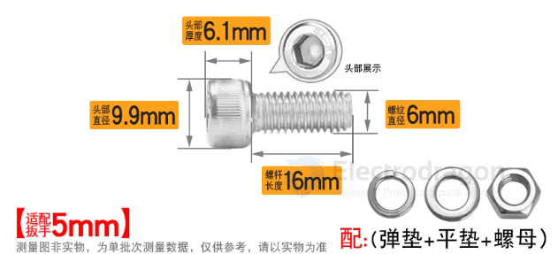

# screws-dat

- [[screws]]

- [[screw-large-head-dat]]

- M3x10
- M5x10 

- M16 
- M25 == ￠25*M20*200(1颗)
- M100螺栓 150mm-800mm == 240 
- M120螺栓 200mm-800mm

- [[hex-key-dat]]

## common combination 

- [[screws-dat]] + [[nut-dat]] + [[washer-spring-dat]] + [[washer-flat-dat]]

## bolt and screw

| Feature               | Bolt                                               | Screw                                                               |
| --------------------- | -------------------------------------------------- | ------------------------------------------------------------------- |
| **Usage**             | Used with a **nut** or threaded hole               | Often used **without a nut**, threads into material directly        |
| **Holding Mechanism** | Relies on **external nut** for clamping force      | Creates clamping force by threading directly into the material      |
| **Tools Used**        | Typically needs a **wrench** or **socket**         | Often driven by **screwdriver** or **Allen key**                    |
| **Installation**      | Requires access to **both sides** (to tighten nut) | Can often be installed from **one side** only                       |
| **Thread Type**       | Usually has a **blunt end** and uniform threads    | Often has **pointed or tapered end**, cutting threads into material |
| **Common Example**    | Hex bolt with nut on the other end                 | Wood screw going into wood directly                                 |

## fit size 

### Common Screw Size Reference

| Item                                 | M3         | M4      |
| ------------------------------------ | ---------- | ------- |
| **Screw Shaft Diameter**             | 3.0 mm     | 4.0 mm  |
| **Button/Socket Head Diameter**      | 5.5–6.0 mm | 7.0 mm  |
| **Countersunk Head Diameter**        | ~5.6 mm    | ~7.5 mm |
| **Washer Outer Diameter (standard)** | 6.0 mm     | 8.0 mm  |

## common used bolt 

- hex head bolt 
- hex socket head bolt 
- Phillips Head Screw

## Screw == Self-tapping Screws

Self-tapping screws are designed to create their own hole as they are driven into the material. They are commonly used in metal, plastic, and wood applications. The most common types of self-tapping screws include:

## Other Head Types 

### Round head 

6. Round Head
Name: Round Head Screw
Description: Fully rounded top, offering a decorative or smooth finish.
Usage: Less common in screws but used in vintage or decorative applications.

### Pan head 

Pan Head Screws M3*6, note length is the screws part 

4. Pan Head
Name: Pan Head Screw
Description: Rounded, slightly raised head with a large diameter.
Usage: Common in electronics, sheet metal fastening, and general applications.

### Countersunk Head

Countersunk Head M3*6, note length is the total length 

### Hex Head 

### Hex socket 

### Button Head 

M5*10 pan head

2. Button Head (Socket Button Head Screw)
Name: Button Head Screw
Description: Low-profile, rounded head with a wide bearing surface.
Usage: Used when a smooth, low-profile finish is needed, such as in enclosures or furniture.

### Cap Head

1. Cap Head (Socket Cap Screw)
Name: Cap Head Screw
Description: Tall, cylindrical head with a deep hex socket.
Usage: High-strength fastening in machinery, automotive, and structural applications.

### Flat Head

3. Flat Head (Countersunk Head Screw)
Name: Flat Head Screw
Description: Tapered, countersunk head that sits flush with the surface.
Usage: Used in applications requiring a smooth, flush surface, such as aerospace or furniture.

### Low Head 

5. Low Head
Name: Low Head Screw
Description: Similar to cap head but with a reduced height for tight spaces.
Usage: Used in applications where clearance is limited but a strong connection is needed.

### Truss Head

7. Truss Head
Name: Truss Head Screw
Description: Extra-wide, low-profile head for better load distribution.
Usage: Used in thin materials like sheet metal or plastic to reduce material damage.

### Oval Head

8. Oval Head (Raised Countersunk Head Screw)
Name: Oval Head Screw
Description: Similar to a flat head but with a slightly domed top.
Usage: Decorative applications or when a smooth, elegant look is needed.

## Drive Types 

Screws can be categorized based on their **drive type**, which refers to the shape of the socket or recess in the screw head where the tool engages.

### 1. Hex Drive (Allen)
- **Common Names:** Hex Socket, Allen  
- **Description:** A hexagonal socket that requires a hex key (Allen wrench).  
- **Usage:** Used in machinery, furniture, and automotive applications for high torque fastening.  

### 2. Phillips Drive (Cross)
- **Common Names:** Phillips, Cross Recess  
- **Description:** A cross-shaped recess designed to prevent over-tightening.  
- **Usage:** Widely used in general-purpose applications, especially in wood and drywall screws.  

### 3. Slotted Drive
- **Common Names:** Slot, Flathead  
- **Description:** A single straight groove that uses a flat-blade screwdriver.  
- **Usage:** Common in older designs, electrical outlets, and light-duty applications.  

### 4. Torx Drive
- **Common Names:** Torx, Star  
- **Description:** A six-pointed star-shaped recess that provides high torque transfer and reduces cam-out.  
- **Usage:** Used in electronics, automotive, and aerospace applications.  

### 5. Pozidriv Drive
- **Common Names:** Pozidriv, PZ  
- **Description:** Similar to Phillips but with extra grooves for better torque and less slippage.  
- **Usage:** Common in European woodworking and electrical applications.  

### 6. Square Drive (Robertson)
- **Common Names:** Robertson  
- **Description:** A square-shaped recess that offers strong torque resistance and prevents cam-out.  
- **Usage:** Used in construction, woodworking, and some automotive applications.  

### 7. Tri-Wing Drive
- **Common Names:** Tri-Wing  
- **Description:** Three-winged recess designed for security screws.  
- **Usage:** Found in aerospace, electronics, and tamper-proof applications (e.g., Nintendo consoles).  

### 8. Spanner Drive (Snake Eye)
- **Common Names:** Spanner, Snake Eye, Twin-Hole  
- **Description:** Two small round holes on the head requiring a special spanner bit.  
- **Usage:** Used in security screws to prevent tampering in public spaces.  

### 9. One-Way Drive
- **Common Names:** One-Way, Security Slot  
- **Description:** Slotted design that allows installation but prevents removal.  
- **Usage:** Used in security applications like restroom fixtures and license plates.  

### 10. Hexalobular Drive (Torx Plus)
- **Common Names:** Torx Plus, 6-Lobe  
- **Description:** A refined version of Torx with a more precise shape for higher torque.  
- **Usage:** Found in automotive, aerospace, and industrial applications.  

### 11. Clutch Drive
- **Common Names:** Clutch Head  
- **Description:** Bowtie-shaped recess used in heavy machinery.  
- **Usage:** Found in buses, trailers, and some older appliances.  

## ref 

- [[nut-dat]]

- [[screws]] 