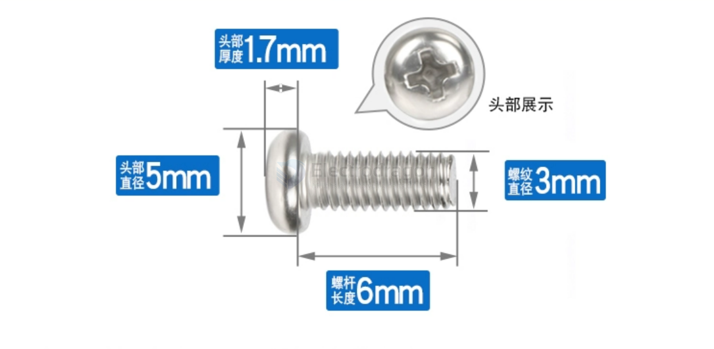
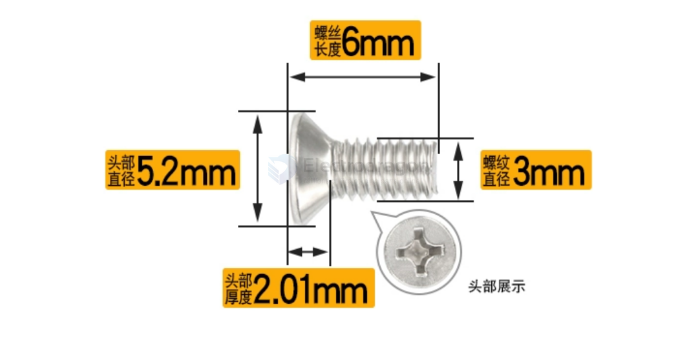

# screws-dat

- M3x10
- M5x10 

## the types of the head of screws

### Round head 

### Pan head 

Pan Head Screws M3*6, note length is the screws part 

### Countersunk Head

Countersunk Head M3*6, note length is the total length 

### Hex Head

## ref 

- [[nut-dat]]

- [[screws]] 