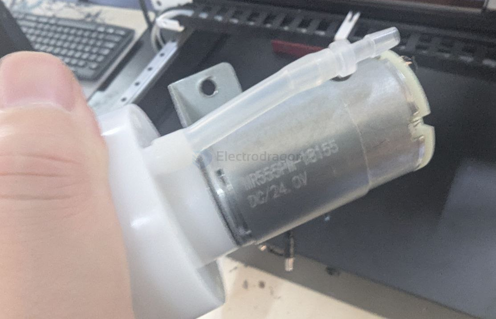
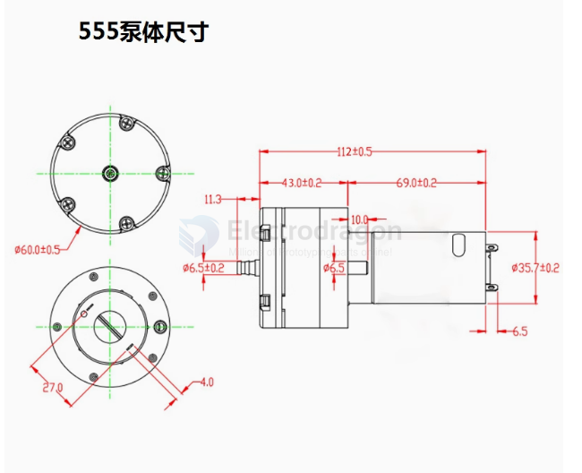
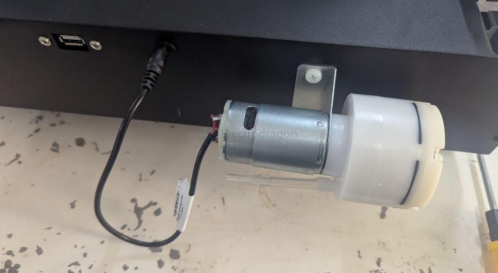

# vacuum-pump-dat

DC 24V

| Feature           | 12V Air Pump | 24V Air Pump |
| ----------------- | ------------ | ------------ |
| No-load Current   | 0.65A        | 0.38A        |
| Full-load Current | 1.5A         | 0.85A        |
| Negative Pressure | ≥ -58KPA     | ≥ -58KPA     |
| Positive Pressure | ≥ 100KPA     | ≥ 100KPA     |
| Air Flow          | ≥ 15L/min    | ≥ 15L/min    |

## dimension 

## installation to machine 

## ref 

- [[vacuum-pump]]