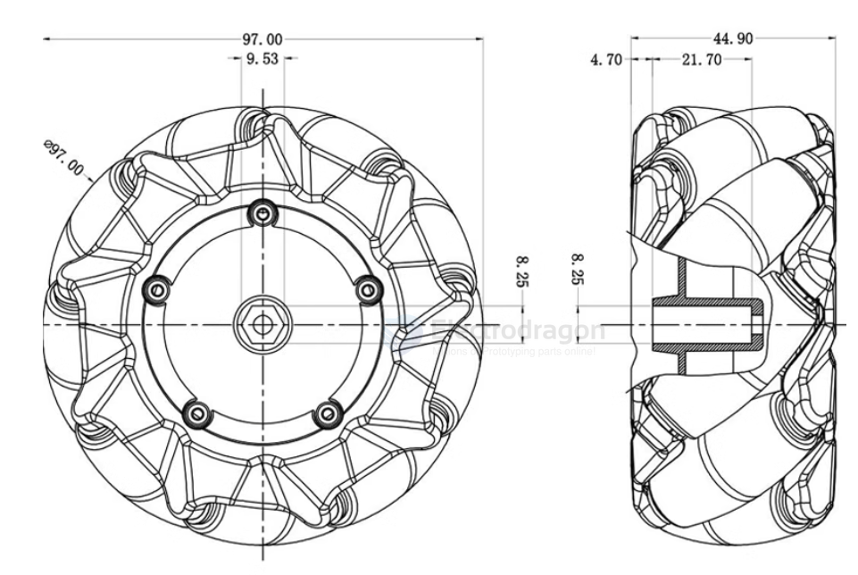
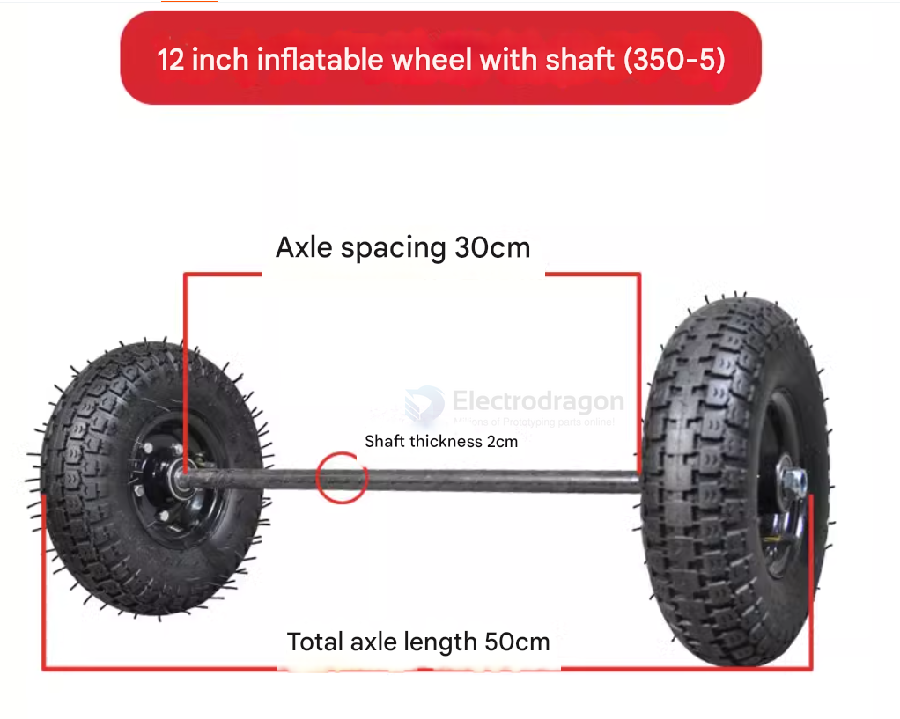
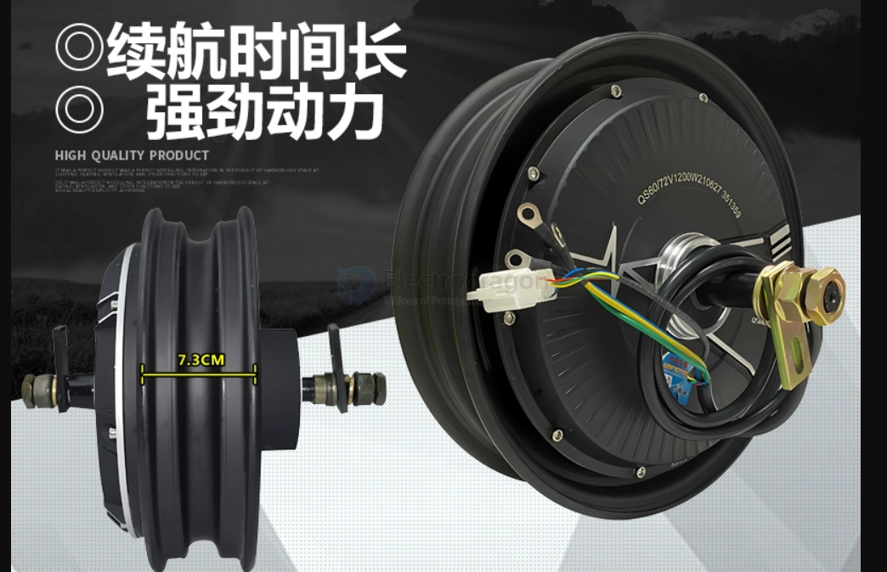
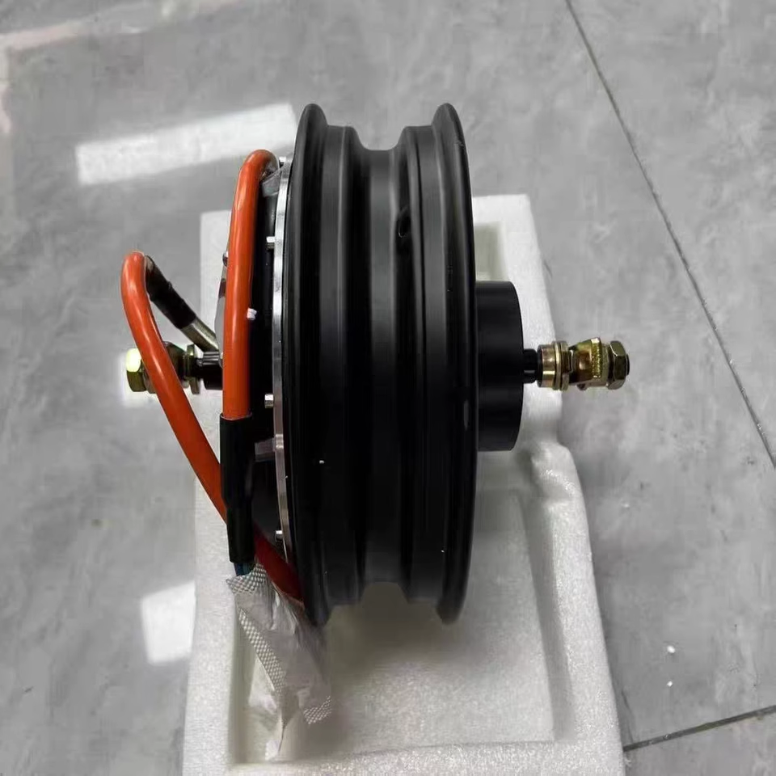
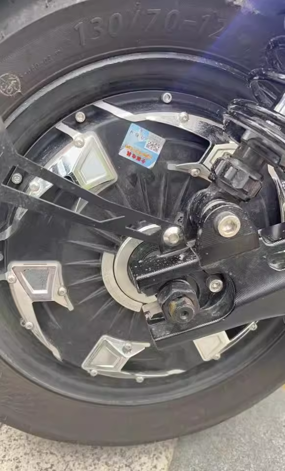
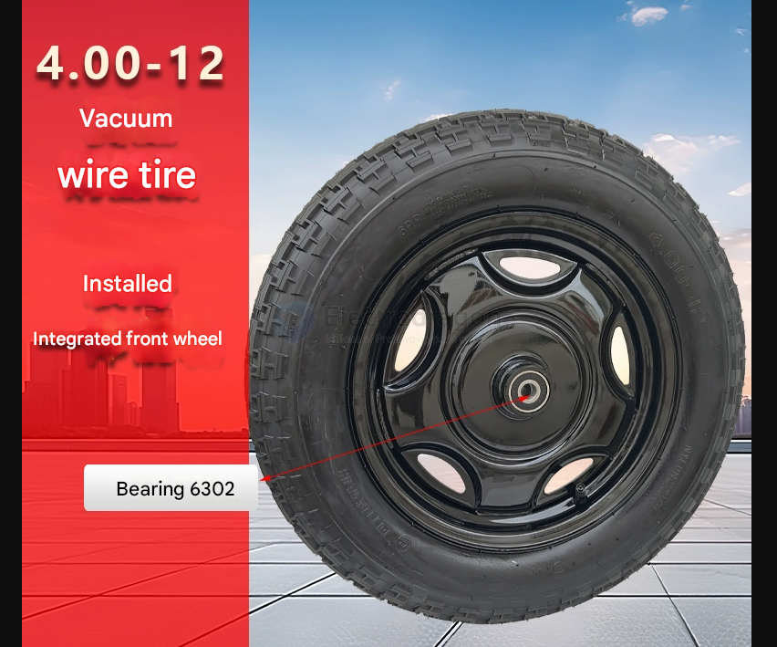

# wheel-dat

97 dia mm 

125 dia mm 

## 12"

12 inches is equal to:

- 30.48 centimeters (cm)
- 304.8 millimeters (mm)

## wheel with motor 

mostly used for balancer kart, electric go-kart, and electric tri-cycle,

12-inch 3000W 18-shaft + Mingzhe semi-molten tire

## wheel without motor 

bearing 6302

## ref 

- [[robot-dat]]

- [[bearing-dat]]

## ref 

- [[wheels]]

