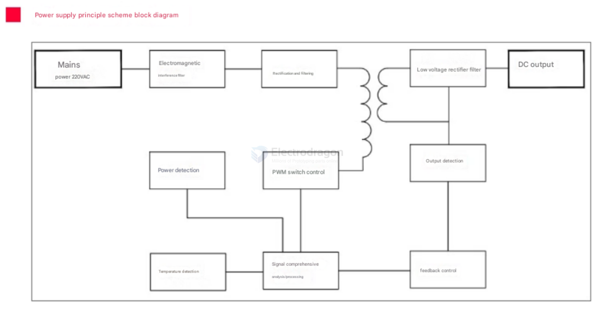
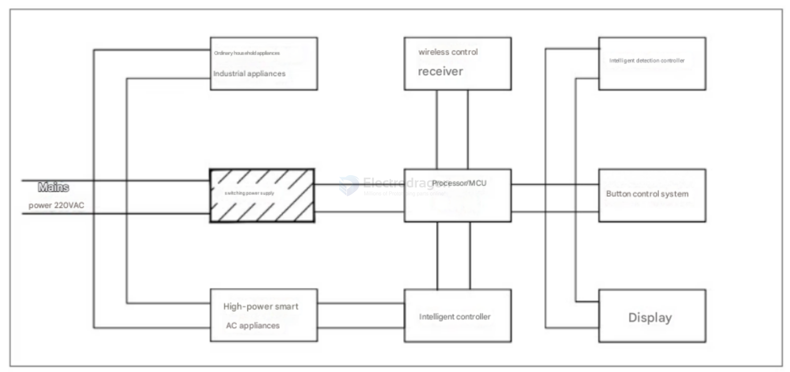
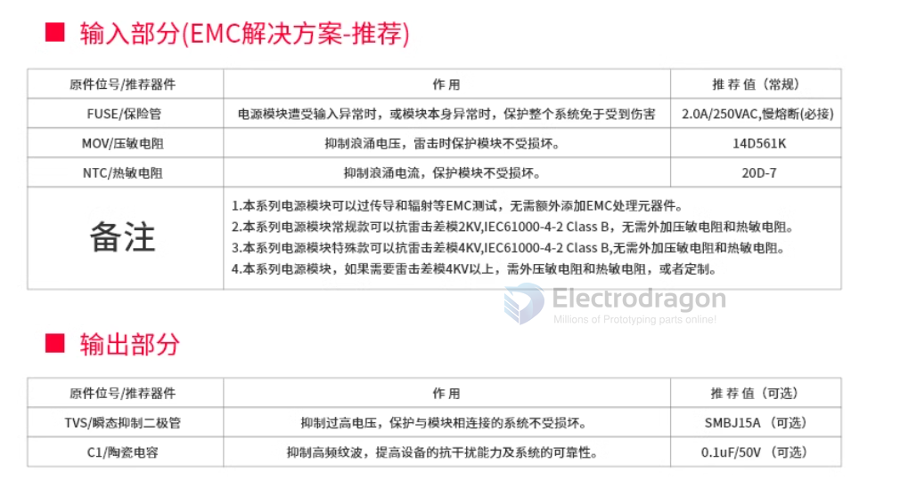
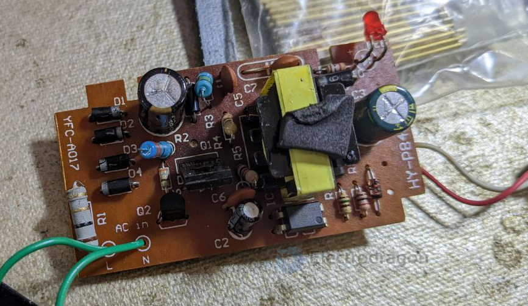
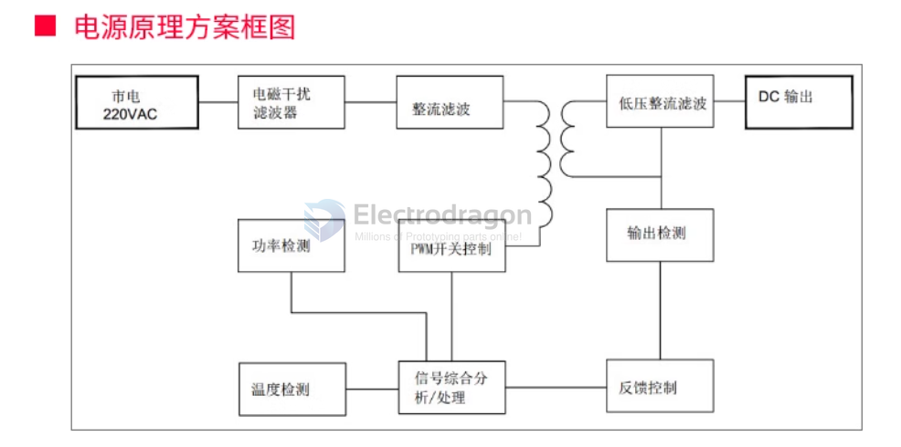

# ACDC dat 

- [[transformer-dat]]

## Modules 

- [[OPM1178-dat]] - [[OPM1110-dat]] - [[OPM1111-dat]] - [[OPM1016-dat]]

- [[OPM1113-dat]]

## Chip Solutions 

- [[AP8022-dat]] - [[AP8012-dat]]

## Board Function diagram 

- Power supply principle scheme block diagram
- Mains power 220VAC
- Electromagnetic interference filter
- Rectification and filtering
- Low voltage rectifier filter
- DC output
- Output detection
- Power detection
- PWM switch control
- Temperature detection
- Signal comprehensive analysis/processing
- feedback control

## Usage Applciation 

## peripheral SCH 

- [[fuse-dat]] - [[MOV-dat]] - [[NTC-dat]]

## SCH ref 

- 4x diodes rectify bridge 

## function map 

## soltuions 

### transformer-less-solutions == non-isolated solutions

- Power Integrations' LinkSwitch or TinySwitch series
- ON Semiconductor's NCL30000 series
- STMicroelectronics VIPer chips

## ref 

- [[ACDC]]

改成了 - [[AC-DC-RPD]]