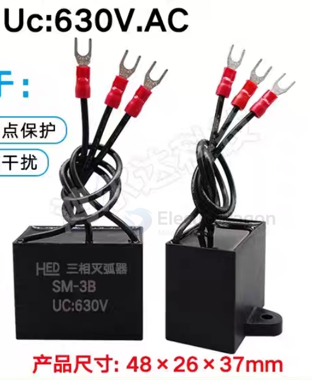
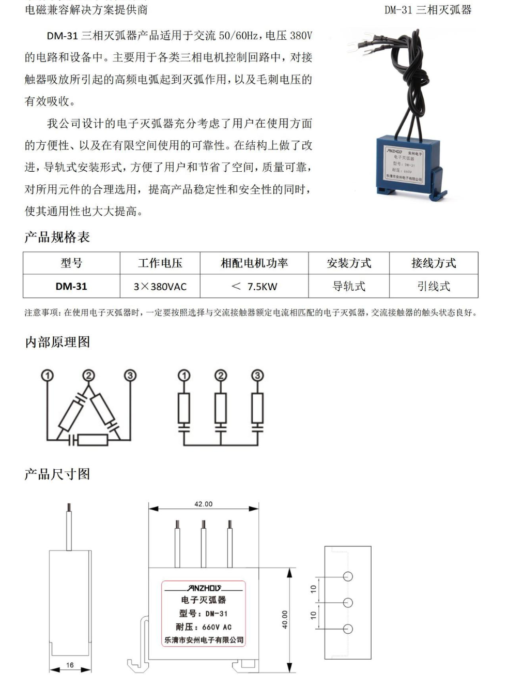

# RC-Snubber-dat

- [[NWI1139-dat]]

## AC inductive load snubber 

A basic design rule of thumb:

> C: 0.01 μF to 0.1 μF (typical for 230V AC applications).
> R: Between 100 Ω to 1 kΩ, depending on load and C.

You want the RC time constant (τ = R × C) to be long enough to absorb the energy but short enough to reset before the next cycle.

For more accurate design, you'd:

Measure or estimate the load's inductance.

Calculate the energy stored:

    𝐸 = 1/2 * 𝐿 * 𝐼^2
 
Ensure the snubber can absorb and dissipate this energy safely.

## Three-Phase Electronic Arc Suppressor (RC Snubber)

三相电子灭弧器，也叫RC灭弧器或电弧抑制器，它的本质是一个 RC串联电路（电阻+电容），并联在接触器触点的两端，通常用于三相交流电机控制回路中，目的是在接触器断开时**抑制电弧（火花）**的产生和传播。

A **three-phase electronic arc suppressor** is used to eliminate electrical arcing when contactors open, especially in circuits with **three-phase induction motors**. Its core is a **series RC circuit (resistor + capacitor)** connected in **parallel** across each contact of the contactor.

### 🔧 Working Principle

When a contactor opens to disconnect an inductive load (like a motor), the sudden interruption of current causes a **high voltage spike** due to the inductance. This spike can generate an **electric arc** across the opening contacts.

The **RC snubber** provides an alternate path for the current to decay safely by:
- **Capacitor (C):** Absorbing the voltage spike
- **Resistor (R):** Limiting the discharge current and damping oscillations

This effectively reduces the arc and protects the contactor.

### ✅ Typical Structure

A three-phase arc suppressor generally includes:
- **Capacitor (C):** e.g., 0.1μF to 0.47μF (AC-rated)
- **Resistor (R):** e.g., 100Ω to 220Ω (sufficient wattage and voltage rating)
- **Encapsulation:** Often epoxy-encased with mounting hardware for panel installation

Each phase (L1, L2, L3) has one RC snubber connected across the contact.

### ⚠️ Notes

- RC values should be chosen based on motor load characteristics and voltage levels.
- Not suitable for direct connection to **VFD (variable frequency drive) output**.
- Designed to **assist with arc suppression**, not as standalone protection.
- Overuse or mismatched parameters can lead to overheating or damage.

### 📘 Example Application

For a 380V AC three-phase motor:
- R = 120Ω, 5W
- C = 0.22μF, 630V AC

One RC network per phase, installed across the contactor terminals.

## ref 

- [[AC-mains-dat]]