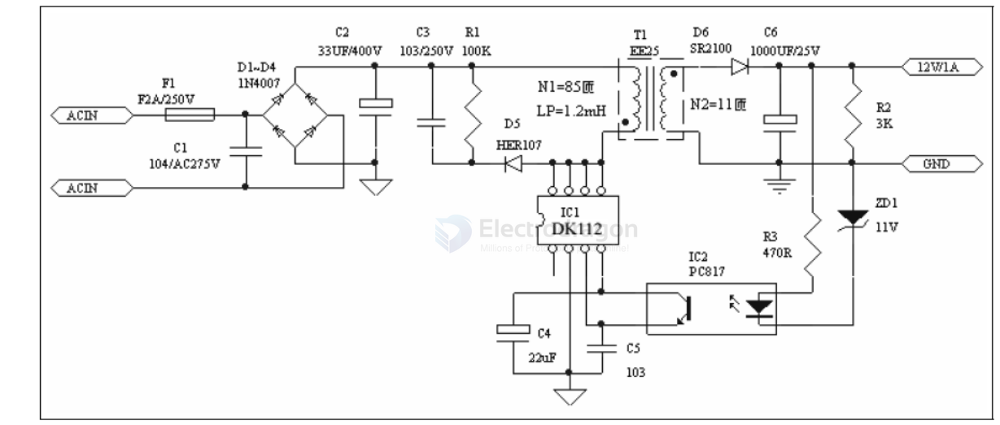

# ac-mains-dat

- [[ac-mains-dat]] - [[ACDC-dat]]

## tech 

- [[sensor-voltage-dat]] - [[sensor-current-dat]] - [[current-transformer-dat]]
  
- [[acdc-adapter-dat]] - [[acdc-dat]]

- [[RC-Snubber-dat]]

[[BOM-dat]] - [[power-isolated-Module-dat]] - [[sample-resistor-dat]]

- [[ac-measurement-dat]]

- [[ac-plug-dat]]

- [[ground-wire-dat]]

- [[ACDC-RC_Buck-dat]]

## parts 

- [[diode-rectifier-dat]]

- [[ac-protections-dat]]

## boards 

- [[OPM1114-dat]] - [[OPM1113-dat]]

## Note 

- The live wire of domestic circuits is usually red and is at high voltage. 
- The neutral wire is black and has voltage close to that of the ground. 
- The potential difference between these two wires in India is about 220 V. 
- The earth or ground wire provides safety against faults and current leaks. 
- Earth pin is longer to ensure earth connection happens first while connecting and last while disconnecting any devices. 

## 1. What is AC (Alternating Current)?
- **AC (Alternating Current)** is the type of electricity commonly used in homes and buildings.
- The voltage **alternates direction** (50 or 60 times per second — 50Hz or 60Hz).
- It powers appliances, lights, outlets, etc.

---

## 2. The Three Main Wires in an AC Circuit

### 🔴 Live (Hot) Wire
- **Carries voltage** from the power source (e.g., 120V or 220V).
- **Dangerous** – touching it can result in electric shock.
- **Color**: Often **black** or **brown** (varies by country).

### 🔵 Neutral Wire
- **Returns current** back to the power source to complete the circuit.
- **Usually near 0V**, but can still be hazardous.
- **Color**: Often **white** or **blue**.

### 🟢 Ground (Earth) Wire
- **Safety wire**, doesn't carry current under normal conditions.
- **Connected to the earth** – redirects electricity safely during a fault.
- **Color**: Usually **green** or **green/yellow striped**.

---

## 3. How They Work Together (Water Analogy)

| Water System      | Electrical System         |
|-------------------|---------------------------|
| Water source      | 🔴 Live wire (carries power) |
| Drain pipe        | 🔵 Neutral wire (returns current) |
| Overflow pipe     | 🟢 Ground wire (emergency path) |

---

## ⚠️ Safety Notes
- Only **Live** wire carries full voltage.
- **Neutral** may still be dangerous if wiring is faulty.
- **Ground** is for safety and **should not be live**.
- **Never touch wires** unless the power is off and you are trained.

---

✅ Use a multimeter to test wiring safely, and always follow local electrical codes and safety standards.

- [[ground-wire-dat]]

## solutions 

- [[CR6842S-dat]] - [[chip-rail-dat]] - [[AC-mains-dat]] - [[OPM1114-dat]]

- [[power-integrations-dat]]

### DK112 

1. DESCRIPTION

The DK112 is specially design for low power switch mode control, it is widely use in small household
electrical appliances.

2. APPLICATIONS

- Battery charger ·DVD/VCD power supply
- Power AC/DC adapters ·Air conditioner power supply
- STB power supply ·AC/DC LED driver applications
- Electromagnetic oven power supply ·TV/Monitor power supply

3. MAIN FEATURES

- · 85V—265V wide range AC power input.
- · 65KHz Oscillation Frequency.
- · Double chip design with Bipolar Junction Transistor (BJT) to save cost.
- · Large scale MOS digital circuit design with E class BJT driving, so that to enhance its High Voltage Resistance capability.
- · Self-power supply design, no need for additional IC to supply the electricity.
- · Internal integrated constant high voltage current driving circuit, no need for additional resistance.
- · Over current, Over loading, Over temperature, Over voltage, Output short circuit and photo-coupler Failure Protection.
- · Internal Ramp Compensation circuit to keep the stability of the circuit in low voltage and high power condition.
- · Internal PMW oscillation circuit with Frequency jittering control to keep EMC characteristics.
- · Internal Frequency Conversion. Frequency-down in low load condition, comply with the Europe Standard (stand power<0.3W), also reduce the output voltage ripple.
- · Ramp current drive circuit included to reduce IC power loss and raise circuit efficiency.
- · 4KV Anti-Static ESD test. 

## ref 

- [[power-dat]]