# ACDC-dat 

- [[SMPS-dat]] - [[power-dat]] - [[ACDC-dat]] - [[DCDC-dat]]

- [[ac-mains-dat]] - [[ACDC-dat]] - [[power-dat]] 

[legacy wiki page](https://www.electrodragon.com/w/AC-DC)

- [[NCP1342-dat]] - [[onsemi-dat]] - [[power-flyback-controller-dat]] - [[power-dat]] - [[SMPS-dat]] - [[ACDC-dat]]

## tech 

- [[transformer-dat]]

- [[protection-power-dat]]

## Modules 

- [[OPM1178-dat]] - [[OPM1110-dat]] - [[OPM1111-dat]] - [[OPM1016-dat]]

- [[OPM1113-dat]] - [[OPM1114-dat]]

- [[OPM1068-dat]]

- [[OPM1178-dat]]

## output 

- 12V/2A
- 5V/2A 
- 

## Board Function diagram 

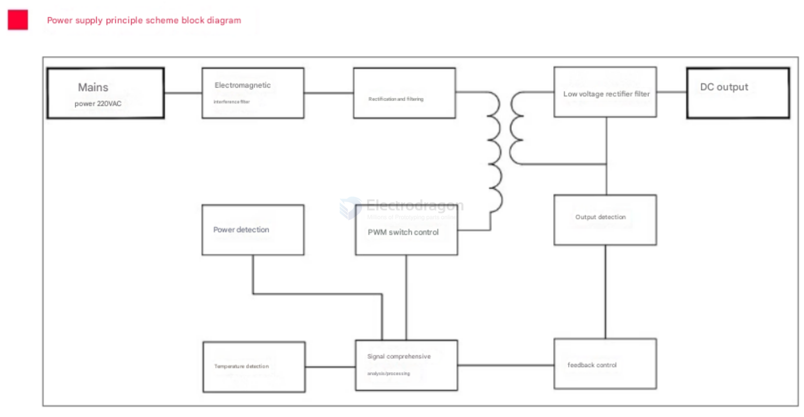

- Power supply principle scheme block diagram
- Mains power 220VAC
- Electromagnetic interference filter
- Rectification and filtering
- Low voltage rectifier filter
- DC output
- Output detection
- Power detection
- PWM switch control
- Temperature detection
- Signal comprehensive analysis/processing
- feedback control

## Usage Applciation 

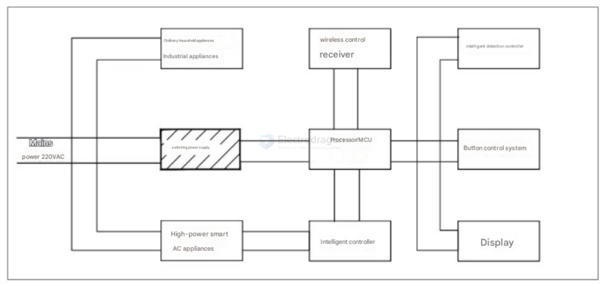

## peripheral SCH 

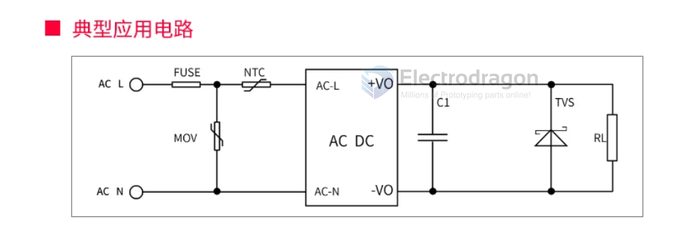

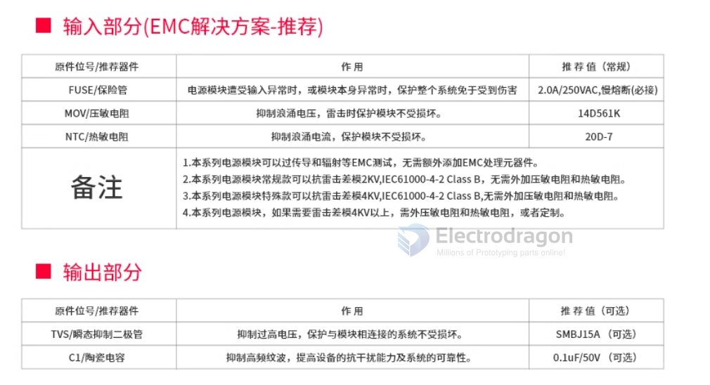

- [[fuse-dat]] - [[MOV-dat]] - [[NTC-dat]]

## SCH ref 

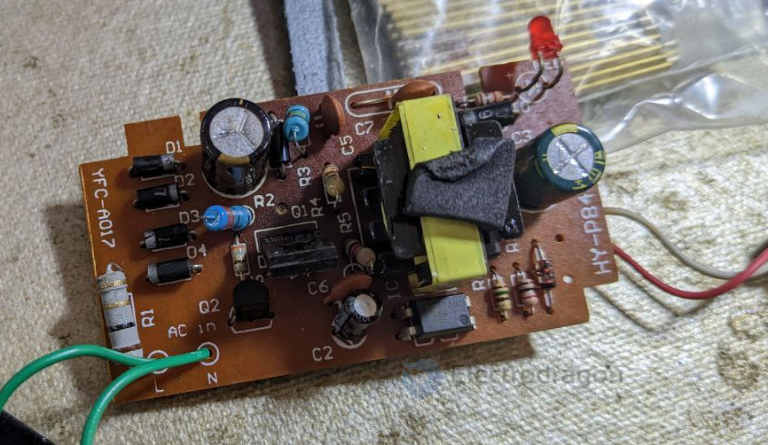

- 4x diodes rectify bridge 

## function map 

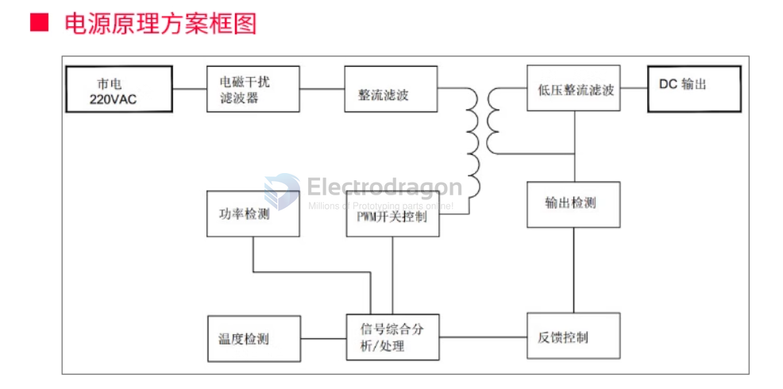

## soltuions 

### transformer-less-solutions == non-isolated solutions

- Power Integrations' LinkSwitch or TinySwitch series
- ON Semiconductor's NCL30000 series
- STMicroelectronics VIPer chips

## prebuild module 

TOP254EN == Enhanced EcoSmart, Integrated Off-Line Switcher with Advanced Feature Set and Extended Power Range == TOPSwitch-HX is a highly integrated monolithic off-line switcher IC designed for off-line power supplies. 

- [[meanwell-dat]]

## chips

- [[SI6021-dat]] - [[SiFirst-dat]] - [[SI6051-dat]] - [[power-adapter-dat]] - [[acdc-dat]] - [[SI5928-dat]] - [[power-switch-dat]] 

- [[depuw-dat]]

- [[ICM-dat]]

- [[AP8012-dat]] - [[AIT-IC-dat]] - [[acdc-dat]] - [[OPM1110-dat]]

Chip Solutions 

- [[AP8022-dat]] - [[AP8012-dat]]

- [[ZSpowerIC-dat]]

- [[IW1700-dat]] - [[renesas-power-dat]] - [[renesas-dat]]

- [[acdc-dat]] - [[ac-mains-dat]]

- [[ST-ACDC-dat]] - [[ACDC-dat]] - [[VIPER22-dat]]

- [[power-integrations-dat]] - [[LNK302-dat]] - [[TNY267-dat]] - [[ACDC-dat]] - [[ac-mains-dat]] 

- [[dongke-dat]] - [[DK112-dat]] - [[ACDC-dat]]

- [[silan-dat]] - [[SD6834-dat]] - [[acdc-dat]]

- [[SDC-dat]] - [[SDC3322-dat]] - [[ACDC-dat]] - [[power-switch-dat]]

- [[SI6021-dat]] - [[SiFirst-dat]] - [[SI6051-dat]]

- [[JW7707-dat]] - [[ACDC-dat]] - [[joulwatt-dat]] - [[QC7707-dat]]

- [[silan-dat]] - [[SP8585-dat]]

## build 

- [[power-adapter-dat]]

### build 4 

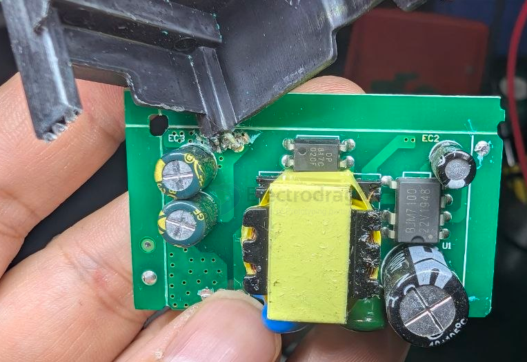

unknown chip - [[chip-unknown-dat]]

- BJM7100 22V1948
- BJM 16R45 15R45

- [[PCB-form-dat]] - [[PCB-stack-dat]]

### build 3 

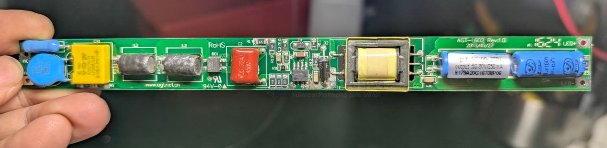

- AZH6MA 

- [[capacitor-dat]] == 68UF / 100V 

### build 2 

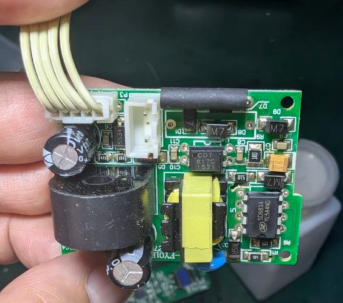

### build 1 

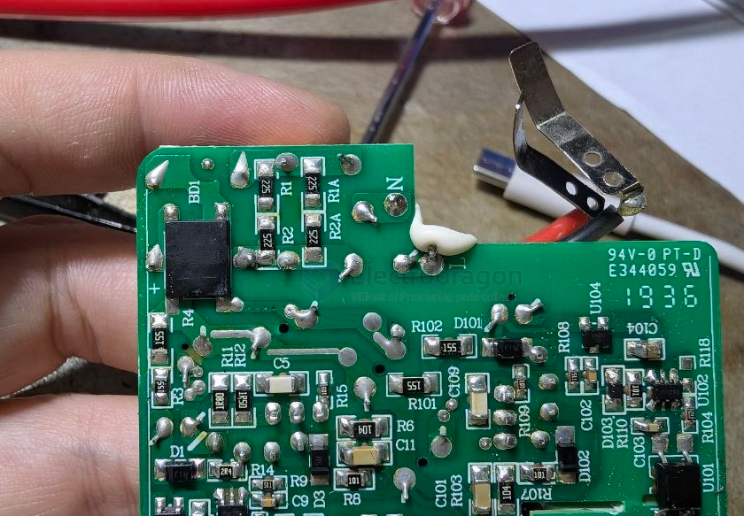

- [[capacitor-X2-dat]] - [[capacitor-dat]]

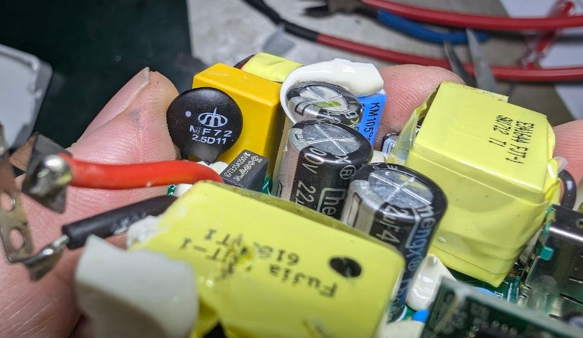

- [[fuse-dat]]

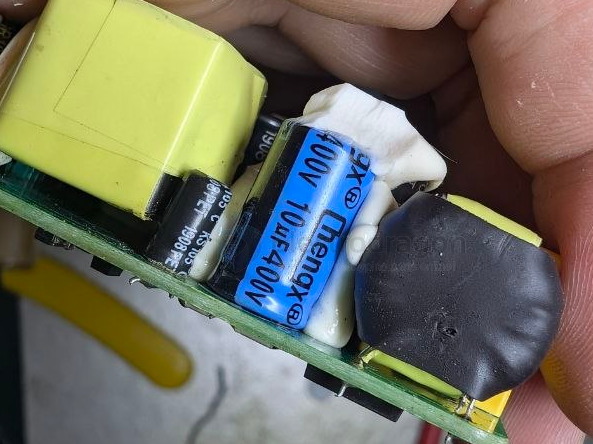

- [[resistor-ICL-dat]] - [[resistor-dat]]

## ref 

- [[ACDC]]

改成了 - [[AC-DC-RPD]]