# ACDC-dat 

- [[SMPS-dat]] - [[power-dat]] - [[ACDC-dat]] - [[DCDC-dat]]

- [[ac-mains-dat]] - [[ACDC-dat]] - [[power-dat]] 

[legacy wiki page](https://www.electrodragon.com/w/AC-DC)

- [[NCP1342-dat]] - [[onsemi-dat]] - [[power-flyback-controller-dat]] - [[power-dat]] - [[SMPS-dat]] - [[ACDC-dat]]

`AC Input` → `Fuse` → `Common Mode Choke` → `X/Y Capacitors` → `Bridge Rectifier` → `High Voltage DC`

- [[AC-mains-dat]] - [[fuse-dat]] - [[choke-dat]] [[choke-common-mode]] - [[capacitor-X-Y-dat]] - [[bridge-rectifier-dat]] - [[ACDC-dat]] - [[DC-HV-dat]] - [[DC-dat]] - [[transformer-dat]] - [[diode-dat]] == for rectification

## tech 

- [[transformer-dat]]

- [[protection-power-dat]]

## Modules 

- [[OPM1178-dat]] - [[OPM1110-dat]] - [[OPM1111-dat]] - [[OPM1016-dat]]

- [[OPM1113-dat]] - [[OPM1114-dat]]

- [[OPM1068-dat]]

- [[OPM1178-dat]]

## output 

- 12V/2A
- 5V/2A 
- 

## Board Function diagram 

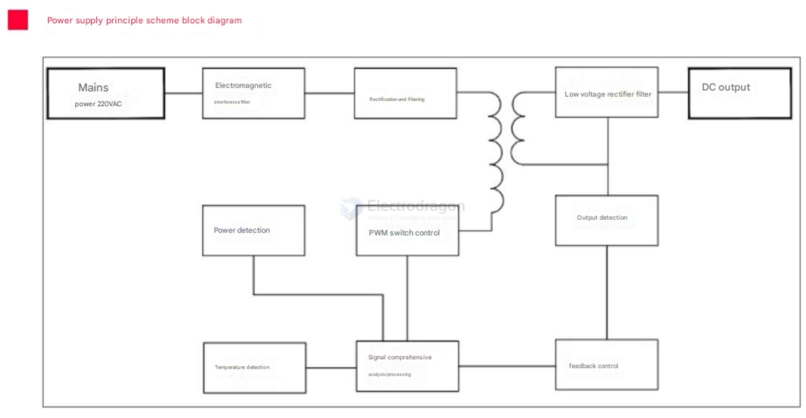

- Power supply principle scheme block diagram
- Mains power 220VAC
- Electromagnetic interference filter
- Rectification and filtering
- Low voltage rectifier filter
- DC output
- Output detection
- Power detection
- PWM switch control
- Temperature detection
- Signal comprehensive analysis/processing
- feedback control

## Usage Applciation 

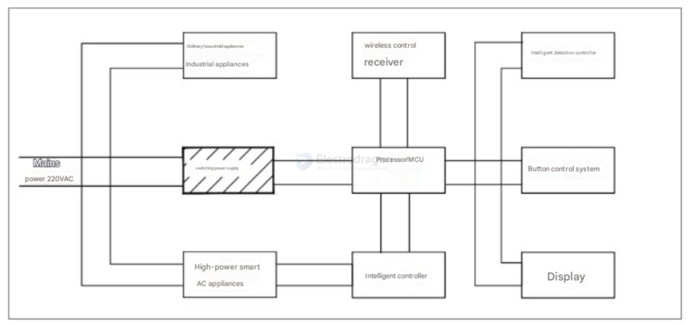

## peripheral SCH 

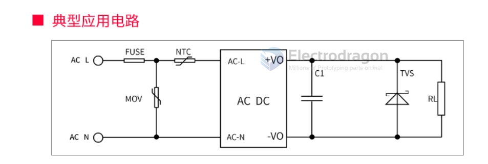

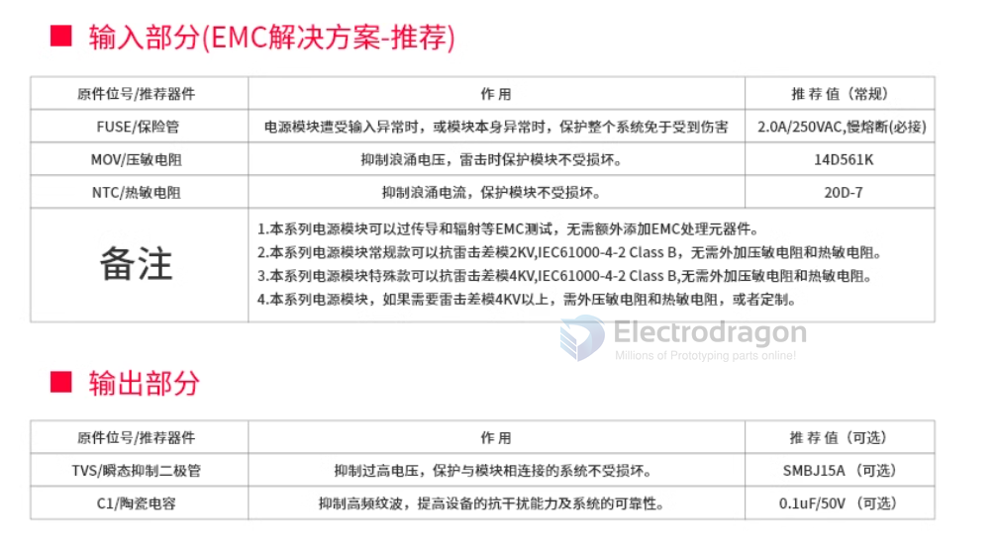

- [[fuse-dat]] - [[MOV-dat]] - [[NTC-dat]]

## SCH ref 

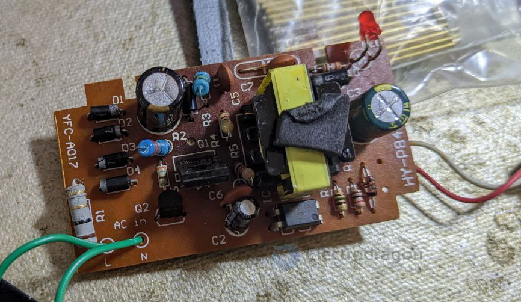

- 4x diodes rectify bridge 

## function map 

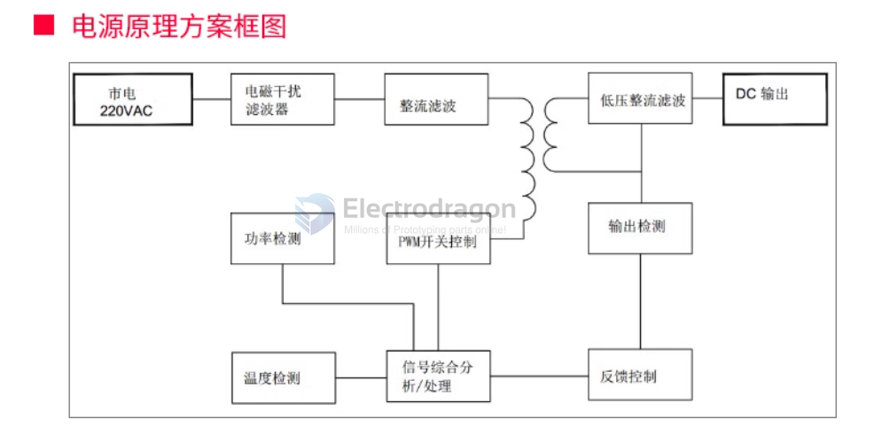

## soltuions 

### transformer-less-solutions == non-isolated solutions

- Power Integrations' LinkSwitch or TinySwitch series
- ON Semiconductor's NCL30000 series
- STMicroelectronics VIPer chips

## prebuild module 

TOP254EN == Enhanced EcoSmart, Integrated Off-Line Switcher with Advanced Feature Set and Extended Power Range == TOPSwitch-HX is a highly integrated monolithic off-line switcher IC designed for off-line power supplies. 

- [[meanwell-dat]]

## chips

- [[CR6842-dat]] CR6842S - [[OB2269-dat]] - [[SG6842-dat]] - [[LD7552-dat]] == Compatible with SG6842J&LD7552&OB2269

- [[CR6842-dat]] - [[chip-rail-dat]]

- [[SI6021-dat]] - [[SiFirst-dat]] - [[SI6051-dat]] - [[power-adapter-dat]] - [[acdc-dat]] - [[SI5928-dat]] - [[power-switch-dat]] 

- [[depuw-dat]]

- [[ICM-dat]]

- [[AP8012-dat]] - [[AIT-IC-dat]] - [[acdc-dat]] - [[OPM1110-dat]]

Chip Solutions 

- [[AP8022-dat]] - [[AP8012-dat]]

- [[ZSpowerIC-dat]]

- [[IW1700-dat]] - [[renesas-power-dat]] - [[renesas-dat]]

- [[acdc-dat]] - [[ac-mains-dat]]

- [[ST-ACDC-dat]] - [[ACDC-dat]] - [[VIPER22-dat]]

- [[power-integrations-dat]] - [[LNK302-dat]] - [[TNY267-dat]] - [[ACDC-dat]] - [[ac-mains-dat]] 

- [[dongke-dat]] - [[DK112-dat]] - [[ACDC-dat]]

- [[silan-dat]] - [[SD6834-dat]] - [[acdc-dat]]

- [[SDC-dat]] - [[SDC3322-dat]] - [[ACDC-dat]] - [[power-switch-dat]]

- [[SI6021-dat]] - [[SiFirst-dat]] - [[SI6051-dat]]

- [[JW7707-dat]] - [[ACDC-dat]] - [[joulwatt-dat]] - [[QC7707-dat]]

- [[silan-dat]] - [[SP8585-dat]]

## build 

- [[power-adapter-dat]]

### build 5 

### unknown 1 

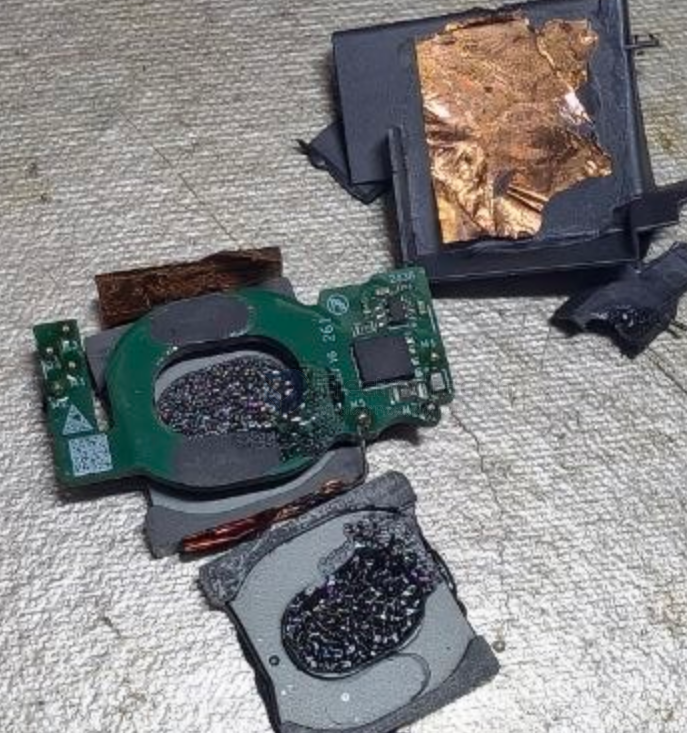

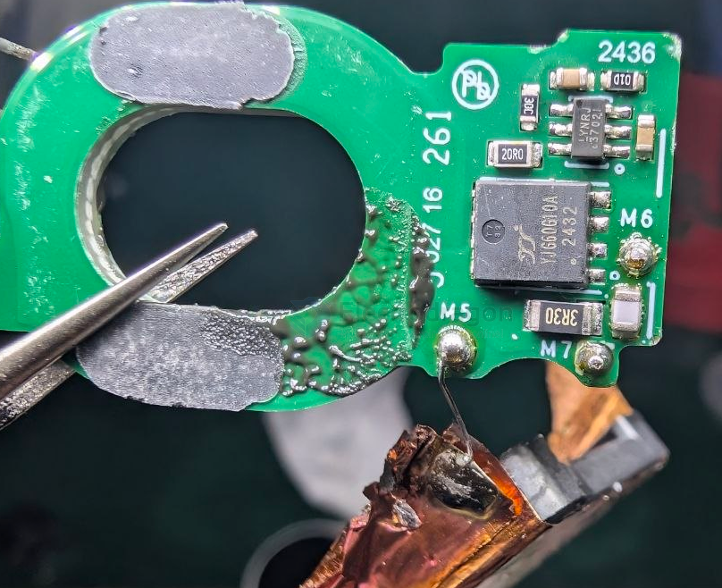

YJ GG0G10A 2432 - guess - [[mosfet-dat]] - [[chip-unknown-dat]]

LYNRJ 37021

开关变压器输出带同步整流，3A电流没啥问题

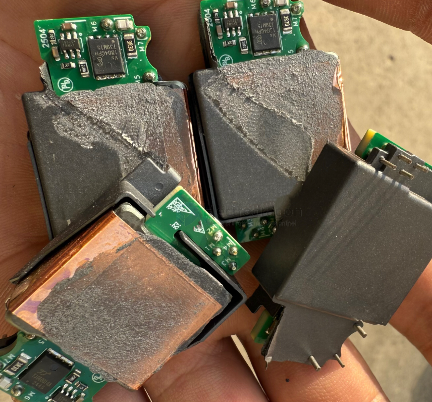

### build 4 

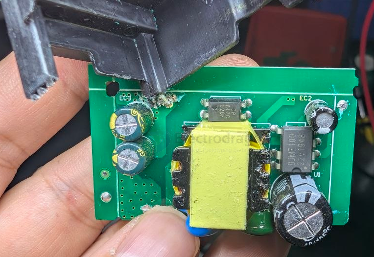

unknown chip - [[chip-unknown-dat]]

- BJM7100 22V1948
- BJM 16R45 15R45

- [[PCB-form-dat]] - [[PCB-stack-dat]]

### build 3 

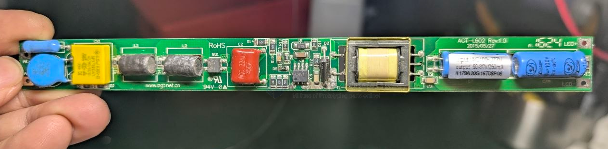

- AZH6MA 

- [[capacitor-dat]] == 68UF / 100V 

### build 2 

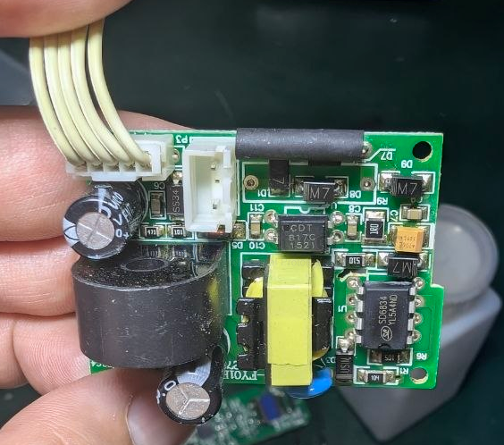

### build 1 

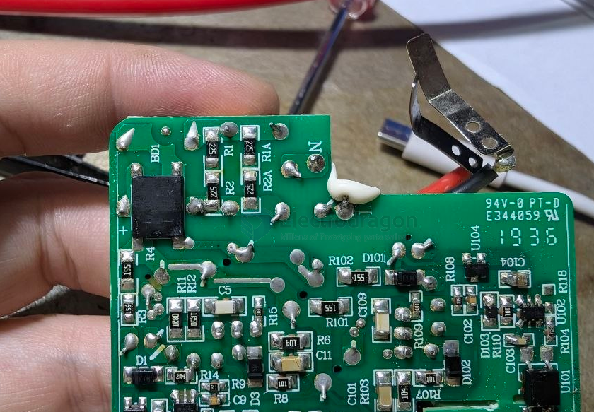

- [[capacitor-X2-dat]] - [[capacitor-dat]]

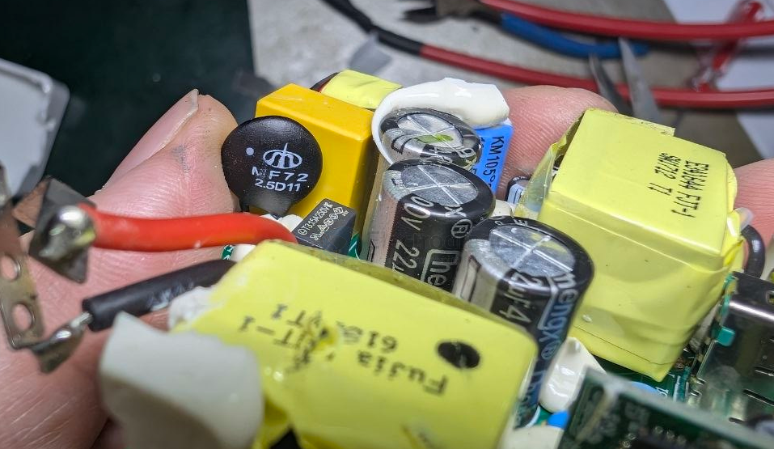

- [[fuse-dat]]

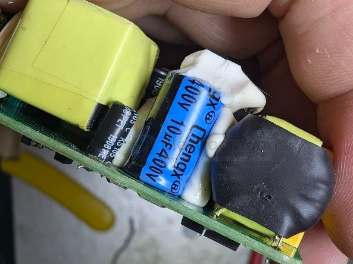

- [[resistor-ICL-dat]] - [[resistor-dat]]

## Topology Overview: Forward, Half-Bridge, and Full-Bridge

In power electronics and switched-mode power supply (SMPS) design, **Forward**, **Half-Bridge**, and **Full-Bridge** are three classic isolated DC-DC (or AC-DC secondary-stage) converter topologies.

They differ primarily in **switch count**, **transformer core utilization**, **target power capability**, and **circuit complexity**.

---

### 1. Forward Topology

The Forward converter is essentially an **isolated version of the Buck converter**. Unlike a Flyback converter, energy is transferred directly to the secondary load **while the primary switch is ON**. When the switch turns OFF, the secondary output inductor and freewheeling diode maintain load current.

* **Switch Count:** 1 (Single-Ended Forward) or 2 (Two-Switch / Double-Ended Forward).
* **Core Utilization:** Unidirectional magnetization (operates in Quadrant I only). The transformer requires a dedicated **demagnetization circuit (reset winding or clamping diodes)** to prevent core saturation.
* **Key Features:**
  * Requires an output filtering inductor and freewheeling diode on the secondary side.
  * The Two-Switch Forward returns energy stored in the transformer back to the input rails via two clamping diodes, limiting switch voltage stress strictly to the input voltage ($V_{in}$). High reliability.
* **Typical Power Range:** Low to Medium ($100\text{ W} \sim 500\text{ W}$).

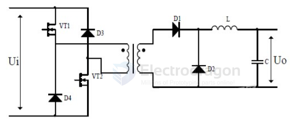

---

### 2. Half-Bridge Topology

The Half-Bridge topology utilizes two controlled switches connected in series across the DC bus, combined with a split-capacitor voltage divider that creates a midpoint. The switches drive the transformer primary alternately.

* **Switch Count:** 2 switches (High-side $Q_1$, Low-side $Q_2$), driven alternately with a dead time.
* **Core Utilization:** Bidirectional symmetrical magnetization (operates in Quadrants I and III), significantly increasing transformer utilization and reducing magnetic core size.
* **Key Features:**
  * The primary winding sees only half of the input voltage ($\frac{1}{2} V_{in}$).
  * The series voltage-divider capacitors block DC offset, preventing transformer core saturation due to magnetic imbalance.
  * Voltage stress on each switch equals $V_{in}$.
* **Typical Power Range:** Medium to High ($300\text{ W} \sim 1000\text{ W}$, e.g., PC ATX power supplies, industrial supplies).

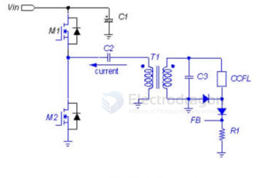

---

### 3. Full-Bridge Topology

The Full-Bridge topology uses four switches arranged in an H-bridge configuration. Diagonal switch pairs ($Q_1 + Q_4$ and $Q_2 + Q_3$) conduct alternately, applying the full input voltage across the transformer primary in both directions.

* **Switch Count:** 4 switches.
* **Core Utilization:** Symmetrical bidirectional magnetization; highest transformer core utilization and maximum power density.
* **Key Features:**
  * The transformer primary experiences the full input voltage ($V_{in}$), delivering twice the output power of a Half-Bridge at the same primary current.
  * Requires complex gate drive circuits (two sets of floating high-side drivers).
  * Can be combined with Phase-Shifted control (PSFB) or LLC resonance to achieve Zero Voltage Switching (ZVS) across the entire load range, significantly boosting efficiency.
* **Typical Power Range:** High Power ($1\text{ kW} \sim 10\text{ kW}+$, e.g., EV On-Board Chargers, server power supplies, high-power solar inverters).

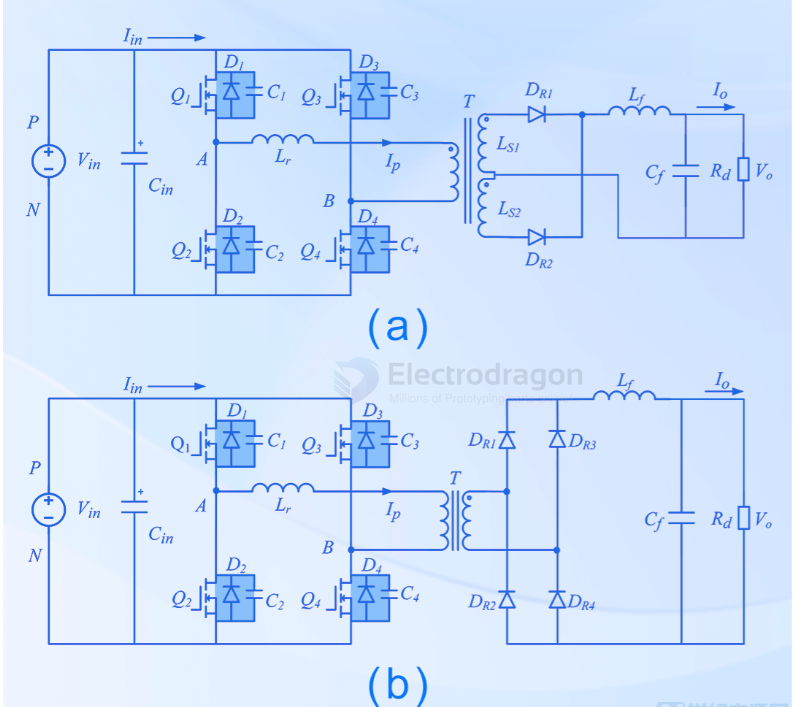
---

### Summary Comparison

| Topology | Switch Count | Primary Voltage | Core Utilization | Key Advantage | Main Disadvantage | Typical Power Range |
| :--- | :--- | :--- | :--- | :--- | :--- | :--- |
| **Forward** | 1 or 2 | $V_{in}$ | Unidirectional (Low) | Simple, robust, low voltage stress (2-switch) | Requires reset circuit, larger transformer | $100\text{ W} \sim 500\text{ W}$ |
| **Half-Bridge** | 2 | $\frac{1}{2}V_{in}$ | Bidirectional (High) | Low switch voltage stress, inherent DC blocking | Primary current is double that of Full-Bridge | $300\text{ W} \sim 1\text{ kW}$ |
| **Full-Bridge** | 4 | $V_{in}$ | Bidirectional (Highest) | Highest power capability, easy ZVS implementation | High component count, complex gate drivers | $1\text{ kW} \sim 10\text{ kW}+$ |

## ref 

- [[ACDC]]

改成了 - [[AC-DC-RPD]]