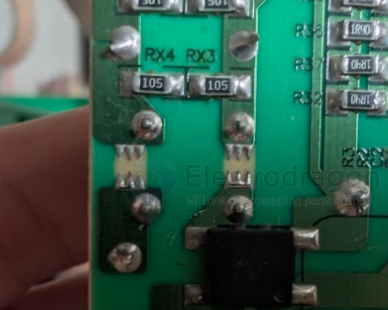

# Spark Gap — Discharge Teeth on PCB

- [[choke-common-mode-dat]] - [[choke-dat]] - [[spark-gap-dat]] - [[acdc-dat]]

The sawtooth copper foil structure between the pins of the common mode inductor in the image is a **Spark Gap** (discharge gap) used for lightning surge / overvoltage protection.

## 1. Working Principle

- **Point Discharge**: According to the principle of point discharge in electromagnetics, the electric field concentrates more easily at sharp edges. The serrated tips significantly lower the air breakdown voltage threshold.

- **Diverting High-Voltage Surges**: When the circuit input is hit by lightning, ESD, or transient high-voltage surges from the mains, the narrow air gap between the sawtooth tips is instantly ionized, creating a spark discharge. This diverts the high voltage to ground or the opposite terminal, clamping the peak voltage within a safe range.

- **Protecting Downstream Components**: By creating a controlled "artificial short-circuit / discharge path", it prevents high voltage from destroying expensive downstream components such as the bridge rectifier (BD1 in the image), filter capacitors, and switching transistors.

## 2. Why Placed Here?

- **Front Line of AC Input**: It sits between the pins of the common mode inductor (i.e., across the AC input lines or between input and ground), making it the first area that a high-voltage surge encounters.

- **Synergy with the Common Mode Inductor**: The common mode inductor presents high impedance to high-frequency surges. When a surge arrives, a large instantaneous voltage differential builds up across the inductor. The spark gap takes advantage of this voltage differential to discharge the energy promptly.

## 3. Why Use a Serrated Spark Gap Instead of a Fuse or MOV?

- **Near-Zero Cost**: It is etched directly from the PCB copper trace — the cost is effectively zero.

- **Extremely Fast Response**: Air/gas breakdown discharge occurs at nanosecond speed.

- **Coordinated Protection**: In low-cost switching power supplies (e.g., chargers, adapters), the spark gap is often used together with MOVs (Metal Oxide Varistors) and safety capacitors. In extremely cost-reduced designs, it may even serve as the sole basic lightning/surge protection measure.

## ref 

