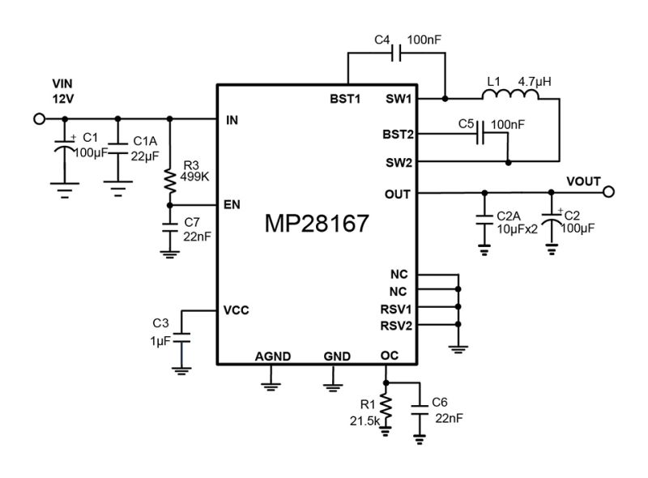

# dcdc-boost-dat 

legacy wiki page - https://www.electrodragon.com/w/DC-DC_Boost

- [[OPM1117-dat]]

- [[OPM1013-dat]]

- [[OPM1032-dat]] 

- [[OPM1089-dat]]

- [[OPM1133-dat]]
- https://www.electrodragon.com/product/mini-boost-buck-dc-board-1-8-5v-3-3v/

- [[OPM1137-dat]]

- [[OPM1175-dat]]
- https://www.electrodragon.com/product/step-up-boost-dc-power-module-me6208-0-9-5vin-5vout-0-5a/

- [[TPS61088-dat]]

## compare 

| model        | description                                                          | peripherals | type        |
| ------------ | -------------------------------------------------------------------- | ----------- | ----------- |
| TPS61040DBVR | TPS6104x Low-Power DC-DC Boost Converter in SOT-23 and WSON Packages | 7           | .           |
| LT8364       | Low IQ Boost/SEPIC/Inverting Converter with 4A, 60V Switch           | 11          |             |
| [[SX1308-dat]]       | High Efficiency 1.2MHz 2A Step Up Converter 85T                      | 6           |             |
| SDB628       |                                                                      | 6           |             |
| LGS6302      |                                                                      | 6           |             |
| [[FP6277-dat]]       | 500kHz 7A High Efficiency Synchronous PWM Boost Converter            | 7           |             |
| PW5410A      | Output 5V,Regulated Charge Pump DC/Dc Converter                      | 3           | charge pump |

fixed 5V output and little periperals 

| **Chip**       | **Input Voltage** | **Output Voltage** | **Output Current** | **Efficiency** | **External Components** | **Notes**                              |
|-----------------|-------------------|--------------------|--------------------|----------------|--------------------------|----------------------------------------|
| TPS61072   | 0.9V–5.5V         | Fixed 5V           | Up to 400mA        | Up to 90%      | 4 (inductor, 2 caps, diode) | Compact, great for low-current devices |
| MIC2288    | 2.5V–10V          | Fixed 5V           | Up to 1.2A         | Up to 90%      | 3 (inductor, 2 caps)       | Minimal components, fixed 5V version   |
| [[FP6293-dat]]     | 2.5V–5.5V         | Fixed 5V           | Up to 1.5A         | Up to 95%      | 4 (inductor, 2 caps, resistor) | High efficiency, great for portable devices |
| [[ME2108-dat]]     | 2V–6.5V           | Fixed 5V           | Up to 1A           | Up to 90%      | 3 (inductor, 2 caps)       | Simplest, minimal components needed    |

- [[microne-dat]]

- [[richtek-dat]] - [[RT9266-dat]]

- [[FP6291-dat]] - [[FP6293-dat]] - [[Feeling-Technology-dat]]

## MPS 

- [[MP28167-dat]] == 2.8V-22V VIN, 3A IOUT, 4-Switch Integrated Buck-Boost Converter with Fixed 5V Output

- [[MPS-dat]]

## common application

- [[5V-dat]] to [[12V-dat]] 
- [[5V-dat]] to [[9V-dat]]

## ref 

- [[dcdc-boost-dat]]

- [[dcdc-boost]]