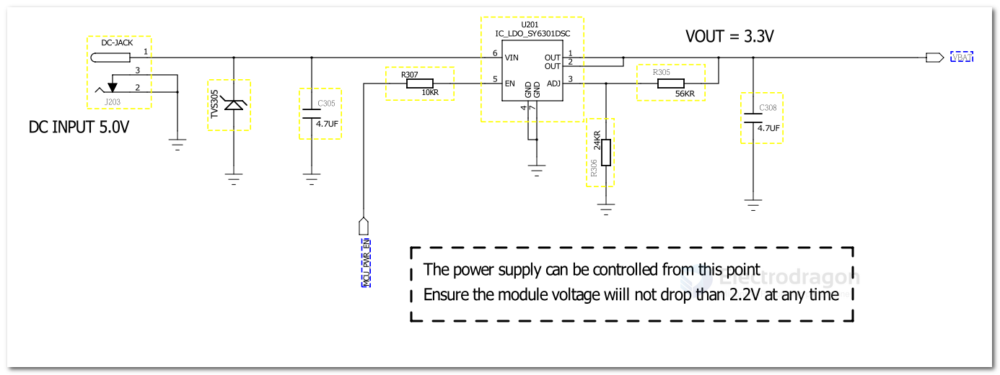
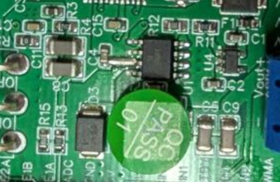

# DCDC-down-dat

- [[dcdc-down]]

- [[MPS-dat]] - [[MP1658-dat]]

- [[TI-power-dat]] - [[TPS54302-dat]]

- [[silergy-dat]]

- [[XL-dat]] - [[XL4015-dat]] - [[XL1509-dat]]

- [[OPM1192-dat]] - [[OPM1152-dat]]

- [[richtek-dat]] - [[RT8279-dat]]

### LM2596 = input 3~40V

- [[OPM1003-dat]] - [[LM2596-dat]] ADJ Display version 

https://www.electrodragon.com/product/lm2596-adj-dc-dc-step-module-high-power-wdisplay/

- [[OPM1026-dat]] - ADJ version 
https://www.electrodragon.com/product/lm2596s-adj-dc-dc-small-tiny-adjustable-step-down-module-3-40vin-1-5-35vout/

- [[6101380-dat]]
https://www.electrodragon.com/product/lm25xx-regulator-2596-2940/

### XL4015 = 37V / 5A 

- [[OPM1171-dat]]
- https://www.electrodragon.com/product/dc-dc-step-down-adj-power-module-xl4015-4-38v-5a-96/

### Option 401

High Efficiency, 1.2MHz, 50V Input, 0.8A Asynchronous Step Down Regulator 

### Option 8201

High Efficiency, Fast Response, 2.0A, 18V Input Synchronous Step Down Regulator 

## template

| chip         | Co.         | Vin       | Ipeak | Inorm | freq | package | cost CNY  |
| ------------ | ----------- | --------- | ----- | ----- | ---- | ------- | --------- |
| TPS5430      |             | 5.5-36V   | 3A    |       |      |         |
| TPS54331     |             | 3.5-28V   | 3A    |       |      | SOP-8   |
| TPS54302 DDCR | [[TI-power-dat]]  | 4.5-28V   | 3A    |       |      | SOT23-6 | 0.98      |
| LM2596S-5.0  |             | 40V       | 3A    |       |      |         |
| TLV62569DBVR |             | 2.5V~5.5V | 2A    |       |      |         |
| TPS5450DDAR  |             | 5.5V~36V  | 5A    |       |      |         |
| TPS54560DDAR |             | 4.5V~60V  |       |       |      |         | 30+: 5.37 |
| XL1509       | [[XL-dat]]  |           |       |       |      |         |
| LM5164DDAR   |             | 6V~100V   |       |       |      |         |
| MP2143       | [[MPS-dat]] | 24V       | 3A    |       |      |         |

TPS 543x 3A、宽输入范围降压转换器

TPS 5430：5.5V 至 36V

TPS 54331 具有 Eco-mode 的 3A、28V 输入、直流/直流降压转换器

TPS 54202 DDCR

TPS 563201 DDCR

MT2492 - 2A,4.5V-16V Input,600kHz Synchronous Step-Down Converter
ME3116AM6G - 最高输入 40V 带载可达 1A 的 DC/DC 降压型稳压器 ME3116

- [[dcdc-down-output-dat]]

## circuits 

## PCB 

[[RT8279-dat]] enlarge output pin 

## ref 

- [[LDO-dat]]
  
- [[XL-dat]] - [[MPS-dat]] - [[silergy-dat]]

- [[dcdc-down]]