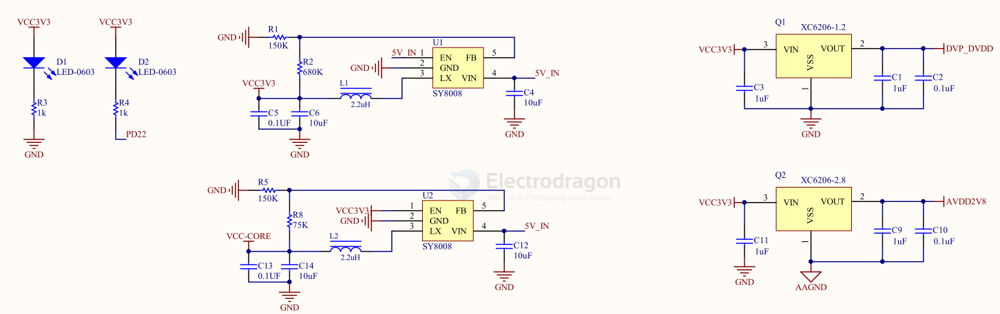

# LDO-dat 

- [[microne-dat]] - [[silergy-dat]] - [[ti-power-dat]]

- [[LDO]]

- [[LDO-2CH-dat]]

- [[LDO-3CH-dat]]

## comparable table 

| chip              | package | VIN |
| ----------------- | ------- | --- |
| [[AMS1117-dat]]   | SOT-89  |     |
| 6211              |         |     |
| SPX3819           |         |     |
| RT9013 / RT9193   |         |     |
| SGM2028 / SGM2019 |         |     |
| MIC5219           |         |     |
| XC6219            |         |     |
| LP2985            |         |     |

- [[LM317-dat]]

CE6260 == 500mA CMOS LDO Regulator, Low Dropout Voltage, Dropout Voltage: 120mV@100mA（3.0V Typ.）, ~200–300mV @ 250mA

[SGM2036 == SGM2036, 300mA, Low Power, and Low Dropout RF Linear Regulator](https://www.sg-micro.com/rect/assets/efa85993-263c-41aa-9274-b488f59f85d5/SGM2036.pdf)

[HM6245 ==1A Low Power LDO, Low voltage drop: 0.06V@100mA](https://dfimg.dfrobot.com/5d57611a3416442fa39bffca/wiki/6f630301d84caf0e92266e3c5cf11edc.PDF)

SC622K == 500mA Low Dropout Regulator, Low voltage drop: 0.1V@100mA

- [[me6206-dat]] - [[microne-dat]]

### SOT23-5

SOT23-5 

| mode   | volt  | current | 1   | 2   | 3   | 4   | 5    |
| ------ | ----- | ------- | --- | --- | --- | --- | ---- |
| XC6204 | 2-10V | 150ma   | VIN | VSS | CE  | NC  | Vout |
| ME6214 | 2-18V | 300ma   | VIN | VSS | CE  | NC  | Vout |

## pins 

| mode            | footprint | 1   | 2    | 3    |
| --------------- | --------- | --- | ---- | ---- |
| [[AMS1117-dat]] | SOT-89    | GND | VOUT | VIN  |
| [[HT7333-dat]]  | SOT-89    | GND | VIN  | VOUT |

## 9742 

## SGM2036 

- VGPS = 2.8V 

## large current 

- [[LM7805-dat]] - [[TI-power-dat]] - [[LM317-dat]]

[LD1086DT33TR](https://www.mouser.com/ProductDetail/STMicroelectronics/LD1086DT33TR?qs=ZqrNm9%252BX9x495avHxGunSw%3D%3D&srsltid=AfmBOoo8TbJZVeh8Kv_urL5uG9JMlbgNaeSaF4P_AzeEG9Svc2ydWkUq) == LDO Voltage Regulators 3.3V 1.5A Positive

## LDO array 

## others 

MC7824BD2TG == Linear Voltage Regulators 24V 1A Positive

Nisshinbo Micro Devices Inc. **NJM78L05UA-TE2** == Fixed Positive Standard Regulator, 5VBIPolar, PSSO3, MINI, PLASTIC, SOT-89, 3 PIN

MIC5365 == High Performance Single 150mA LDO

MIC5528 == Single High Performance 500mA LDO w/ Auto Discharge & Internal Enable Pulldown

TPS == - [[TI-power-dat]]

TPS74401-EP == 3.0-A ULTRA-LDO WITH PROGRAMMABLE SOFT-START

TPS7A89 == Small, Dual, 2-A, Low-Noise (3.8 μVRMS), LDO Voltage Regulator

MC7800, MC7800A, MC7800AE, NCV7800 == Voltage Regulators – Positive 1.0 A

## ref 

- [[DC-dat]]

- [[LDO]]

- [[silergy]]

- [[PCB-design]]