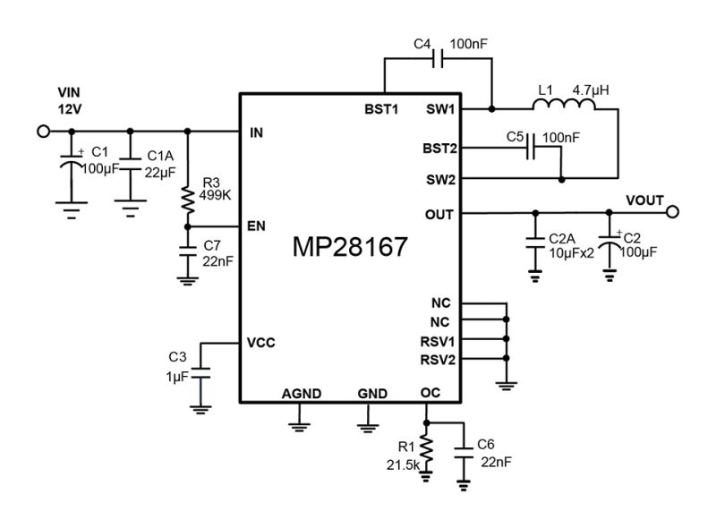

# dcdc-boost-dat 

- [[dcdc-boost]]

legacy wiki page - https://www.electrodragon.com/w/DC-DC_Boost

- [[OPM1117-dat]] - [[OPM1013-dat]] - [[OPM1032-dat]] - [[OPM1089-dat]] - [[OPM1133-dat]] - [[OPM1137-dat]] - [[OPM1175-dat]]

- [[cable-dat]] style - [[PCA1093-dat]] - [[PCA1094-dat]]

- [[type-c-sniffer-dat]] - [[OPM1185-dat]] - [[usb-type-c-dat]]

- [[XL-dat]] - [[dcdc-down-dat]] - [[dcdc-boost-dat]] - [[XL6009-dat]]

- [[OPM1009-dat]] - [[OPM1019-dat]] - [[dcdc-boost-dat]] - [[XL-dat]]

- [[TI-power-dat]] - [[TPS61088-dat]] - [[LM2577-dat]] - [[TI-power-dcdc-boost-dat]]

- [[MT3608-dat]] - [[dcdc-boost-dat]] - [[OPM1089-dat]]

- [[dcdc-boost-dat]] - [[xysemi-dat]]

- LY1038 - https://w.electrodragon.com/w/images/b/b0/LY1038.pdf

high power - [[OPMS080-dat]]

10A 150W == [[OPM1013-dat]]

- [[battery-dat]]

## compare 

| model        | description                                                          | peripherals | type        |
| ------------ | -------------------------------------------------------------------- | ----------- | ----------- |
| TPS61040DBVR | TPS6104x Low-Power DC-DC Boost Converter in SOT-23 and WSON Packages | 7           | .           |
| LT8364       | Low IQ Boost/SEPIC/Inverting Converter with 4A, 60V Switch           | 11          |             |
| [[SX1308-dat]]       | High Efficiency 1.2MHz 2A Step Up Converter 85T                      | 6           |             |
| SDB628       |                                                                      | 6           |             |
| LGS6302      |                                                                      | 6           |             |
| [[FP6277-dat]]       | 500kHz 7A High Efficiency Synchronous PWM Boost Converter            | 7           |             |
| PW5410A      | Output 5V,Regulated Charge Pump DC/Dc Converter                      | 3           | charge pump |

fixed 5V output and little periperals 

| **Chip**       | **Input Voltage** | **Output Voltage** | **Output Current** | **Efficiency** | **External Components** | **Notes**                              |
|-----------------|-------------------|--------------------|--------------------|----------------|--------------------------|----------------------------------------|
| TPS61072   | 0.9V–5.5V         | Fixed 5V           | Up to 400mA        | Up to 90%      | 4 (inductor, 2 caps, diode) | Compact, great for low-current devices |
| MIC2288    | 2.5V–10V          | Fixed 5V           | Up to 1.2A         | Up to 90%      | 3 (inductor, 2 caps)       | Minimal components, fixed 5V version   |
| [[FP6293-dat]]     | 2.5V–5.5V         | Fixed 5V           | Up to 1.5A         | Up to 95%      | 4 (inductor, 2 caps, resistor) | High efficiency, great for portable devices |
| [[ME2108-dat]]     | 2V–6.5V           | Fixed 5V           | Up to 1A           | Up to 90%      | 3 (inductor, 2 caps)       | Simplest, minimal components needed    |

- [[microne-dat]]

- [[richtek-dat]] - [[RT9266-dat]]

- [[FP6291-dat]] - [[FP6293-dat]] - [[Feeling-Technology-dat]]

## MPS 

- [[MP28167-dat]] == 2.8V-22V VIN, 3A IOUT, 4-Switch Integrated Buck-Boost Converter with Fixed 5V Output

- [[MPS-dat]]

- [[MT3608-dat]]

## common application

- [[5V-dat]] to [[12V-dat]] 
- [[5V-dat]] to [[9V-dat]]

## apps 

Applications

- `DIY an output adjustable vehicle power supply`, only need access to your 12V power input, the output voltage can (14-35V)  continuously adjust, but the output voltage can not be lower than the input voltage.
- `Universal on-vehicle laptop power supply`. Input connector on your 12V power supply, the output voltage is adjusted to your laptop to work.
- `Boost charger`, you can use the 12V power supply is higher than 12V battery charging, for example, 24V battery.
- `Power for your electronic devices`, as long as the voltage and current of the voltage regulator to your needs can not exceed the rated current is working properly.
- `Primary front level system power supply`, when you do a project at the time of 10-18V input when the system board and you need to supply 24V and about its great power, with ordinary DC-DC module power is too small , then you choose this module we will be your best choice, do not debug directly on the machine to work, easy to do and efficient power boost.

## ref 

- [[dcdc-boost-dat]]

- [[dcdc-boost]]