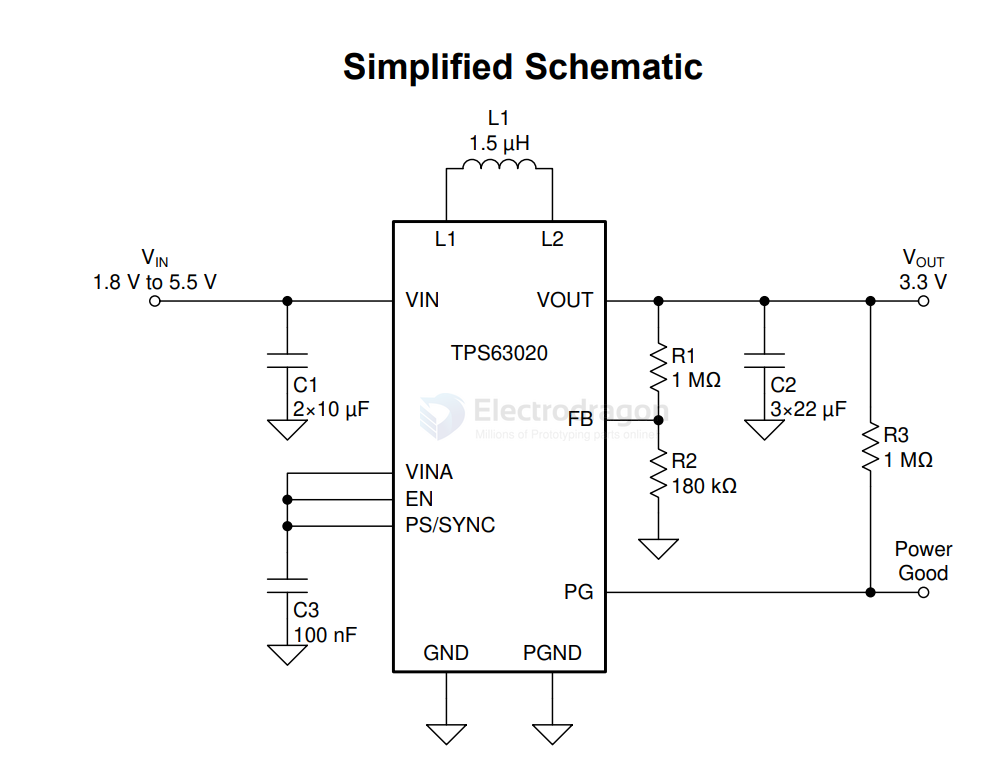

# dcdc-boost-down-dat

- [[charge-pump-dat]] - [[dcdc-boost-down-dat]] - [[power-dat]] - [[constant-current-dat]] - [[CV&CC-dat]]

[TPS63020, TPS63021](https://www.ti.com/lit/ds/symlink/tps63020.pdf)

TPS6302x High Efficiency Single Inductor Buck-boost Converter with 4-A Switches

The TPS6302x devices provide a power supply solution for products powered by either a two-cell or three-cell alkaline, NiCd or NiMH battery, a one-cell Li-ion or Li-polymer battery, supercapacitors or other supply rails. Output currents up to 3 A are supported.

## LTC3780

High Efficiency, Synchronous, 4-Switch Buck-Boost Controller

- [[LTC3780-dat]]

## XL4015

- [[XL4015-dat]]

## ref 

- [[dcdc-boost-down]] - [[dcdc]]