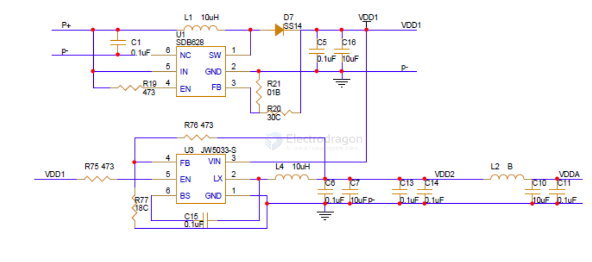
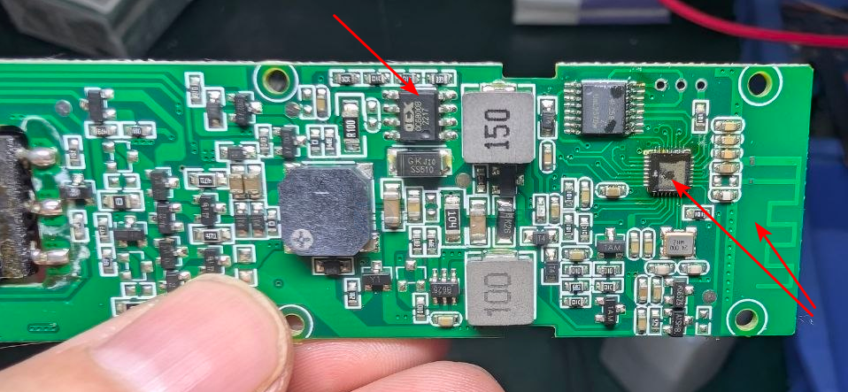
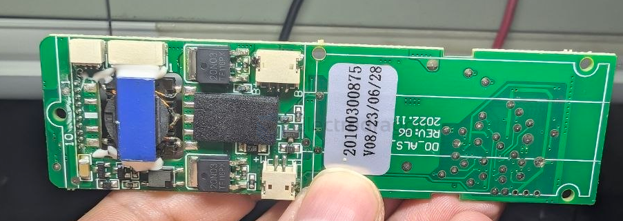

# dcdc-boost-down-dat

- [[charge-pump-dat]] - [[dcdc-boost-down-dat]] - [[power-dat]] - [[constant-current-dat]] - [[CV&CC-dat]] - [[dcdc-dat]] 

- [[TI-power-dcdc-boost-down-dat]] - [[TI-power-dat]] - [[TI-dat]]

## LTC3780

High Efficiency, Synchronous, 4-Switch Buck-Boost Controller

- [[LTC3780-dat]]

## XL4015

- [[XL4015-dat]]

## chip 

- [[AD-power-dat]]

- [[OCX-dat]] - [[OC6800B-dat]] - [[dcdc-boost-down-dat]] == 内置 100V/5A MOS 升压/升降压型 DC-DC 

## combination 

- [[SD628-dat]] - [[DCDC-boost-dat]] - [[JW5033-dat]] - [[joulwatt-dat]] - [[dcdc-down-dat]] - [[dcdc-boost-down-dat]] - [[dcdc-dat]] 

## build 

## ref 

- [[dcdc-boost-down]] - [[dcdc]]