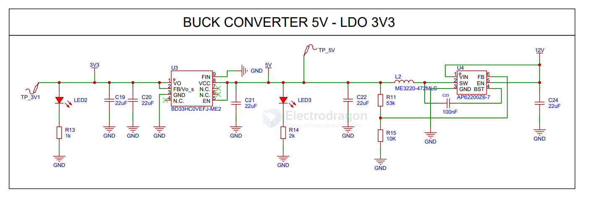

# dcdc-dat 

- [[SD628-dat]] - [[DCDC-boost-dat]] - [[JW5033-dat]] - [[joulwatt-dat]] - [[dcdc-down-dat]] - [[dcdc-boost-down-dat]] - [[dcdc-dat]] 

- [[SMPS-dat]] - [[power-dat]] - [[ACDC-dat]] - [[DCDC-dat]]

- [[dcdc-down-dat]] - [[dcdc-boost-dat]]

- [[ti-power-dat]] - [[silergy-dat]]

- [[dcdc-inverting-regulator-dat]]

- [[charge-pump-dat]] - [[dcdc-boost-down-dat]] - [[power-dat]]

- [[dcdc-boost-down-dat]] - [[SC8906-dat]] - [[southchip-dat]]

# DC-dat

legacy wiki page - https://w.electrodragon.com/w/Category:DC-DC#Schematic

- [[dcdc-dat]] - [[ldo-dat]] - [[dc-voltage-monitor-dat]] - [[voltage-supervisor-dat]]

- [[dcdc-dat]] - [[dcdc-down-dat]] - [[dcdc-boost-dat]] - [[charge-pump-dat]] - [[dcdc-boost-down-dat]]

## chip companies 

- [[murata-dat]] - [[MEJ2-dat]] - [[chip-dat]] - [[dcdc-dat]] 

- [[injoinic-dat]] - [[consonance-dat]] - [[AMS-dat]] - [[microne-dat]] - [[richtek-dat]]

## APP 

- [[power-booster-dat]] - [[power-bank-dat]]

- [[high-voltage-dat]]

## bulk + LDO 

- [[dcdc-down-dat]] - [[LDO-dat]] 

SCH 

## ref 

- [[dcdc]]

