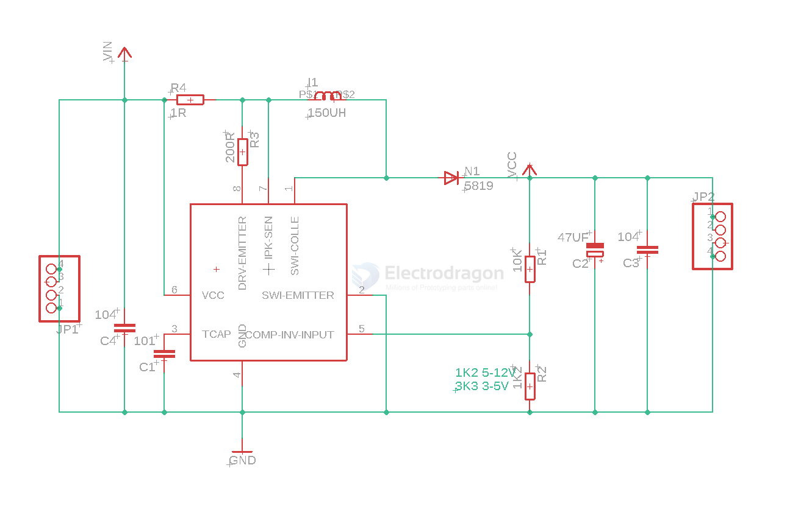

# dcdc-inverting-regulator-dat.md

- [[dcdc-dat]] - [[dcdc-inverting-regulator-dat]]

## MC34063 

MC34063A, MC33063A, SC33063A, NCV33063A - Inverting Regulator - Buck, Boost, Switching 1.5 A

The MC34063A Series is a monolithic control circuit containing the primary functions required for DC−to−DC converters. These devices consist of an internal temperature compensated reference, comparator, controlled duty cycle oscillator with an active current limit circuit, driver and high current output switch. This series was specifically designed to be incorporated in Step−Down and Step−Up and Voltage−Inverting applications with a minimum number of external components. Refer to Application Notes AN920A/D and AN954/D for additional design information.

## ref 

