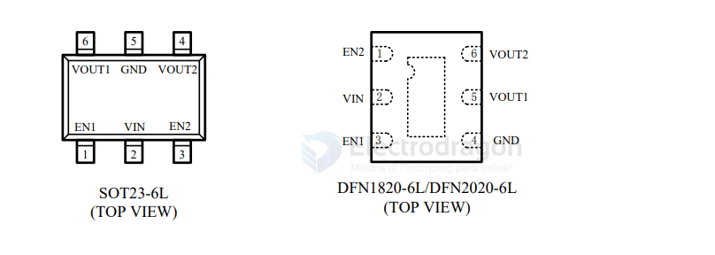
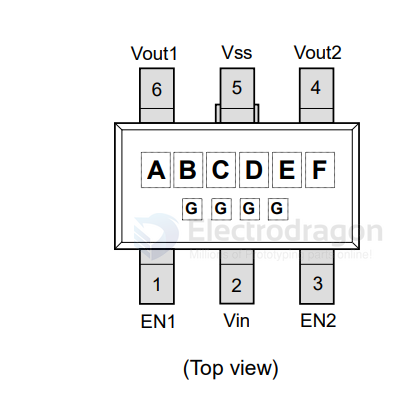
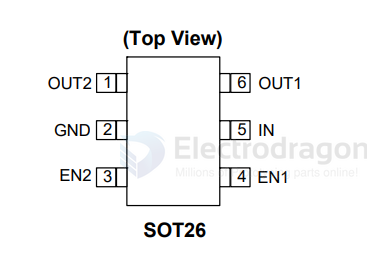
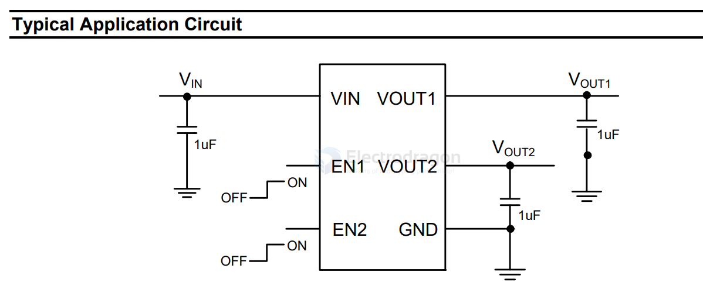
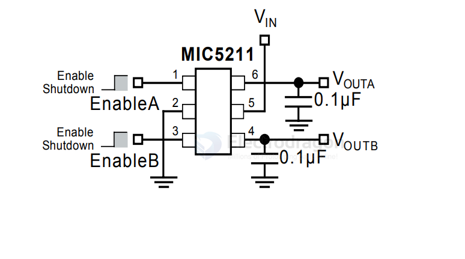
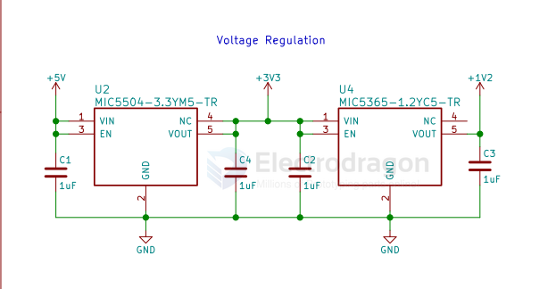

# LDO-2CH-dat

- [[RT9011-dat]] - [[RT9013-dat]] - [[RT9193-dat]] - [[richtek-dat]] - [[RT9266-dat]] - [[RT8279-dat]] - [[LDO-2CH-dat]]

- [[AP7312-dat]] == 150mA - [[diodes-dat]] - [[LDO-2CH-dat]] - [[AP7332-dat]] == 300mA

- [[anasemi-dat]] - [[VRD1828-dat]] - [[VRD1818-dat]]

- [[micrel-dat]] - [[MIC5211-dat]]

- [[Torex-dat]] - [[XC6415-dat]] 

Dual LDO Regulator with ON/OFF Switch

- [[netlinear-dat]] - [[LN6401-dat]] 

双 300mA 高速低压差 CMOS 电压稳压器

## LN6401

## VRD1828

## AP7312 

DUAL 150mA LOW QUIESCENT CURRENT FAST
TRANSIENT LOW DROPOUT LINEAR REGULATOR

## XC6206 

- [[XC6206-dat]]

## XC6206 SCH 1 

## ME6206 

## MIC5211

Dual µCap 80mA LDO Regulator

## MIC5504 + MIC6365 

- [[MIC5504-dat]] - [[MIC6365-dat]] - [[LDO-dat]] - [[LDO-2CH-dat]]

## VDD and VDD_A 

- [[camera-DVP-dat]] - [[STM32-dat]] - [[LDO-2ch-dat]]

## ref 

- [[LDO-2CH]]