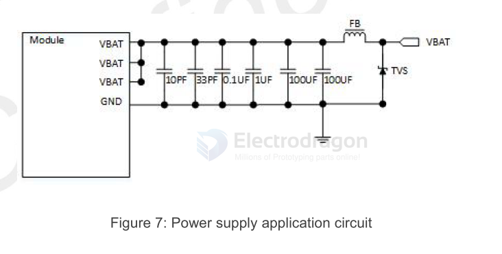
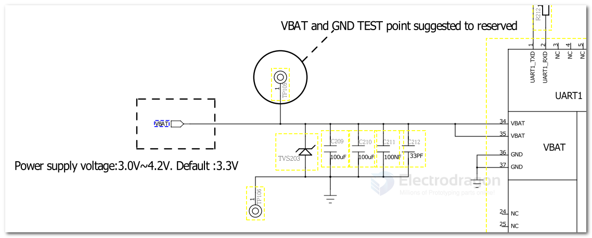

# VBAT-dat 

- [[circuits-dat]] - [[VIN-dat]] - [[VBUS-dat]] - [[VBAT-dat]] - [[power-dat]] - [[Vref-dat]] - [[voltage-dat]]

- [[VIN-dat]] - [[VBUS-dat]] - [[VBAT-dat]] - [[power-dat]] - [[HDK-dat]]

## VBAT 2A 

In the user's design, special attention must be paid to the design of the power supply. If the voltage drops
below `3.4V`, the RF performance of the module will be affected, the module will shut down if the voltage is
too low. It is recommended to select an LDO or DC-DC chip with an enable pin, and the enable pin is
controlled by the MCU.

When the power supply can provide a peak current of `2A`, the total capacity of the external power
supply capacitance is recommended to be no less than `300uf`. If the peak current of `2A` cannot be
provided, the total capacity of the external capacitance is recommended to be no less than `600uf` to
ensure that the voltage drop on the Vbat pin at any time is `not more than 300mV`.

It is recommended to place four 33PF/10PF/0.1UF/1UF ceramic capacitors near Vbat to improve RF
performance and system stability. At the same time, it is recommended that the Vbat layout routing width
from the power supply on the PCB to the module be at least 3mm. Reference design recommendations are
as follows:

If the Vbat input contains high-frequency interference, it is recommended to add magnetic beads for filtering.
The recommended types of magnetic beads are BLM21PG300SN1D and MPZ2012S221A.

In addition, in order to prevent the damage of A7672X/A7670X caused by surge and overvoltage, it is
recommended to parallel one TVS on the Vbat pin of the module.

- 1 JCET ESDBW5V0A1 5V DFN1006-2L
- 2 WAYON WS05DPF-B 5V DFN1006-2L
- 3 WILL ESD5611N 5V DFN1006-2L
- 4 WILL ESD56151W05 5V SOD-323

## NBIOT 

- [[NBIOT-dat]] - [[M2M-dat]] - [[M2M-HDK-dat]] - [[M2M-HDK-ref-dat]] - [[M2M-HDK-debug-dat]] 

- 100uf *2 
- 100nf 
- 33pf 

## ref 

