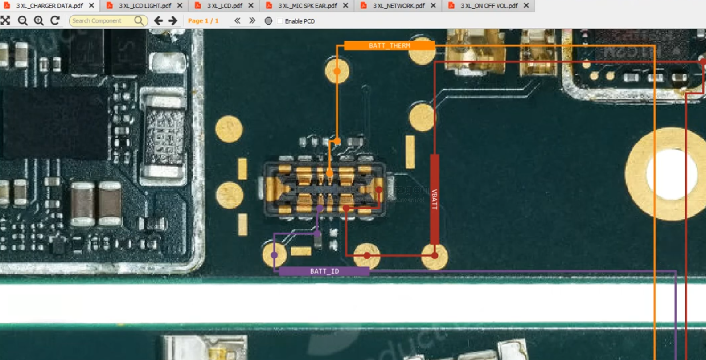

# battery-smartphone-dat.md

- [[bq27541-dat]] - [[ti-power-dat]]

## integrated battery 

- [[pixel-3xl-dat]] - [[phone-pixel-dat]]

battery pins 

| Pin | Name         | Function                                                                                   |
|-----|--------------|--------------------------------------------------------------------------------------------|
| AL  | Alarm/Alert/Allow | Used for signaling battery status (faults, over-temp, etc.) or enabling/disabling battery functions. |
| TH  | Thermistor/Temperature | Connects to a thermistor for monitoring battery temperature, ensuring safe charging/discharging. |
| SC  | Sense/Serial Clock | Used for voltage/current sensing or as a clock line in communication protocols (e.g., I²C/SMBus).   |
| SD  | Serial Data/Shutdown | Used for data communication (I²C/SMBus data line) or to control battery shutdown.                  |
| ID  | Identification | Identifies battery type/capacity via resistor or chip, ensuring device compatibility and correct charging. |
[[phone-pixel-dat]]
These pins are typical in smart/integrated batteries, supporting safety, communication, and identification features.

- [[pixel-phone-dat]]

### How to Bypass Battery Pins

| Pin | Bypass Method | Notes / Risks |
|-----|--------------|---------------|
| AL  | Connect to ground or Vcc | Disables protection; may allow battery operation but removes fault detection. |
| TH  | Replace with fixed resistor (10kΩ–100kΩ) | Simulates safe temperature; disables thermal protection. |
| SC  | Connect to main battery terminal or leave open | Sensing/communication features lost. |
| SD  | Tie to ground or Vcc | Keeps battery enabled; disables smart/shutdown features. |
| ID  | Add resistor (e.g., 10kΩ) to ground or Vcc | Mimics correct battery type; may affect charging safety. |

> ⚠️ Bypassing disables safety features and can be dangerous. Use only for testing, not

## phone battery connector 

Replacement Battery FPC Connector (On the Flex Cable) for Google Pixel 3 / 3XL / 4 / 4XL / 5 / 5XL / LG G7 

## ref 

- [[battery-app-dat]]