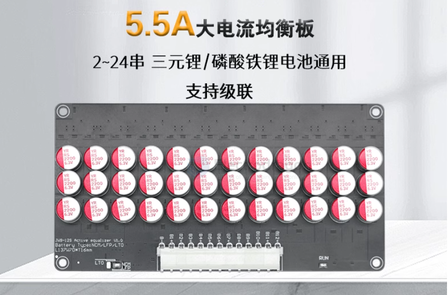

# active-BMS-dat

# active-battery-balancing-board-dat

An **active battery balancing board** for lithium batteries ensures that all cells in a battery pack maintain the same voltage level during charging and discharging. It actively redistributes energy between cells, transferring charge from higher-voltage cells to lower-voltage ones. This helps:

- **Improve Battery Life**: Prevents overcharging or over-discharging of individual cells, reducing wear and extending the overall lifespan of the battery pack.
- **Enhance Performance**: Ensures consistent voltage across cells, improving the efficiency and reliability of the battery.
- **Increase Safety**: Reduces the risk of overheating, overcharging, or cell failure due to imbalances.
- **Optimize Capacity**: Maximizes the usable capacity of the battery pack by ensuring all cells are equally charged.

This is especially important in applications like electric vehicles, power tools, and energy storage systems.

## capacitive type active BMS 

- 电容式主动均衡板
- 修电池组压差·
- 恢复电池组容量·
- 延长电池组寿命
- 24小时不间断·
- 自动启动·
- 整体均衡

## ref 

- [[BMS-dat]]