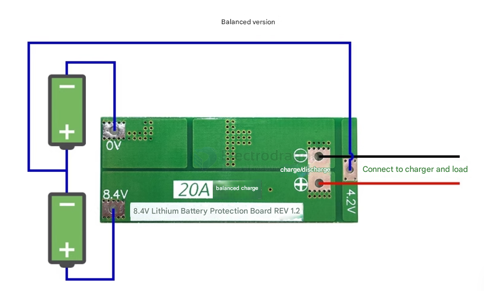
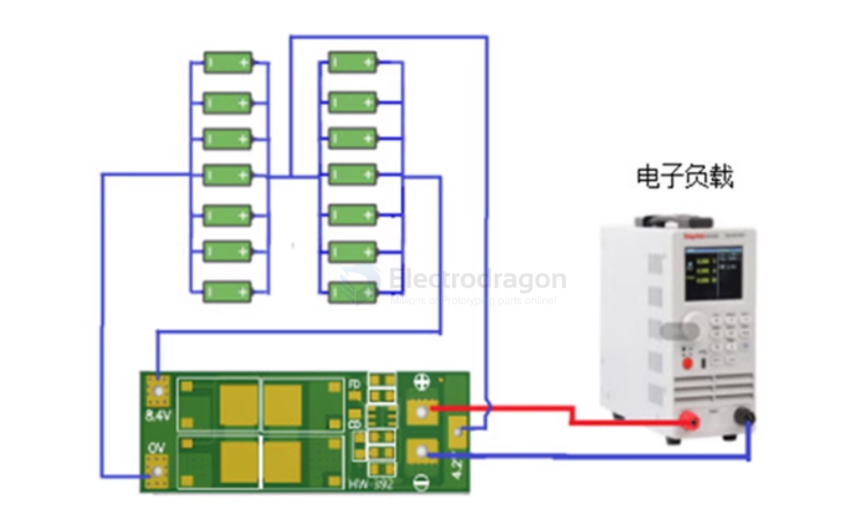
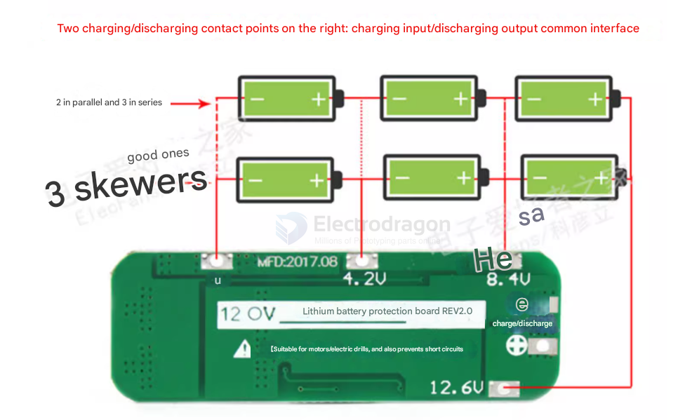

# active-BMS-dat

# active-battery-balancing-board-dat

An **active battery balancing board** for lithium batteries ensures that all cells in a battery pack maintain the same voltage level during charging and discharging. It actively redistributes energy between cells, transferring charge from higher-voltage cells to lower-voltage ones. This helps:

- **Improve Battery Life**: Prevents overcharging or over-discharging of individual cells, reducing wear and extending the overall lifespan of the battery pack.
- **Enhance Performance**: Ensures consistent voltage across cells, improving the efficiency and reliability of the battery.
- **Increase Safety**: Reduces the risk of overheating, overcharging, or cell failure due to imbalances.
- **Optimize Capacity**: Maximizes the usable capacity of the battery pack by ensuring all cells are equally charged.

This is especially important in applications like electric vehicles, power tools, and energy storage systems.

## capacitive type active BMS 

- 电容式主动均衡板
- 修电池组压差·
- 恢复电池组容量·
- 延长电池组寿命
- 24小时不间断·
- 自动启动·
- 整体均衡

## basic active charger 

### 2S version 

The diagram below shows the module discharge. The battery is a 2-series configuration, and the connected batteries must support a 20A discharge current. This can be achieved by connecting batteries in parallel or by purchasing batteries with a higher discharge current. 

For example, if the battery is 2000mAh with a 10C discharge rate, then only 2 series and 2 parallel (2S2P) are needed, which can provide a discharge current of 40A. 

For stable discharge, 2 series and 4 parallel (2S4P) are required, and attention should be paid to heat dissipation, as the battery power will drop quickly during discharge.

- To successfully start an electric drill, you need two 10C-20C power batteries, or four 5C-10C power batteries (recommended battery models: Sony VTC4S, VTC4A, VTC5, VTC6). For the 0V and 8.4V connection wires, use copper wires of at least 2 square millimeters (do not use strips).
- When welding the battery for the first time, you need to charge it first to get output. Strictly follow the diagram to connect 0V, 4.2V, and 8.4V. When welding wires, do not touch any components on the board, and do not intentionally short-circuit.
- When welding the battery for the first time or while charging, as long as any single cell exceeds 4.2V, the "430" resistor will heat up to discharge (discharge stops when it drops to about 4.19V). If the "430" resistor becomes very hot (too hot to touch), please check if the wiring is incorrect.

#### 故障处理：

| Fault Phenomenon         | Fault Check & Cause                                                                                   |
|--------------------------|------------------------------------------------------------------------------------------------------|
| Cannot charge            | Measure the voltage of 3 battery groups. If any group exceeds about 4.25V, the protection board triggers overcharge protection. |
| Cannot discharge         | Measure the voltage of 4 battery groups. If any group drops below about 2.5V, the protection board triggers over-discharge protection. |
| Charging/discharging fails | OV, 4.2V, 8.4V wires are connected incorrectly.                                                     |
| Overcharge/over-discharge fails | OV, 4.2V, 8.4V wires are connected incorrectly.                                                |
| Discharge protection     | Check if the battery pack has sufficient discharge capability.                                       |
| Cold solder joint        | Check if the load's starting current exceeds the protection board's overcurrent protection current.  |
| Solder bridge            | One pin of a component is not connected to the PCB pad, or two or more pins are shorted together.    |
| ESD breakdown A          | When powered off, measure MOSFET G, D, S pins. If the forward and reverse resistance between any two pins is 0Ω, it is broken down. |
| ESD breakdown B          | Remove the MOSFET and measure resistance between G-D and G-S. If resistance exists, it is broken down. Normally, resistance should be

### 3S version 

note 

1. Strictly follow the diagram to connect 0V, 4.2V, 8.4V, and 12.6V. Be careful to check for short circuits.
2. When connecting 3 battery groups in series, make sure each group has the same voltage. If not, fully charge each group separately before connecting them in series. During discharge testing, the group whose voltage drops quickly is the bad battery—replace it with a good one.
3. Never mix good and bad batteries together, and do not mix new and old batteries.
4. To successfully start an electric drill, you need three 15C-20C power batteries, or six 10C-15C power batteries (ordinary 18650 batteries cannot start an electric drill!!!).
5. For loads with brushed motors, you must connect a non-polarized capacitor (rated voltage above 25V, capacity 10uF-100uF) in parallel at the motor's positive and negative terminals to prevent reverse voltage spikes from the motor from interfering with the protection board or

## ref 

- [[BMS-dat]]