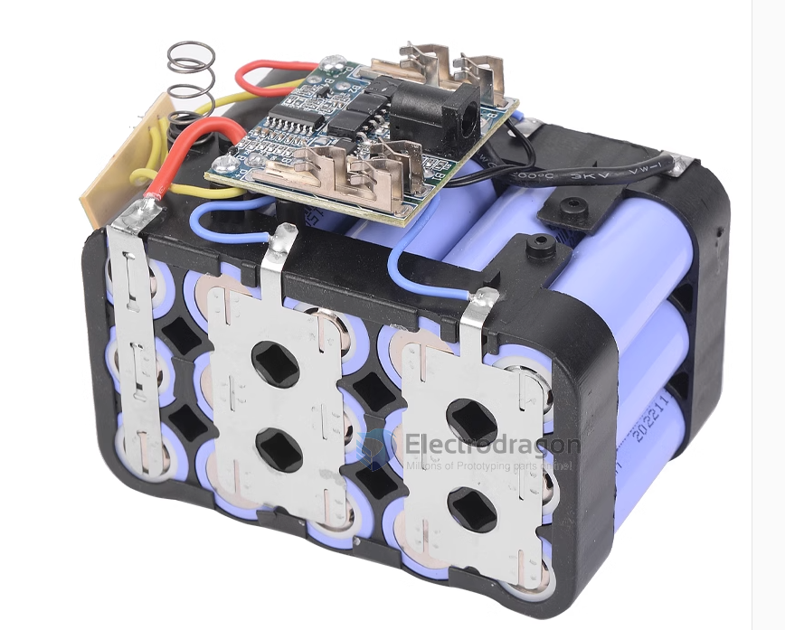
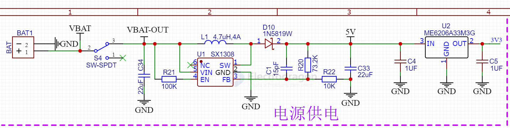
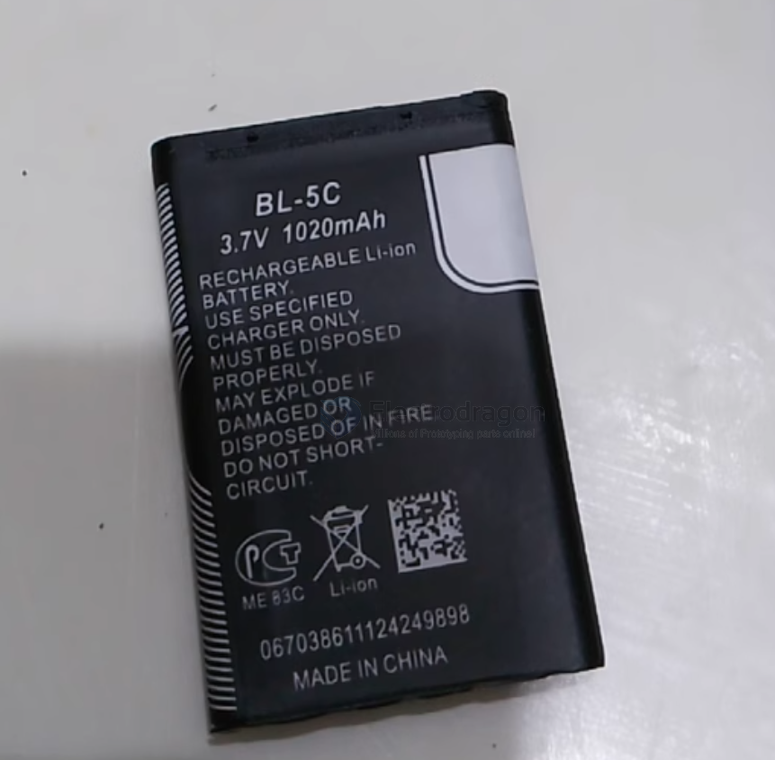

# battery-dat 

- [[BMS-dat]]

- [[battery-rechargerable-dat]] - [[li-battery-dat]] - [[lead-acid-battery-dat]] - [[LFP-dat]]

- [[battery-pack-dat]] - [[battery-holder-dat]]

- [[battery-charger-dat]] - [[2S-lithium-battery-charger-dat]]

- [[battery-alkaline-dat]] - [[battery-9V-dat]]

- [[battery-soldering-dat]] - [[battery-tester-dat]]

- [[battery-discharge-dat]]

- [[spot-welding-dat]]

- [[battery-supply-dat]]

## coin battery dat 

CR2030 provides up to 3V 210~225 mAh, and CR1220 provides up to 3V 38mAh power.

Both button cells provide very low discharge rate that can work for 1-3 years.

## 🔋 Battery Specifications

| Specification                 | Description                                                           | Example / Notes                            |
| ----------------------------- | --------------------------------------------------------------------- | ------------------------------------------ |
| **Nominal Voltage (V)**       | Average voltage during discharge                                      | 3.7V (Li-ion), 1.2V (NiMH)                 |
| **Capacity (mAh or Ah)**      | Amount of charge the battery holds                                    | 2200mAh = 2.2A for 1 hour                  |
| **Discharge Rate (C-Rating)** | Multiplier of capacity for safe discharge rate                        | 10C = 10 × Capacity (e.g. 10A for 1000mAh) |
| **Burst Discharge Rate**      | Max short-duration current                                            | 20C = 20 × Capacity                        |
| **Max Continuous Discharge**  | Maximum current battery can supply continuously                       | Capacity × C-rating                        |
| **Internal Resistance (mΩ)**  | Resistance inside the cell (lower is better)                          | 5–50 mΩ                                    |
| **Charge Rate (C or A)**      | Max safe charging current                                             | 1C for 2200mAh = 2.2A                      |
| **Cycle Life**                | Number of charge/discharge cycles before capacity drops (e.g. to 80%) | 300–1000 cycles                            |
| **Cutoff Voltage**            | Minimum safe voltage during discharge                                 | 3.0V (Li-ion)                              |
| **Max Charge Voltage**        | Voltage at full charge                                                | 4.2V per cell (Li-ion)                     |
| **Temperature Range (°C)**    | Safe operating/charging temperature range                             | -20°C to 60°C (discharge), 0–45°C (charge) |

## Power battery 

## compare 

| **Battery Type** | **Size**       | **Voltage** | **Capacity**  | **Current Capability**                    | **Typical Use**              | **Features**                                      |
| ---------------- | -------------- | ----------- | ------------- | ----------------------------------------- | ---------------------------- | ------------------------------------------------- |
| **AA Alkaline**  | 14.5 x 50.5 mm | 1.5V        | 2000-3000 mAh | Up to 700-1000 mA                         | Medium to high power devices | High capacity, suitable for long runtime          |
| **CR2032**       | 20 x 3.2 mm    | 3V          | 200 mAh       | ~0.2-3 mA (sustained), up to 10 mA (peak) | Low-power devices            | Compact, suitable for low-power applications      |
| **CR2025**       | 20 x 2.5 mm    | 3V          | 150 mAh       | ~0.2-2 mA (sustained), up to 10 mA (peak) | Low-power devices            | Slightly lower capacity than CR2032               |
| **LR44**         | 11.6 x 5.4 mm  | 1.5V        | 110-130 mAh   | ~1-10 mA (sustained)                      | Small low-power devices      | Small size, lower voltage, and capacity           |
| **CR1220**       | 12 x 2.0 mm    | 3V          | 35-40 mAh     | ~0.1-1 mA (sustained), up to 5 mA (peak)  | Small electronics, key fobs  | Very small and thin for low-power devices         |
| **CR1632**       | 16 x 3.2 mm    | 3V          | 120 mAh       | ~0.2-2 mA (sustained), up to 10 mA (peak) | Watches, calculators         | Slightly thicker, offers more capacity            |
| **SR621SW**      | 6.8 x 2.1 mm   | 1.55V       | 17-20 mAh     | ~0.1-1 mA                                 | Watches, small calculators   | Stable voltage, long-lasting in low-drain devices |
| **LR927**        | 9.5 x 2.7 mm   | 1.5V        | 30-45 mAh     | ~0.5-3 mA                                 | Laser pointers, small toys   | Small, used in low-power gadgets                  |

## AA vs. AAA 

| **Feature**            | **AA Battery**                                                            | **AAA Battery**                                                           |
| ---------------------- | ------------------------------------------------------------------------- | ------------------------------------------------------------------------- |
| **Size**               | 14.5 mm (diameter) x 50.5 mm (length)                                     | 10.5 mm (diameter) x 44.5 mm (length)                                     |
| **Voltage**            | 1.5V (Alkaline) / 1.2V (Rechargeable NiMH)                                | 1.5V (Alkaline) / 1.2V (Rechargeable NiMH)                                |
| **Capacity**           | 2000-3000 mAh (Alkaline)                                                  | 600-1200 mAh (Alkaline)                                                   |
| **Current Capability** | 700-1000 mA sustained                                                     | 300-500 mA sustained                                                      |
| **Typical Use**        | Medium to high-power devices: flashlights, toys, wireless mice, clocks    | Low-power devices: remote controls, small toys, wireless keyboards        |
| **Weight**             | Approx. 23 g (Alkaline)                                                   | Approx. 11.5 g (Alkaline)                                                 |
| **Cost**               | Generally slightly more expensive per battery                             | Slightly less expensive per battery                                       |
| **Energy Density**     | Higher capacity and energy per unit                                       | Lower capacity due to smaller size                                        |
| **Runtime**            | Longer due to higher capacity                                             | Shorter due to lower capacity                                             |
| **Features**           | Ideal for devices that require more power and have higher current demands | Ideal for smaller devices that require less power and a more compact size |

### Key Differences:

Size: AA batteries are larger than AAA batteries, both in diameter and length. This difference in size translates to a larger energy storage capacity for AA batteries.

Capacity: AA batteries typically have 2-3 times the capacity of AAA batteries. This means AA batteries will last longer in devices that use the same amount of power.

Current Capability: AA batteries can deliver higher currents (700-1000 mA), making them better suited for devices that need more power, such as flashlights, toys, and certain electronics. AAA batteries, due to their smaller size, typically provide lower current (300-500 mA), which is suitable for low-power devices like remote controls and wireless keyboards.

Weight: AA batteries are about twice as heavy as AAA batteries due to their larger size and greater energy storage.

Usage: Devices that require more energy or have higher power consumption tend to use AA batteries, while devices that prioritize size and weight, like remotes and small electronics, often use AAA batteries.

## battery stable circuit 

- [[SX1308-dat]] - [[ME6206-dat]]

## BL-5C nokia battery 

## ref 

- [[current-dat]] - [[voltage-dat]]

- [[battery]] - [[l76-dat]] - [[super-cap-dat]]

- [[XH-414H]] - [[ohm-dat]]