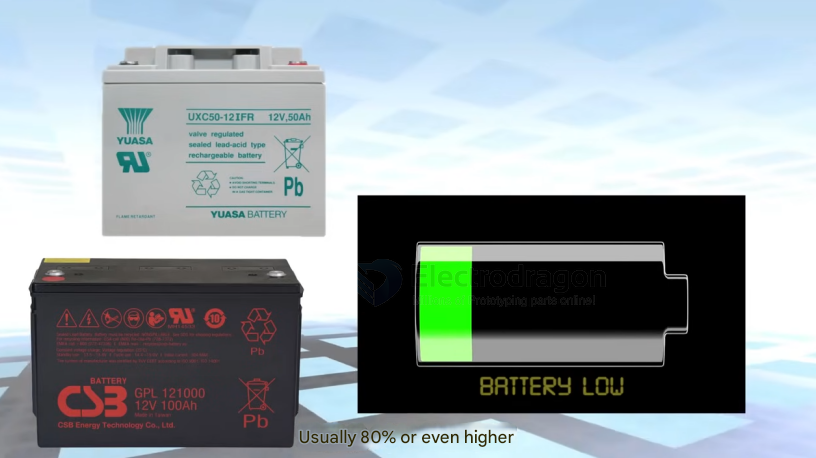
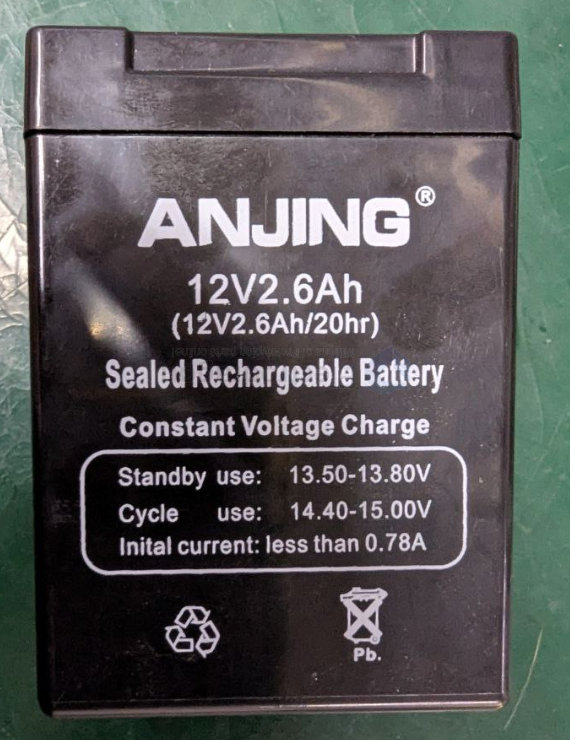

# Lead-acid-battery-dat

Batteries store the energy produced by your solar panels for later use.

##  Types:

### General Lead-Acid Batteries:
 
Common in automotive applications. They are relatively inexpensive and the technology is mature. However, they are heavy, have a shorter lifespan (approx. 3 years), require maintenance, and are not suitable for frequent deep discharge (recommended depth of discharge is ~20%).

### Deep Cycle Lead-Acid Batteries:

Designed for deep discharge (up to 80% or more) without significantly affecting lifespan. They have thicker plates and durable materials, making them well-suited for solar power systems, electric vehicles, and campers requiring continuous, stable power.
 

**Capacity:** Measured in Amp-hours (Ah). A 12V 100Ah battery stores 12V * 100Ah = 1200 Watt-hours (Wh) of energy.

## lead-acid-battery-dat

- LAB: Lead-Acid Battery
- 蓄电池 (xù diàn chí) is the Chinese term for "rechargeable battery." It is a type of electrical battery that can be recharged multiple times. It is commonly used in various electronic devices such as mobile phones, laptops, electric vehicles, and many other portable devices.

- Here are some links where you can find more information about 蓄电池:

- Wikipedia: Rechargeable Battery - https://zh.wikipedia.org/wiki/%E8%93%84%E7%94%B5%E6%B1%A0
- China Battery Industry Association - http://www.cbia.com.cn/
- Battery University: Rechargeable Batteries - https://batteryuniversity.com/learn/article/types_of_rechargeable_batteries

## voltage 

- 12V == [[solar-power-dat]]
- 72V == [[motor-dat]]

## LAB Example 

*   **Brand:** ANJING
*   **Type:** Sealed Rechargeable Battery (Likely SLA/VRLA) Sealed Lead-Acid (a specific type, but often used generally)
*   **Nominal Voltage:** 12V
*   **Capacity:** 2.6Ah (Rated at 20-hour discharge rate - 12V 2.6Ah/20hr)
    *   This implies a discharge current of 0.13A (2.6Ah / 20h) for 20 hours.
*   **Charging Method:** Constant Voltage Charge
    *   **Standby Use (Float):** 13.50V - 13.80V
    *   **Cycle Use:** 14.40V - 15.00V
    *   **Initial Charging Current:** Less than 0.78A (0.3C)
*   **Chemistry:** Lead-acid (Pb symbol present)
*   **Markings:**
    *   Recycling symbol
    *   Do not dispose symbol (crossed-out bin)

As noted on the battery (12V2.6Ah/20hr), this specific 2.6Ah rating was determined using a 20-hour discharge period. This means it was likely discharged at a current of 0.13A (2.6Ah / 20h = 0.13A) for 20 hours.

### Estimated Runtime Calculation

This calculation estimates how long the ANJING 12V 2.6Ah battery can power a 5V 1A load using a DC-DC converter.

**1. Calculate Load Power:**
   - Load Voltage (V_load) = 5V
   - Load Current (I_load) = 1A
   - Load Power (P_load) = V_load × I_load = 5V × 1A = 5 Watts

**2. Account for DC-DC Converter Efficiency:**
   - Assume a typical converter efficiency (η) = 85% (or 0.85). Real-world efficiency may vary.
   - Power drawn from the battery (P_batt) = P_load / η
   - P_batt = 5W / 0.85 ≈ 5.88 Watts

**3. Calculate Current Drawn from Battery:**
   - Battery Nominal Voltage (V_batt) = 12V
   - Current drawn from battery (I_batt) = P_batt / V_batt
   - I_batt = 5.88W / 12V ≈ 0.49 Amps

**4. Compare to Rated Discharge:**
   - The battery's capacity (2.6Ah) is rated for a 20-hour discharge (as noted in the file: `12V2.6Ah/20hr`).
   - Rated Discharge Current (I_rated) = 2.6Ah / 20h = 0.13 Amps
   - The calculated draw (0.49A) is significantly higher than the rated discharge current (0.13A).

**5. Calculate Ideal Runtime (Ignoring Peukert's Effect):**
   - Battery Capacity (C) = 2.6Ah
   - Ideal Runtime (T_ideal) = C / I_batt
   - T_ideal = 2.6Ah / 0.49A ≈ 5.3 hours

**6. Consider Peukert's Effect:**
   - Lead-acid batteries deliver less total capacity when discharged at rates higher than their rating (Peukert's Law).
   - Since 0.49A is much higher than the 0.13A rating, the *effective* capacity will be lower than 2.6Ah.

**Conclusion:**

The **ideal calculated runtime is approximately 5.3 hours**. However, due to the higher discharge current (0.49A vs. the 0.13A rating), the actual runtime will be **noticeably less than 5.3 hours**. The exact reduction depends on the specific Peukert exponent of this battery model, which is not provided.

## app 

- [[power-storage-dat]]

## ref 

- [[Lead-acid-battery]]