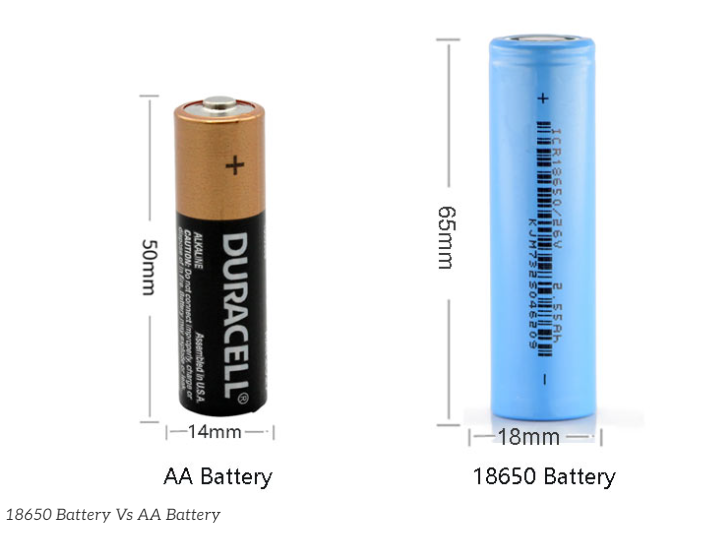

# 18650

18mm x 65mm

- [[18650-battery-holder-dat]]

## discharge current 

### 🔧 Typical Discharge Ratings by Category

| **Category**             | **Examples**            | **Max Continuous Discharge** | **Notes**                                 |
|--------------------------|--------------------------|-------------------------------|-------------------------------------------|
| **Standard Energy Cells** | Panasonic NCR18650B     | 2A–3A                         | High capacity (up to 3400mAh), low drain  |
|                          | LG MJ1, Samsung 35E      | 5A                            | Up to ~3500mAh                            |
| **Balanced Cells**        | Samsung 30Q, LG HG2      | 10A–15A                       | Good mix of capacity (3000mAh) and power  |
| **High-Drain Cells**      | Sony VTC6, Molicel P26A  | 20A                           | Often 2600–3000mAh                        |
| **Extreme High-Drain**    | Sony VTC5A, Molicel P28A | 25A–30A                       | Used in power tools, e-skates, vaping     |

---

### 📌 Notes

- **Pulse current** (short bursts) may be 1.5–2× the continuous rating.
- Always check **manufacturer datasheet** for:
  - Continuous discharge current
  - Pulse current (duration & cooldown)
  - Required cooling
- Actual safe discharge also depends on:
  - Temperature
  - Battery aging
  - Internal resistance

---

### ⚠️ Warning

Using a cell above its rated discharge current may:
- Cause overheating or thermal runaway
- Reduce lifespan drastically
- Trigger BMS protection or cause fire risk

---

### ✅ Recommended Use

| **Application**       | **Recommended Cell Type**      |
|-----------------------|---------------------------------|
| Flashlights, DIY packs | Standard or balanced (5A–10A)  |
| E-bikes, e-scooters    | High-drain (15A–30A)           |
| Power tools, drones    | High to extreme high-drain     |

## 14500 vs 18650 vs 21700 batteries

| Feature                      | AA Size Lithium (14500)    | 18650 Lithium-Ion           | 21700 Lithium-Ion         |
| ---------------------------- | -------------------------- | --------------------------- | ------------------------- |
| **Typical Size (mm)**        | 14 x 50                    | 18 x 65                     | 21 x 70                   |
| **Nominal Voltage**          | 3.7V                       | 3.6V – 3.7V                 | 3.6V – 3.7V               |
| **Capacity Range**           | 500 – 800 mAh              | 1800 – 3500 mAh             | 4000 – 5000+ mAh          |
| **Max Continuous Discharge** | 1 – 3A                     | 5 – 20A                     | 10 – 35A                  |
| **Common C-Rate**            | 1C – 3C                    | 1C – 10C                    | 1C – 10C+                 |
| **Rechargeable**             | Yes                        | Yes                         | Yes                       |
| **Common Use Cases**         | Small flashlights, sensors | Laptops, power tools, vapes | EVs, e-bikes, power tools |
| **Weight (approx.)**         | ~20g                       | ~45g                        | ~70g                      |
| **Energy Density**           | Low – Medium               | Medium                      | High                      |

## **18650 Battery Types**

| **Type**                          | **Main Composition**                             | **Features**                                     | **Applications**                        |
| --------------------------------- | ------------------------------------------------ | ------------------------------------------------ | --------------------------------------- |
| **NCM/NCA**                       | Nickel-Cobalt-Manganese / Nickel-Cobalt-Aluminum | High energy density, medium safety               | EVs (Tesla Model S/X), laptop batteries |
| **LFP (Lithium Iron Phosphate)**  | Lithium Iron Phosphate                           | Long lifespan, high safety, lower energy density | Energy storage, power tools, e-bikes    |
| **LCO (Lithium Cobalt Oxide)**    | Lithium Cobalt Oxide                             | High energy density, shorter lifespan            | Laptops, battery packs                  |
| **IMR (Lithium Manganese Oxide)** | Lithium Manganese Oxide                          | High discharge rate, heat resistance             | High-power flashlights, vaping devices  |

---

## **18650 vs. 21700 Batteries**
| **Model** | **Size**   | **Energy Density** | **Common Uses**                 |
| --------- | ---------- | ------------------ | ------------------------------- |
| **18650** | 18 × 65 mm | 2000 – 3500mAh     | Laptops, EVs, tools             |
| **21700** | 21 × 70 mm | 4000 – 5000mAh     | Tesla batteries, energy storage |

Tesla originally used **18650 batteries** in **Model S/X** but later switched to **21700** for **Model 3/Y** and is now moving towards **4680** cells for higher efficiency.

The 18650 battery should fall under the Lithium-ion Battery category, as it is a specific form factor of the lithium-ion battery, commonly used in applications such as laptops, power tools, flashlights, and electric vehicles.

## safety concern 

After 30 years of development, the preparation process of 18650 battery has been very mature. In addition to the great improvement in performance, its safety is also perfect. 

To prevent the metal casing from exploding, the battery is now fitted with a safety valve at the top. The safety valve is now a standard part of every 18650 Li-ion battery and is the most important barrier. When the pressure inside the cell becomes too high, the top safety valve opens to vent and depressurize, preventing an explosion. 

However, when the safety valve is open, chemicals leaking from inside the battery can react with oxygen in the air at high temperatures and still cause a fire. 

In addition, most 18650 batteries now also come with their own protection panel with overcharge and overdischarge and short circuit protection, which has high safety performance.

- [[battery-protection-dat]]

## CID safety 

The CID (Current Interrupt Device) in an 18650 battery is a safety feature designed to prevent overheating and potential hazards. If the internal pressure of the battery gets too high (usually due to overcharging or overheating), the CID disconnects the circuit, stopping the current flow to prevent a dangerous situation, such as thermal runaway or explosion.

Each manufacturer might have slightly different specifications, but the CID is a common safety component in lithium-ion batteries, especially in high-capacity cells like the 18650.

### CID reset trick 

- https://www.youtube.com/watch?v=IhUtKvCV6fs&ab_channel=WalamusPrime

### 🔒 What is CID Safety for 18650 Batteries?

#### What is CID?

- **CID** stands for **Current Interrupt Device**.
- It is a **built-in safety mechanism** inside many 18650 lithium-ion cells.
- Designed to **prevent dangerous overpressure and overheating**.

---

#### How Does CID Work?

- The CID is a **pressure-sensitive switch** inside the cell.
- When internal gas pressure rises above a certain threshold (due to:
  - Overcharging,
  - Short circuit,
  - Thermal runaway),
  
  the CID **disconnects the internal current path**.
- This **interrupts current flow**, effectively stopping the battery from further charging or discharging.
- It **helps prevent cell rupture, fire, or explosion**.

---

#### Why Is CID Important?

- Lithium-ion cells generate gas if damaged or overcharged.
- Pressure build-up can cause catastrophic failure.
- CID acts as a **last-resort safety valve** inside the cell.
- It **works alongside external protection circuits and BMS**.

---

#### Summary Table

| Feature               | Description                                    |
|-----------------------|------------------------------------------------|
| Purpose               | Prevent overpressure and overheating            |
| Mechanism             | Pressure-activated internal switch               |
| Activation Threshold  | Specific pressure level inside the cell          |
| Effect                | Interrupts internal circuit to stop current flow |
| Role                  | Safety backup inside individual 18650 cells     |

---

#### Important Notes

- CID **does not reset** after activation; cell is permanently disabled.
- Cells with CID still **require external protection** (BMS).
- Not all lithium cells have CID — mostly found in high-quality 18650s.

### short test 

- https://www.youtube.com/watch?v=bKQzfrO6WBA&ab_channel=EngineerX
- https://www.youtube.com/watch?v=AUMiSk1D4Xg&ab_channel=DIYTech%26Repairs

## 🔋 How to Use 18650 Batteries Safely

### 1. Choose Quality Batteries

- Buy from **reputable brands** (Panasonic, Samsung, LG, Sony, Molicel)
- Avoid cheap or counterfeit cells
- Check for **safety features** like CID and PCM

---

### 2. Use Proper Chargers

- Use a charger designed for **Li-ion 18650 cells**
- Prefer chargers with **constant current / constant voltage (CC/CV)** charging profile
- Avoid using chargers designed for other chemistries

---

### 3. Never Overcharge or Overdischarge

- Do not charge above **4.2V per cell**
- Do not discharge below **2.5V per cell**
- Use a **Battery Management System (BMS)** for packs

---

### 4. Avoid Short Circuits

- Do not let battery terminals touch metal objects
- Use protective holders or cases
- Handle with care to avoid damaging the cell casing

---

### 5. Prevent Physical Damage

- Avoid dropping, crushing, or puncturing cells
- Do not expose to extreme temperatures (keep between 0°C and 45°C for charging)

---

### 6. Store Properly

- Store batteries in a **cool, dry place**
- Keep batteries at around **40-60% charge** for long-term storage
- Use battery cases to prevent accidental shorts

---

### 7. Monitor Battery Health

- Check for swelling, corrosion, or leaks
- Dispose of damaged or old batteries safely at designated recycling centers

---

### 8. Use Appropriate Protection Circuits

- For battery packs, use a **BMS** to prevent overcharge, overdischarge, overcurrent, and short circuit
- Individual protected 18650 cells include an internal **PCM (Protection Circuit Module)**

---

### Summary Table

| Safety Tip                | Description                           |
|---------------------------|-------------------------------------|
| Buy quality cells          | Avoid counterfeit or low-grade cells |
| Use correct charger        | CC/CV chargers designed for Li-ion  |
| Avoid overcharge/discharge | Charge max 4.2V, discharge min 2.5V |
| Prevent short circuits     | Use protective cases and careful handling |
| Avoid physical damage      | Do not crush, puncture, or overheat  |
| Store at partial charge    | 40–60% SOC in cool, dry place        |
| Use BMS/PCM                | Protect against electrical faults    |

## battery rack 

- [[week-4-8-dat]]

## ref 

- [[lithium-battery-dat]]

