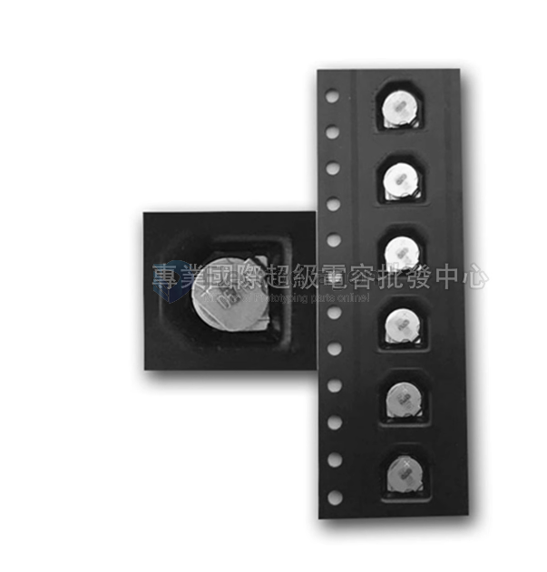

# super-cap-dat

- Brand: Seiko Corporation (SII)
- Model: XH414H-1V01E
- Specifications: Thickness 1.4, Diameter 4.8
- Capacitance: 0.08F
- Voltage: 3.3V
- Charging time: 30min
- Weight: 0.07g
- Internal resistance: 80-100 ohms
- Operating temperature range: -20~60 degrees Celsius

## ref 

- [[super-cap]]

- [[battery]]