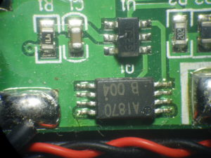

# BMS-dat

## 🔋 Active vs. Passive BMS

A **Battery Management System (BMS)** monitors and protects battery packs, especially lithium-based ones, from overcharging, overdischarging, and overheating. It also performs **cell balancing** to maintain consistent voltage across cells.

---

### ✅ 1. Passive BMS

#### 🔧 How It Works:
- **Dissipates excess energy** from high-voltage cells as **heat** using resistors.
- Bleeds off charge from full cells so others can catch up during charging.

#### ⚙️ Features:
- Simple and inexpensive
- Uses resistors and MOSFETs
- Common in e-bikes, power tools, and budget battery systems

#### ⚠️ Downsides:
- Wastes energy
- Balancing is slower
- Less efficient for large or high-performance systems

---

### ✅ 2. Active BMS

#### 🔧 How It Works:
- **Transfers charge** from higher-voltage cells to lower-voltage ones using capacitors, inductors, or DC-DC converters.
- Recycles energy instead of burning it off.

#### ⚙️ Features:
- High efficiency
- Faster, more accurate balancing
- Used in electric vehicles (EVs), drones, and large battery banks

#### ⚠️ Downsides:
- More complex and expensive
- Requires advanced control circuitry

---

### 🔄 Summary Table

| Feature               | **Passive BMS**                       | **Active BMS**                           |
|-----------------------|----------------------------------------|------------------------------------------|
| Energy Handling       | Dissipates as heat                    | Transfers charge between cells           |
| Efficiency            | Low                                   | High                                     |
| Complexity            | Simple                                | Complex                                  |
| Cost                  | Low                                   | High                                     |
| Speed of Balancing    | Slow                                  | Fast                                     |
| Common Use Cases      | E-bikes, power tools, small packs     | EVs, solar storage, high-end systems     |

---

### 🤔 Which Should You Use?

- **Passive BMS**: Ideal for small to medium systems with basic balancing needs.
- **Active BMS**: Best for large, high-value, or performance-critical battery systems.

## Single Cell Protection solution 

### A1870 + 3GJG (bad quality combination)

A1870 - [[uc1870+ver1_x76b.pdf]]

G3JQ - S8261 - [[S8261_E.pdf]]

### DW01 + FM8205

### protection board 

- [[week-4-8-dat]]

## Precautions before applying BMS:

1. Before installing the protection board, make sure the batteries are matched:
   
- the voltage difference between each battery should not exceed 0.05V, 
- the internal resistance difference should not exceed 5mΩ
- and the capacity difference should be less than 30mAh. 

The smaller the voltage difference between the batteries, the better the performance of the protection board.

2. Connect the batteries in parallel first, then in series, and ensure correct welding (use nickel strips for spot welding on 18650 batteries, and solder for other batteries). 

Never use screws to fasten them, as this may damage the IC of the protection board.

3. If you are replacing the protection board on old batteries, please check whether the batteries are in good condition before purchasing.

4. During installation, use a multimeter to check whether the voltage of each battery in the series is the same. 
   
If the voltage difference exceeds 1.0V, it may indicate a fault such as poor range, power cut-off at startup, or short charging time, which are often caused by battery cell issues. 

A protection board fault typically results in: inability to charge, or the battery has voltage but cannot discharge.

## example BMS for 3S1P 18650

[[18650-dat]]

### ⚙️ What is a 3S1P Pack?

- **3S** = 3 cells in **series** → 11.1V nominal (12.6V fully charged)
- **1P** = 1 cell in **parallel** → Capacity = 1 cell's capacity
- Common cell type: **18650** or **LiPo pouch**
  - Example: 18650, 3.7V, 3000mAh, max 5A–10A discharge

---

### ✅ Recommended BMS Current Ratings

| **Battery Type**           | **Max Cell Discharge** | **Recommended BMS Current** |
|----------------------------|------------------------|------------------------------|
| Standard 18650 (3A–5A)     | 5A–10A                 | 10A–15A                      |
| High-Drain 18650 (10A)     | 10A–15A                | 15A–20A                      |
| LiPo Pouch (10C+)          | Varies                 | 15A+                         |

> ⚠️ Tip: Choose a BMS with a **trip current slightly above** your system's max current (about 1.2×).

---

### 🔐 Ideal Protection Settings

- **Continuous current**: 10–15A
- **Overcurrent trip**: 20–25A
- **Short-circuit protection**: Yes (fast cut-off)
- **Overvoltage cutoff**: ~4.25V/cell
- **Undervoltage cutoff**: ~2.5V/cell
- **Charge current**: ~5A or as per charger rating

## 🔧 Example

If using 3000mAh 18650 cells rated at 10A max:
- **Use BMS rated for 10A–15A continuous**
- **Trip limit around 20A–25A**

## ref 

- [[BMS]] - [[battery]]