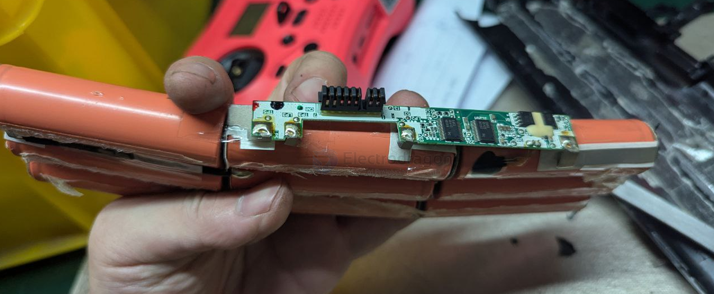
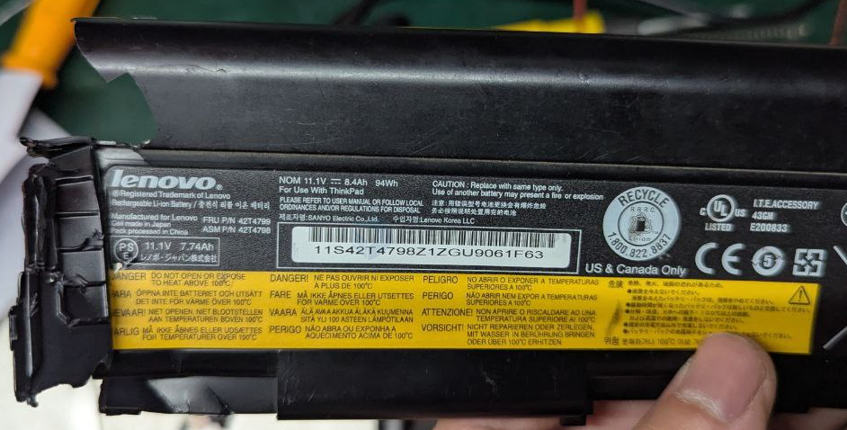
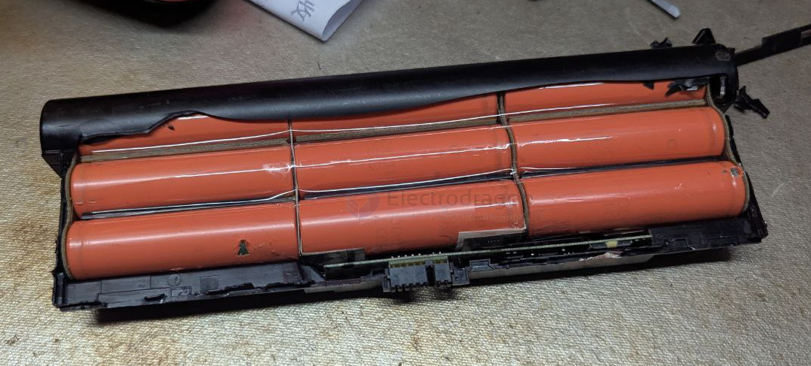
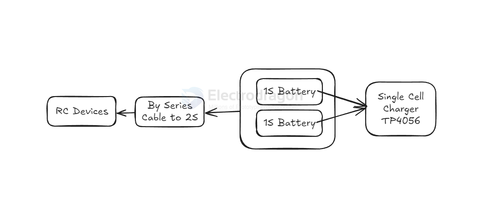
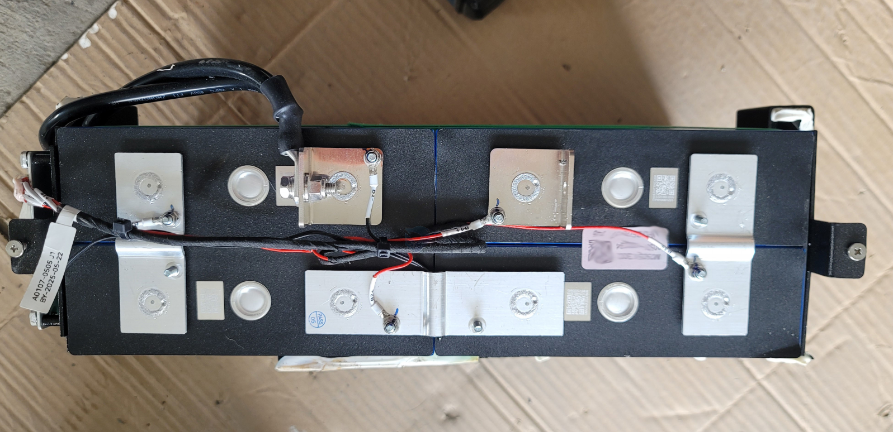
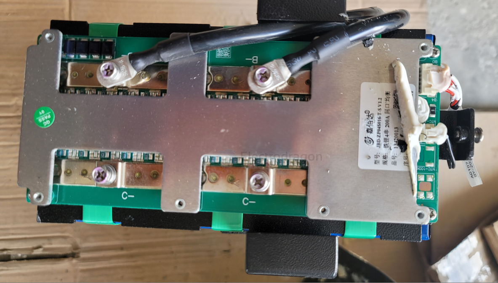
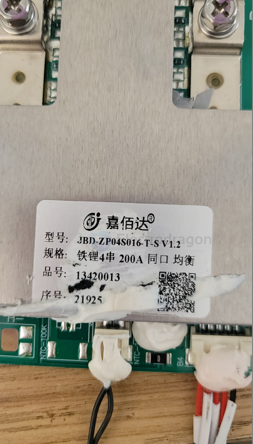
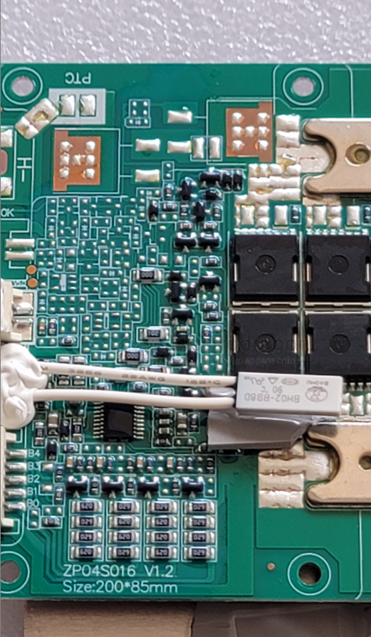
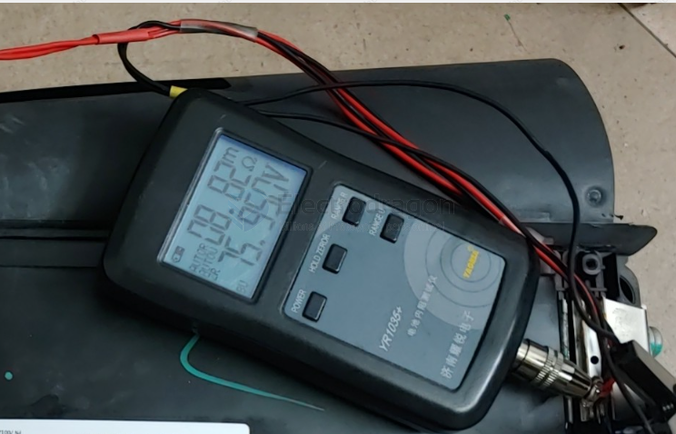

# battery-pack-dat

- in the pack including [[BMS-dat]]

- battery upgrade by [[battery-holder-dat]] - [[battery-pack-kit-dat]]

- battery upgrade by [[cable-dat]] (Series And Parallel Connection Cable)

- battery test by [[electronic-loader-dat]]

- check [[battery-discharge-dat]]

- battery isolation == rack (specially when have movement or vibration), Insulating Gasket

- FB design - [[resistor-feedback-dat]]

- soldering by [[spot-welding-dat]]

## battery pack examples 

- 48V 15Ah == 703 RMB - - [[32125-dat]] [[li-battery-dat]]  

- 36V 9AH == 1269 RMB 

- [[e-bike-dat]]

### laptop internal battery pack

3S-3P == 11V - [[lenovo-dat]]

## 🔋 Common Lithium Battery Pack Combinations

- 2S = 8.4V 
- 3S = 12.6V
- 4S = 16.8V

| Configuration | Voltage (V)     | Full Charge Voltage (V) | Description                           |
| ------------- | --------------- | ----------------------- | ------------------------------------- |
| 1S1P          | 3.7V            | 4.2V                    | Single cell                           |
| 1S2P          | 3.7V            | 4.2V                    | 2 cells in parallel                   |
| 2S1P          | 7.4V            | 8.4V                    | 2 cells in series                     |
| 2S2P          | 7.4V            | 8.4V                    | 4 cells total (2 series × 2 parallel) |
| **3S1P**      | **11.1V = 12V** | **12.6V**               | **Common for RC and drones**          |
| 3S2P          | 11.1V           | 12.6V                   | 6 cells total                         |
| 4S1P          | 14.8V           | 16.8V                   | Laptop batteries, [[power-tools-dat]] |
| 4S2P          | 14.8V           | 16.8V                   | Higher capacity variant               |
| 5S1P          | 18.5V           | 21.0V                   | Electric tools                        |
| 5S2P          | 18.5V           | 21.0V                   | Longer runtime tools                  |
| 6S1P          | 22.2V           | 25.2V                   | Drones, high-power packs              |
| 6S2P          | 22.2V           | 25.2V                   | More capacity, same voltage           |
| 7S1P          | 25.9V           | 29.4V                   | E-bikes, mid-size packs               |
| 7S2P          | 25.9V           | 29.4V                   | E-bikes, scooters                     |
| 10S1P         | 37V             | 42.0V                   | Standard for e-bike packs             |
| 10S2P         | 37V             | 42.0V                   | Common e-bike configuration           |
| 13S1P         | 48.1V           | 54.6V                   | High-voltage e-bike pack              |
| **13S2P**     | **48.1V**       | **54.6V**               | **E-bikes, scooters**                 |
| 14S1P         | 51.8V           | 58.8V                   | Some 52V e-bike packs                 |
| 14S2P         | 51.8V           | 58.8V                   | Higher capacity                       |

common apps - [[Electric-tools-dat]] - [[drone-battery-dat]]

## why one bad 18650 battery will ruin other paralled batteries 

How it ruins other paralleled batteries:

- **Constant Discharging of Healthy Cells**: Healthy cells in parallel will try to "charge" the bad cell that is at a lower voltage. This means the good cells are constantly discharging into the bad cell, even when no external load is connected. This continuous drain can over-discharge the healthy cells, reducing their lifespan and capacity.
- **Overheating and Safety Risks**: The bad cell, due to higher internal resistance or being constantly charged by other cells, can overheat. This heat can transfer to adjacent healthy cells, potentially damaging them or even leading to thermal runaway in severe cases, which is a significant safety hazard (fire or explosion).
- **Reduced Overall Pack Performance**: The overall capacity and current delivery capability of the pack will be severely limited by the weakest cell. The pack will perform as if all cells are as bad as the faulty one.
- **Accelerated Aging of Healthy Cells**: The constant stress of trying to compensate for the bad cell accelerates the aging process of the healthy cells.

## can 18650 lihtium battery be soldered by soldering iron? 

*   **Heat Damage:** Lithium-ion cells are sensitive to heat. Excessive heat from a soldering iron can:
    *   Damage the internal chemistry of the cell, reducing its capacity, lifespan, and performance.
    *   Melt or damage the internal safety components like the pressure vent or PTC (Positive Temperature Coefficient) switch.
    *   In extreme cases, lead to thermal runaway, which can cause the battery to vent, catch fire, or even explode.

*   **Difficulty:** The positive and negative terminals of 18650 cells are often made of materials (like nickel or steel) that can be difficult to solder to without specialized flux and a powerful iron. Prolonged heating to achieve a good solder joint increases the risk of heat damage.

*   **Safety Risks:**
    *   Accidentally short-circuiting the battery with the soldering iron tip or solder can cause extremely high currents, leading to sparks, burns, and battery damage.
    *   Overheating can release flammable and toxic gases.

### **Recommended Alternatives:**

*   **Spot Welding:** This is the industry-standard method for connecting 18650 cells. Spot welders deliver a very high current for a very short duration, creating a strong weld with minimal heat transfer to the cell's internals.
*   **Battery Holders:** Using appropriate battery holders allows for connections without soldering directly to the cells. This is a safer option for many DIY projects.
*   **Pre-tabbed Cells:** Some 18650 cells are available with nickel tabs already spot-welded to the terminals. These tabs are much easier and safer to solder to.

## Simple 1S to 2S management Solutions 

## FPV power battery 

**Balance Connector**

- 2S battery = 2 cells in series → total 2 voltages to monitor (Cell 1 & Cell 2).
- The 3 pins are:
 - **Pin 1 (B-)** → negative of first cell / main ground.
 - **Pin 2 (C1)** → middle point between cell 1 and cell 2.
 - **Pin 3 (B+)** → positive of second cell / total pack voltage.
- This lets a **balance charger** measure each cell individually.

## "Powerful" battery

### 1. Upgrade to Higher Cell Count (More Voltage)
- **Switch from 2S (7.4V) to 3S (11.1V) or 4S (14.8V)** for more motor RPM and torque.
- ✅ **Check compatibility** of your **ESC and motor** before upgrading.
  - If not rated for higher voltage, you risk burning them out.

**Pros:**
- Significant performance boost
- Higher speed and torque

**Cons:**
- Can overheat/damage components
- May require stronger drivetrain

---

### 2. Increase Battery Discharge Rate (C-Rating)
- **Higher C-rating = more current output**, improving throttle response and torque.

**Example:**
- 2S 5000mAh 20C → 5A × 20 = 100A max discharge
- 2S 5000mAh 50C → 5A × 50 = 250A max discharge

**Pros:**
- Better throttle response
- Handles load more effectively (climbing, off-road)

**Cons:**
- Higher cost
- May be slightly heavier

---

### 3. Increase Capacity (mAh)
- **Higher mAh = longer run-time** and **less voltage sag under load**

**Example:**
- Upgrade from 2200mAh to 5000mAh for more endurance

## reference images 

## 分容

先并联充好电，再串联24串一组 恒流放电，需要接个极空保护板计量容量，每次触发保护时标计一个单体的容量， 并移走替换满电的，直到一轮一轮的测完

分容可以有这个:  EBC-A10H 电池容量测试仪 充放电仪 电子负载 电源测试 5A充10A放

YR1035+

- [[internal-resistance-meter-dat]]

## unbalance Series and Parallel 

You have a battery configuration: **3P + 6P + 6P in series**.  
- **3P group** = 3 cells in parallel  
- **6P groups** = 6 cells in parallel  
- **Series connection** → pack is 3S  

Even though some groups have more cells, the **smallest parallel group (3P)** limits the total usable capacity.  

---

### 1. Discharge Behavior
- Current is **the same through all series groups**.  
- Example: load draws 9A total:  
  - 3P group → 9A ÷ 3 = 3A per cell (high stress)  
  - 6P groups → 9A ÷ 6 = 1.5A per cell (lighter load)  
- ✅ 3P cells drain faster.  
- ❌ Pack is considered “empty” when 3P group is fully discharged, even if 6P groups still have charge.  

---

### 2. Charge Behavior
- Charger applies current evenly through series groups.  
- Example: 9A charging current:  
  - 3P group → 9A ÷ 3 = 3A per cell  
  - 6P groups → 9A ÷ 6 = 1.5A per cell  
- ✅ 3P group reaches full voltage first.  
- ❌ Charger stops when 3P group is full → extra cells in 6P groups aren’t fully used.  

---

### 3. Key Effects
1. **Capacity wasted**: Extra cells in larger parallel groups are underutilized.  
2. **Unbalanced stress**: Smaller parallel group wears out faster.  
3. **Reduced lifespan**: Smallest group limits whole pack life and capacity.  

---

### 4. Best Practice
- Ensure **all parallel groups in series have the same number of cells**.  
- Example: redesign as **3S6P** → full 18Ah usable capacity instead of being limited to 9Ah.  

---

### ✅ **Summary**:  
In series packs, **the smallest parallel group determines the usable capacity**. Extra cells in larger groups are underused, and the smaller group experiences higher current stress, reducing overall pack efficiency and lifespan.

## ref 

- [[battery-dat]] - [[battery-charger-dat]]

- [[battery-pack]] - [[battery]]