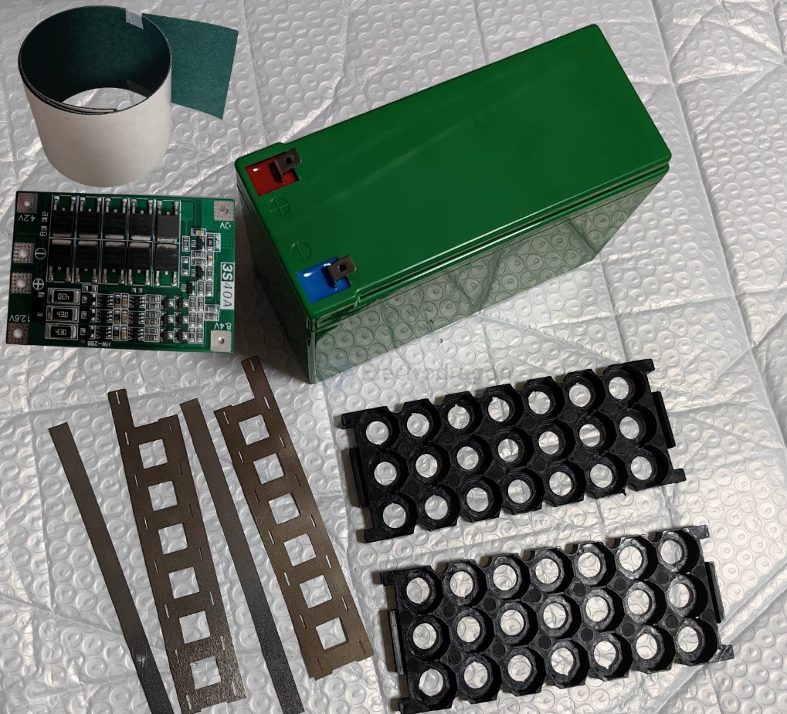
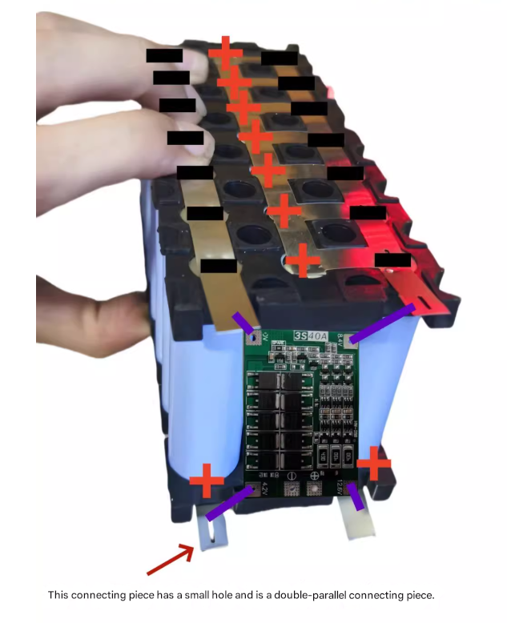
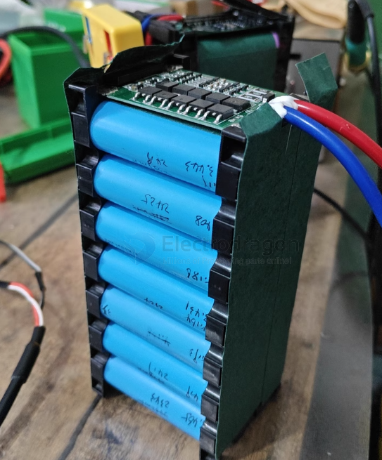
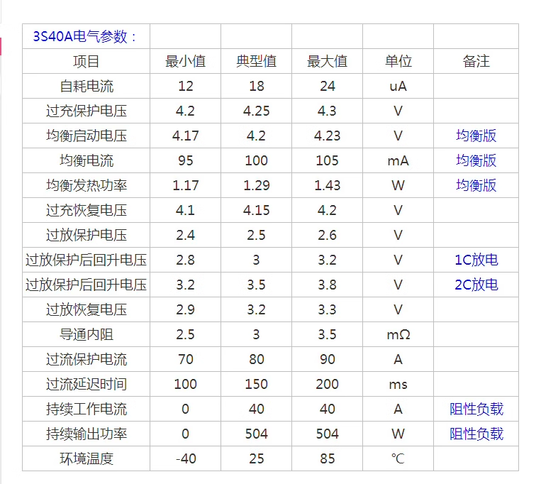

# battery-pack-kit-dat

- [[active-BMS-dat]] 

- [[case-dat]]

- [[battery-holder-dat]] == rack 

- Nickel Sheet

- Insulating Paper

- [[18650-dat]] - [[18650]]

## 3S7P == 12V 8400 mAH == 12V 8.4 AH 

## wiring diagram 

## examples

## Important Notes for Battery Pack Assembly

1. **Activation Required**  
   After welding, the battery pack must be activated with a 12.6V charger before it can output normally. Without activation, the output voltage will not reach the expected level.

2. **Insulation and Protection Board Installation**  
   It is strongly recommended to wrap the battery pack with fish paper (insulating paper) before installing the protection board. The protection board should not be attached directly to the battery cells. Wrap a layer of fish paper around the cells, then install the protection board.  
   Ensure all welds are solid—cold solder joints may cause overheating or fire. Only users with experience in battery pack assembly should purchase. If you are not familiar, please buy with caution. The shop only sells parts and is not responsible for any consequences of use.

---

### 3S 12.6V 40A Lithium Battery Protection Board

- **Application:**  
  Suitable for lithium batteries with a nominal voltage of 3.7V and a fully charged voltage of 4.2V  
  (including 18650, 26650, and polymer lithium batteries; no restriction on cell size)

- **Product Dimensions:**  
  - Enhanced version: 41 × 55 × 3.4 mm  
  - Balanced version: 41 × 60 × 3.4 mm

- **Product Weight:**  
  - Enhanced version: 8.8g  
  - Balanced version: 9.8g

- **Charging Voltage:** 12.6V ~ 13.6V  
- **Continuous Discharge Current (Max):** 40A (reduce load current if heat dissipation is poor)  
- **Continuous Charging Current (Max):** 20A

- **Enhanced Version:**  
  Suitable for drills with starting current below 80A and power below 170W.

- **Balanced Version:**  
  Same as above, but with balanced charging function.

---

#### Precautions

1. **Battery Selection:**  
   To successfully start a drill, use either three 10C–20C power cells or six 5C–10C power cells.  
   Recommended cell models: SONY VTC4, VTC4A, VTC5A, VTC6.  
   Use 0V and 12.6V connection wires with copper wire of at least 3 mm² (do not use nickel strips!).

2. **Wiring:**  
   Strictly follow the wiring diagram for 0V, 4.2V, 8.4V, and 12.6V connections.  
   When soldering wires, do not touch any components on the board and never intentionally short-circuit.

3. **First-Time Soldering or Charging:**  
   When first soldering the battery or during charging, if any single cell exceeds 4.2V, the "430" resistor will heat up to discharge (stops heating when voltage drops to about 4.19V).  
   If the "430" resistor becomes extremely hot (too hot to touch), check for wiring errors.

## Purpose of Insulating Paper (Fish Paper) in a Battery Pack:

1. **Electrical Insulation**  
   - Prevents short circuits between cells, busbars, and metal casings.  

2. **Thermal Resistance**  
   - Provides heat resistance and helps protect against localized overheating.  

3. **Mechanical Protection**  
   - Adds a physical barrier between components to reduce abrasion or vibration damage.  

4. **Safety Enhancement**  
   - Improves overall safety of the battery pack by minimizing risks of electrical arcing, leakage, or thermal runaway propagation.  

## ref 

- [[battery-pack-dat]]