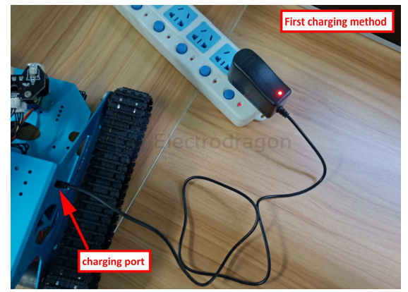
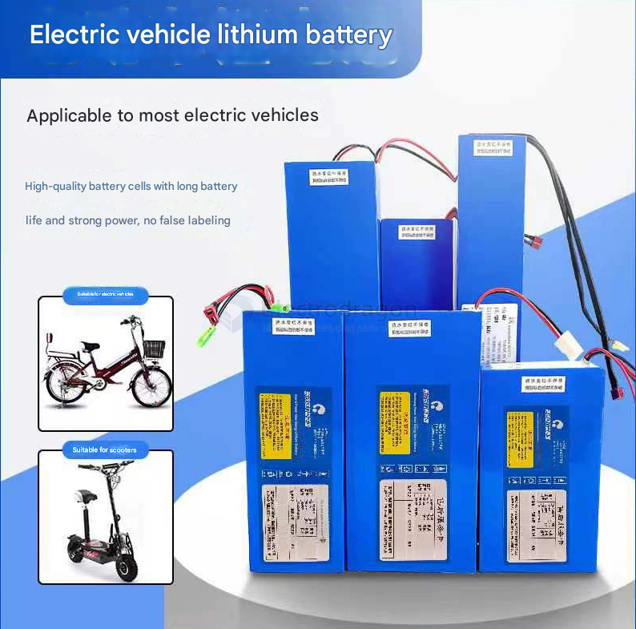
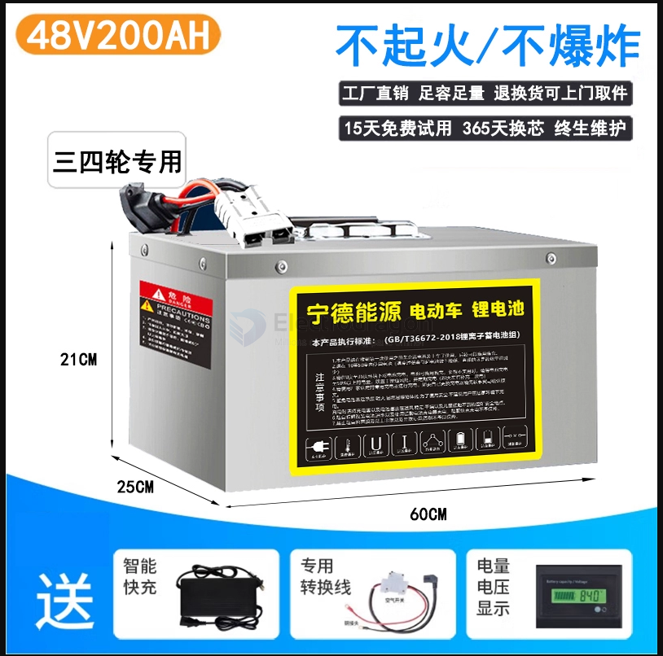

# li-battery-app-dat

### By Apps 

Robot tank battery

3x 3000mAH x 3.7 == 33.3 Wh / 12.5V == **2.66 Ah (2660 mAh)

for electric-bike, electric-kart, electric-scooter, electric-skateboard, etc

- [[power-tools-dat]]

3x 18650 

single-unit large battery 

48V / 200AH

## calculata density 

If the battery voltage is 72V, you can use the following formula to calculate the energy in kilowatt-hours (kWh):

Energy (kWh) = (Battery Capacity (AH) × Voltage (V)) / 1000

Substituting the values:

Energy (kWh) = (50 AH × 72 V) / 1000 = 3.6 kWh

So, a 50AH battery with a voltage of 72V equals 3.6 kWh.

To calculate how many kilometers can be traveled per 1 kWh, we need to divide the total range (100-150 km) by the total energy (3.6 kWh).

For the lower range (100 km): Kilometers per kWh = 100 km / 3.6 kWh ≈ 27.78 km/kWh

For the higher range (150 km): Kilometers per kWh = 150 km / 3.6 kWh ≈ 41.67 km/kWh

**So, for each 1 kWh, the vehicle can travel between 27.78 km and 41.67 km depending on conditions.**

## ref 

- [[li-battery-app]] - [[lithium-battery]]

- [[power-dat]]