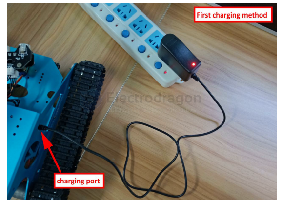
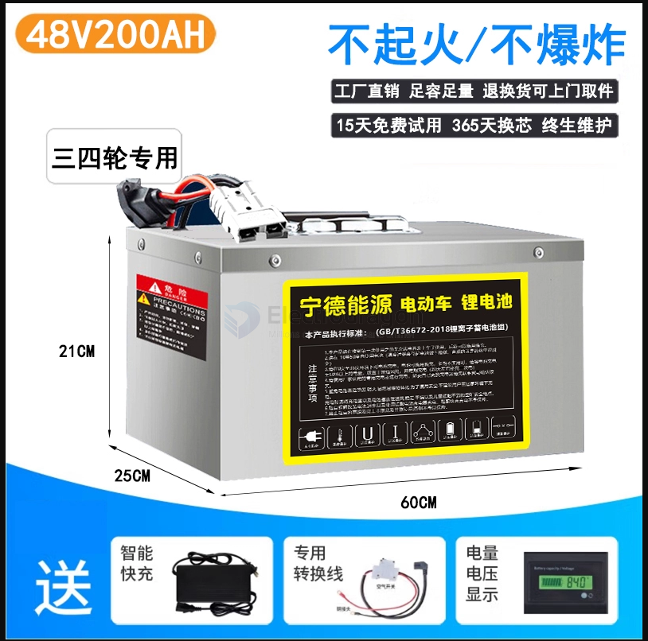

# lithium-battery-dat

## info 

- [[BMS-dat]] - [[battery-charger-dat]]

- [[active-battery-balancing-board-dat]] - [[battery-soldering-dat]]

- high current wires == [[AWG-wires-dat]]

## Classification Summary 

By Electrode Materials - [[LFP-dat]] - [[Ternary-Lithium-Battery-dat]]

By Electrode Materials Status - [[li-ion-battery-dat]] - [[lipo-battery-dat]]

By size - [[18650-dat]] - [[26650-dat]]

### By Apps 

Robot tank battery 

## Classification 

### **1. Classification by Electrode Materials**

#### **(1) Positive Electrode Materials**

- **Lithium Cobalt Oxide (LiCoO₂)**
  - **Characteristics**: High energy density, suitable for portable devices, but expensive and less thermally stable with shorter cycle life.
  - **Applications**: Smartphones, laptops, cameras, etc.

- **Nickel Cobalt Aluminum (NCA)**
  - **Characteristics**: High energy density and long cycle life, widely used in electric vehicles (EVs).
  - **Applications**: Electric vehicles, battery packs, etc.

- **Nickel Cobalt Manganese (NCM)**
  - **Characteristics**: Balanced performance, high energy density, and long cycle life. The performance can vary depending on the ratio of nickel, cobalt, and manganese.
  - **Applications**: Electric vehicles, battery packs, etc.

- **Lithium Iron Phosphate (LiFePO₄)**
  - **Characteristics**: High safety, good thermal stability, low cost, but lower energy density.
  - **Applications**: Electric vehicles, energy storage systems, low-power devices.

- **Lithium Manganese Oxide (LiMn₂O₄)**
  - **Characteristics**: Safe and stable, but slightly lower energy density and capacity compared to lithium cobalt oxide.
  - **Applications**: Power tools, e-bikes, battery packs.

#### **(2) Negative Electrode Materials**

- **Graphite**
  - **Characteristics**: Most common negative electrode material, low cost, good conductivity, and cycle performance.
  - **Applications**: Most Li-ion batteries, including smartphones and laptops.

- **Silicon-based Materials**
  - **Characteristics**: Silicon has a high theoretical capacity but suffers from expansion and contraction issues, usually used in composite materials with graphite.
  - **Applications**: High-capacity batteries, electric vehicles, smartphones.

- **Silicon-Carbon Composite**
  - **Characteristics**: Combines the high energy density of silicon with the stability of carbon, offering better performance than traditional graphite.
  - **Applications**: High-performance batteries, especially in electric vehicles and storage systems.

- **Lithium Titanate (Li₄Ti₅O₁₂)**
  - **Characteristics**: Better safety and longer cycle life but lower energy density, stable discharge voltage.
  - **Applications**: High-power, long-lifetime applications.

---

### **Classification of Lithium-ion Batteries by Size**

Lithium-ion batteries can be classified into different sizes depending on their **form factor**, **capacity**, and **voltage**. The most common types of lithium-ion batteries based on size include cylindrical, prismatic, and pouch batteries. Below is a detailed classification based on size:

---

#### **1. Cylindrical Lithium-ion Batteries**

Cylindrical lithium-ion batteries are among the most common and widely used in consumer electronics and electric vehicles. These batteries come in standardized sizes, providing easy options for manufacturers to integrate them into their products.

##### **Common Sizes:**

- **18650**  
  - **Dimensions**: 18mm diameter, 65mm length  
  - **Capacity**: Typically 2,000mAh - 3,500mAh  
  - **Applications**: Laptops, power banks, electric vehicles, flashlights, etc.

- **21700**  
  - **Dimensions**: 21mm diameter, 70mm length  
  - **Capacity**: Typically 3,000mAh - 5,000mAh  
  - **Applications**: Electric vehicles, power tools, energy storage systems.

- **26650**  
  - **Dimensions**: 26mm diameter, 65mm length  
  - **Capacity**: Typically 4,000mAh - 5,500mAh  
  - **Applications**: Power tools, high-capacity power banks, solar energy storage.

---

#### **2. Prismatic Lithium-ion Batteries**

Prismatic lithium-ion batteries have a rectangular shape and are commonly used in applications where space utilization is critical. They are often used in electric vehicles and energy storage systems, as they can be more efficient in terms of volume compared to cylindrical batteries.

##### **Common Sizes:**

- **Small Prismatic Batteries**  
  - **Dimensions**: Custom sizes, ranging from 50mm x 70mm to 100mm x 150mm  
  - **Capacity**: Typically 1,000mAh - 5,000mAh  
  - **Applications**: Consumer electronics, portable devices, and small power tools.

- **Medium/High-Capacity Prismatic Batteries**  
  - **Dimensions**: Custom sizes for electric vehicles or energy storage systems  
  - **Capacity**: Typically 10,000mAh - 50,000mAh  
  - **Applications**: Electric vehicles, industrial applications, solar energy storage.

---

#### **3. Pouch Lithium-ion Batteries**

Pouch lithium-ion batteries are flexible and can be designed into various shapes and sizes, making them ideal for applications where space and weight are important factors, such as in portable devices and wearable technologies.

##### **Common Sizes:**

- **Small Pouch Batteries**  
  - **Dimensions**: Custom sizes for portable electronics, typically under 50mm x 100mm  
  - **Capacity**: Typically 500mAh - 3,000mAh  
  - **Applications**: Smartphones, tablets, drones, wearable devices.

- **Large Pouch Batteries**  
  - **Dimensions**: Custom sizes for energy storage systems, electric vehicles, and larger applications  
  - **Capacity**: Typically 5,000mAh - 30,000mAh  
  - **Applications**: Electric vehicles, energy storage systems, large power banks.

---

#### **4. Coin Cell Lithium-ion Batteries**

Coin cell batteries are small, disc-shaped batteries typically used in low-power applications where size and weight are critical, such as in hearing aids, remote controls, and watches.

##### **Common Sizes:**

- **CR2032**  
  - **Dimensions**: 20mm diameter, 3.2mm thickness  
  - **Capacity**: Typically 200mAh - 300mAh  
  - **Applications**: Watches, medical devices, remote controls.

- **CR2025**  
  - **Dimensions**: 20mm diameter, 2.5mm thickness  
  - **Capacity**: Typically 150mAh - 200mAh  
  - **Applications**: Key fobs, fitness devices, and other small electronics.

---

### **Summary**

Lithium-ion batteries are classified based on their **size**, which influences their capacity, applications, and design flexibility. The most common categories based on size include **cylindrical, prismatic, pouch, and coin cell**. Below is a summary of the typical sizes:

| **Battery Type**               | **Common Sizes**           | **Applications**                                        |
|---------------------------------|----------------------------|---------------------------------------------------------|
| **Cylindrical Batteries**       | 18650, 21700, 26650        | Laptops, electric vehicles, power banks, flashlights    |
| **Prismatic Batteries**        | Custom sizes, 50mm x 70mm - 100mm x 150mm | Electric vehicles, energy storage, industrial applications |
| **Pouch Batteries**             | Custom sizes               | Smartphones, tablets, wearable devices, drones, EVs     |
| **Coin Cell Batteries**         | CR2032, CR2025              | Watches, medical devices, remote controls               |

This classification helps manufacturers and consumers select the appropriate battery type based on the size, capacity, and specific requirements of the application.

## li-battery tech 

### Low Battery Voltage (Below Safe Threshold)

Protection boards are designed to protect lithium batteries from over-discharge, overcharge, and short circuits. Many lithium battery protection circuits cut off the battery's output if the voltage drops below a certain threshold, often around 2.5V to 2.8V.

If the battery is at **2.6V**, it's very close to this cutoff threshold, and the protection circuit may be designed to prevent any further discharge to avoid damaging the battery, which could explain the drop to 0V.

### Lithium battery Check 

- battery voltage B+/B- = OK, output == 0V, BMS problem 

## 📋 Common Cylindrical Lithium-Ion Battery Types

| Type     | Size (mm)           | Capacity Range (approx.)     | Common Uses                         |
|----------|---------------------|-------------------------------|-------------------------------------|
| 14500    | 14 x 50              | 600–1000 mAh                  | Flashlights, small electronics      |
| 16340    | 16 x 34              | 700–1400 mAh                  | Flashlights, laser pointers         |
| 18350    | 18 x 35              | 800–1400 mAh                  | Compact flashlights, vaping mods    |
| 18650    | 18 x 65              | 1800–3500+ mAh                | Laptops, power banks, e-bikes       |
| 21700    | 21 x 70              | 3000–5000+ mAh                | Electric cars, high-performance tools|
| 26650    | 26 x 65              | 4000–6000+ mAh                | Flashlights, power tools, e-bikes   |
| 32650    | 32 x 65              | 6000–7000+ mAh                | Energy storage, high-capacity uses  |

🧠 Which to Choose?
18650: Most versatile and widely used.

21700: Replacing 18650 in high-drain applications (e.g., Tesla).

26650: Best for high-capacity flashlights and tools where size is less of a concern.

Smaller types (e.g., 14500): Used in compact or AA-sized electronics.

## 🔌 Notes on Battery Chemistry

Most of these are Lithium-Ion (Li-ion) or Lithium Iron Phosphate (LiFePO₄):

Li-ion: Higher energy density, common in consumer electronics.

LiFePO₄: Lower energy density, but longer cycle life and more stable — often used in solar and industrial applications.

## 🔒 Protected vs Unprotected

Protected cells: Include a small circuit to prevent overcharge, overdischarge, and short-circuit.

Unprotected cells: Require careful handling but are often used in custom battery packs or devices with built-in protection.

## large battery 

48V 
200AH

## ref 

- [[lithium-battery]]