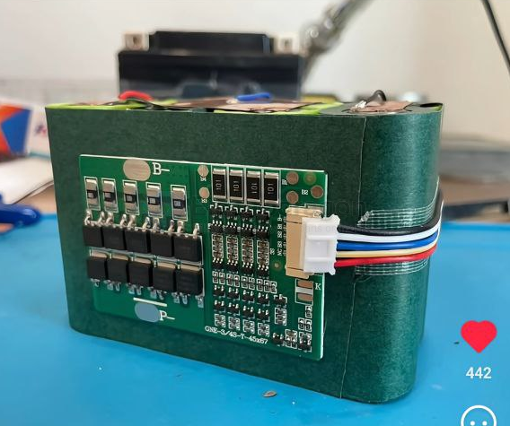

# 26650-dat

- [[battery-capacity-dat]]

## motorbike battery

- 12-14 milliohm internal resistance
- [[active-battery-balancing-board-dat]] 
- internal 4x2 = 14.5 V 
- 10C / Instant discharge 20C

## 1. Overview
- **26650** = Cylindrical cell, **26 mm diameter**, **65 mm length**.
- Commonly Li-ion chemistry (LiCoO₂, LiNiMnCo, LiFePO₄, etc.).

## 2. Typical Specs (Li-ion NMC type)
| Parameter              | Common Value Range        |
|------------------------|---------------------------|
| Nominal Voltage        | 3.6–3.7 V                 |
| Capacity               | 4,000–5,500 mAh           |
| Energy (Wh)            | 14.4–20.35 Wh              |

> **Energy formula**:  
> `Energy (Wh) = Nominal Voltage × Capacity (Ah)`

Example:  
- 5000 mAh (5.0 Ah) × 3.65 V ≈ **18.25 Wh**

## 3. LiFePO₄ 26650 Variant
| Parameter              | Common Value Range        |
|------------------------|---------------------------|
| Nominal Voltage        | 3.2–3.3 V                 |
| Capacity               | 3,000–3,500 mAh           |
| Energy (Wh)            | 9.6–11.55 Wh              |

## 4. Summary
- **NMC/NCA Li-ion 26650**: ~18 Wh typical.
- **LiFePO₄ 26650**: ~10 Wh typical.
- Actual usable energy is slightly less due to discharge cut-off and efficiency losses.

## ref 

- [[26650-lithium-battery]] - [[li-battery-size]] - [[lithium-battery]]