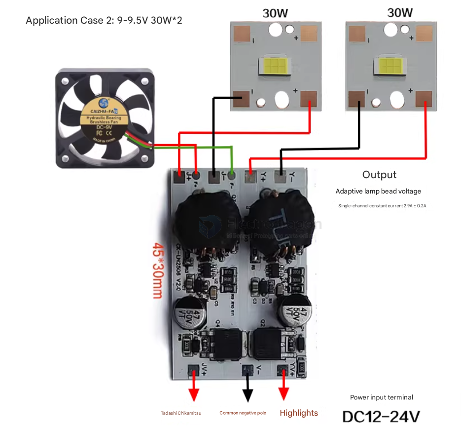
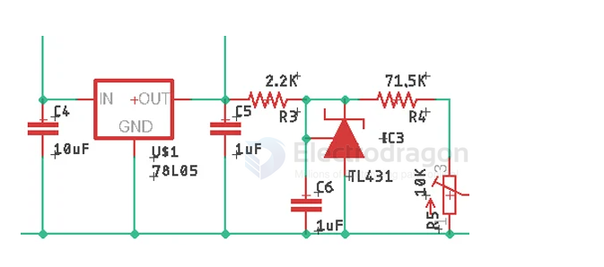

# constant-current-dat

- [[constant-current-dat]] - [[CV&CC-dat]]

## apps 

- [[LED-driver-dat]]

- [[fan-dat]] 

## current limit control 

Current Limiting Circuit with TL431

Now, let's understand how the current limiting functionality works. In the schematic, you can see we have a 78L05 Voltage Regulator, which is an ultra-low-power regulator that is used to convert the input voltage to a constant 5V for the TL431 IC. The TL431 is a reference that is set to a constant current regulator mode with the help of a 71.5K resistor and a potentiometer. This reference is compared to the sense voltage from the output side of the resistor to limit the current. The circuit shown below is the TL431 circuit that is providing a constant current source to the op-amps. 

## ref 

