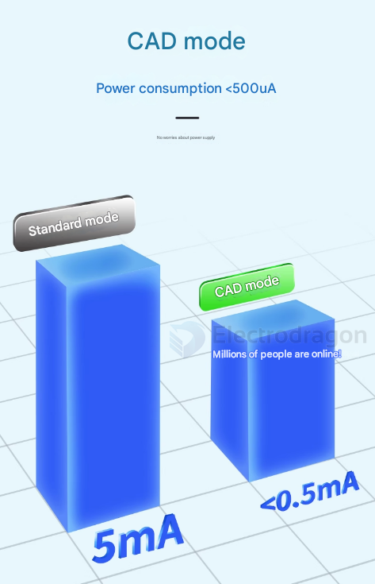

# Low-Power-dat

## low power display 

- [[ILC1066-dat]] - [[ILC1067-dat]] - [[segment-lcd-dat]]

- [[epaper-dat]]

## low power board 

[[ARM1007-dat]] - [[DOD1074-dat]] - based on - [[segment-lcd-dat]]

[[DVA1002-dat]] - [[DVA1007-DAT]]

- https://twitter.com/electro_phoenix/status/1639160253811142656
- Loraduino low power test, sleep in 80uA

## low power mode [[DVA1007-dat]]

- first init RF Lora 
- then, must well initiated flash, or this cost 1-2 mA - https://github.com/LowPowerLab/SPIFlash
- turn RF Lora into sleep mode, or this cost 1-2 mA
- turn on arduino into low power mode - https://github.com/LowPowerLab/LowPower
- arduino low power, powerdown and wake up periodically 

[[NGS1096-DAT]] - [[SIM7020-dat]] - [[NBIOT-da]]

- Sim7020g low power test 27ua in sleep mode, wake up by pin
- https://twitter.com/electro_phoenix/status/1640585737308622850

## Flash Issue

- Please remember to use "low-power-lab" arduino library: https://github.com/LowPowerLab/SPIFlash
- install the library: flash.initialize()
- https://github.com/Edragon/Arduino-main/blob/master/Sketchbook/memory/SPIFlash_LowPowerLab/SPIFlash_LowPowerLab.ino

## arduino deep sleep library 

- https://github.com/arduino-libraries/ArduinoLowPower
- https://www.arduino.cc/reference/en/libraries/arduino-low-power/

## LORA CAD Mode 

## ref 

- legacy wiki page - https://w.electrodragon.com/w/Category:Low_Power

- low power design guide [[AN1416.pdf]]

- [[low-power]]

- [[power-dat]]