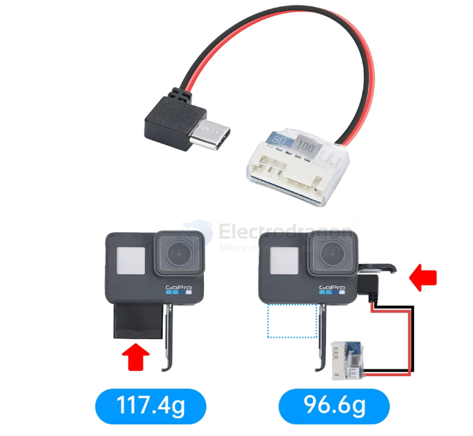

# power-BEC-dat

- [[ESC-dat]] - [[power-BEC-dat]] - [[power-FPV-dat]]

## BEC to gopro 

- [[gopro-dat]] 

技术参数：
1.供电电压：4-6S
2.输出：5V/3A
3.输入插头：XH2.54（电池平衡头）
4.输出插头：90°Type-C插头
5.长度：137mm
6.重量：5.5g
7.兼容Gopro6/7/8/9/10直插使用

特点：
可代替原有gopro电池，使用飞机上的电池供电，使得整机更轻

## BEC Info 

**BEC power** is a **low-voltage regulated power supply** that:
- Takes power from a **main battery** (high voltage)
- Converts it to a **safe, stable low voltage**
- Powers **control electronics** so a separate battery is not needed

---

## Where BEC Is Commonly Used

- **RC ESCs** (Electronic Speed Controllers)
- **Drones / UAVs**
- **RC cars, boats, planes**
- **Robotics control systems**

Typical loads:
- Receiver
- Servos
- Flight controller
- Sensors

## Typical BEC Output

| Parameter | Common Values |
|---------|---------------|
| Output voltage | 5 V / 6 V / 7.4 V |
| Output current | 0.5 A – 10 A |
| Input voltage | 2S–12S LiPo (7.4 V–50 V) |
| Regulation type | Linear or Switching |

---

## Why It’s Called “Battery Eliminator”

Without BEC:

    Main battery → Motor/ESC
    Small battery → Receiver & servos

With BEC:

    Main battery → ESC → BEC → Receiver & servos

## ref 

- [[RC-dat]] - [[power-dat]]