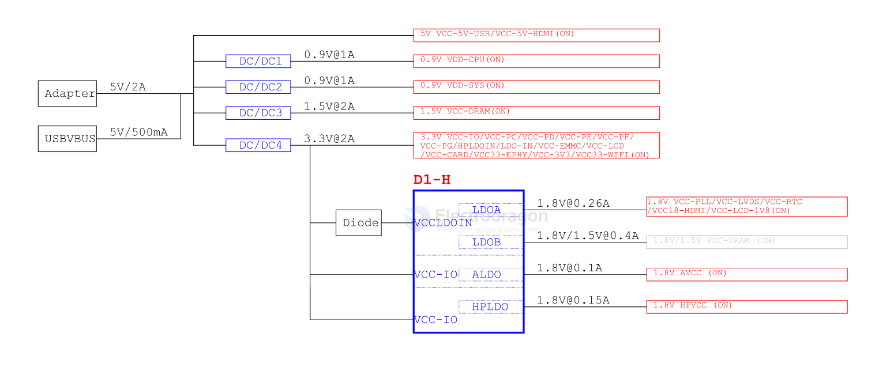

# power-dat.md

- [[power-dat]] - [[battery-dat]] 

- [[li-battery-dat]]- [[battery-BMS-dat]]

- [[battery-drainer-dat]] - [[acdc-dat]] - [[power-sensor-dat]]
  
- [[DC-dat]] - [[dcdc-dat]] - [[dcdc-down-dat]] - [[dcdc-boost-dat]] 

- [[LDO-dat]]

- [[low-power-dat]]

- [[battery-pack-dat]]

- [[CONN-power-dat]]

- [[power-isolated-module-dat]]

- [[ti-power-dat]] - [[diodes-dat]]

- [[current-limit-switch-dat]]

- [[AC-mains-dat]] - [[ACDC-dat]]

- [[solar-dat]] - [[solar-power-dat]]

- [[Power-distribution-dat]]

- [[supervisory-dat]] - [[power-switch-dat]] - [[voltage-reference-dat]] - [[voltage-interverter-dat]]

- [[constant-current-dat]]

- [[power-detector-dat]] - [[power-amplifier-dat]]

## power design workflow

1. design: [[power-dat]] 

1. consider power jack [[power-jack-dat]]

2. [[power-protection-dat]]

## over power protocols 

- [[POE-dat]] - Power Over Ethernet (POE)
- [[powerbus-dat]] - PowerBus - [[ITF1009-dat]]

## Info 

- [[breadboard-power-dat]]

- [[wireless-charge-dat]]

- [[dcdc-down-dat]] - [[dcdc-dat]]

- [[LDO-dat]]

- charger-pump

| Parts | Common Value | Note |
| ----- | ------------ | ---- |

## Power selection 

By switching from 5V to 3.3V, you can achieve up to 34% power savings in circuits where the current remains the same. In practice, the actual savings may be higher because some components draw less current at lower voltages.

## power tree for D1-H

## Integrated PDB (Power Distribution Board)

An **Integrated PDB** is a circuit board built **into a drone’s flight controller or frame** that distributes power from the battery to all electronic components, such as:

- ESCs (Electronic Speed Controllers)
- Motors
- Flight Controller (FC)
- Video Transmitter (VTX)
- LEDs and other accessories

## other chips 

[LM3880 == LM3880 Three-Rail Simple Power Supply Sequencer](https://www.ti.com/lit/ds/symlink/lm3880.pdf?ts=1757470644079&ref_url=https%253A%252F%252Fwww.ti.com%252Fproduct%252Fja-jp%252FLM3880%252Fpart-details%252FLM3880MF-1AE%252FNOPB)

### Sink and Source DDR Termination Regulator

- [[ti-power-dat]] == TPS51200DRC - TPS51200 Sink and Source DDR Termination Regulator - The TPS51200 device is a sink and source double data rate (DDR) termination regulator specifically designed for low input voltage, low-cost, low-noise systems where space is a key consideration.

### Power Supply Sequencer 

LM3880-Q1 Three-Rail Simple Power Supply Sequencer 

The LM3880-Q1 simple power supply sequencer offers the easiest method to control powerup sequencing and powerdown sequencing of multiple Independent voltage rails. By staggering the startup sequence, it is possible to avoid latch conditions or large in-rush currents that can affect the reliability of the system.

### transfomer driver 

- [[TI-power-dat]] SN6501DBVT - Low-noise, 350-mA, 410-kHz transformer driver for isolated power supplies

## ref 

- [[power]]