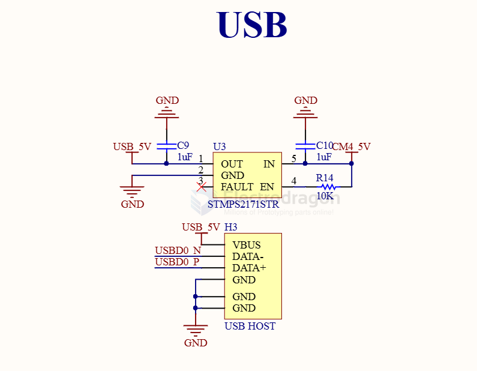

# power-switch-dat

power switch and distribution 

- [[switch-dat]] 

AP22652/AP22653/AP22652A/AP22653A - PRECISION ADJUSTABLE CURRENT-LIMITED POWER SWITCHES

## DIO7003HCST5

DIO7003HCST5 == DIO7003 5.5V Low Loss Power Distribution Switch

The DIO7003 device limits the output current under a safe level by using a constant current mode when the output load exceeds the current limit threshold. 

## SY6280

- SY6280AAC
Low Loss Power Distribution Switch

The SY6280 develops ultra-low Rds(on) switch with programmable current limiting to protect the power source from over current and short circuit conditions. It integrates the over temperature protection and discharges the output capacitor during the shutdown. In case the output is pulled higher than the input voltage under the shutdown, the SY6280 can block the current flowing from the output to the input. 

- [[high-side-driver-dat]]

### STMPS2151

Enhanced single channel power switches

https://www.st.com/en/switches-and-multiplexers/stmps2151.html

The STMPS2141, STMPS2151, STMPS2161, STMPS2171 power distribution switches are intended for applications where heavy capacitive loads and short-circuits are likely to be encountered. These devices incorporate 90 mΩ N-channel MOSFET high-side power switches for power distribution. These switches are controlled by a logic enable input.

All features
- 90 mΩ high-side MOSFET switch
- 500/1000 mA continuous current
- Thermal and short-circuit protection with overcurrent logic output
- Operating range from 2.7 to 5.5 V
- CMOS and TTL compatible enable input
- Undervoltage lockout (UVLO)

- [[RPI-CM4-expansion-board-dat]]

### VN750

- [[VN750-dat]]

## ref 

- [[power-switch]] 