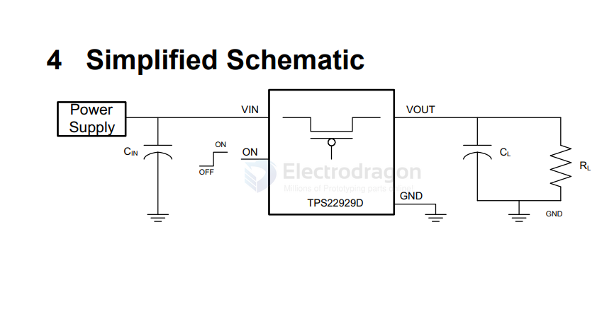

# power-switch-dat

power switch and distribution 

- [[RT9742-dat]] - [[richtek-dat]]

- [[ST-dat]] - [[STMPS21x1-dat]]

- [[switch-dat]] 

AP22652/AP22653/AP22652A/AP22653A - PRECISION ADJUSTABLE CURRENT-LIMITED POWER SWITCHES

## ti 

- [[TI-power-dat]]- [[power-switch-dat]]

TPS22929D == TPS22929D Ultra-Small, Low on Resistance Load Switch With Controlled Turn-on

The `TPS22929D` is a small, low ron load switch withcontrolled turn on. The device contains a P-channelMOSFET that can operate over an input voltagerange of 1.4 V to 5.5 V. The switch is controlled by anon/off input (ON), which is capable of interfacingdirectly with low-voltage control signals. TheTPS22929D is active high enable.

The TPS22929D contains a 150-Ω on-chip loadresistor for quick output discharge when the switch isturned off. The rise time of the device is internallycontrolled in order to avoid inrush current.

The TPS22929D device provides circuit breakerfunctionality by latching off the power-switch duringreverse voltage situations. An internal reverse voltagecomparator disables the power-switch when theoutput voltage (Vouτ) is driven higher than the input(Vın) to quickly (10 μs typ) stop the flow of currenttowards the input side of the switch. Reverse currentis always active, even when the power-switch isdisabled. Additionally, under-voltage lockout (UVLO)protection turns the switch off if the input voltage istoo low.

The TPS22929D is available in a small, space-saving6-pin SOT23 package and is characterized foroperation over the free-air temperature range of–40°C to 85°C.

## DIO7003HCST5

DIO7003HCST5 == DIO7003 5.5V Low Loss Power Distribution Switch

The DIO7003 device limits the output current under a safe level by using a constant current mode when the output load exceeds the current limit threshold. 

## SY6280

- SY6280AAC
Low Loss Power Distribution Switch

The SY6280 develops ultra-low Rds(on) switch with programmable current limiting to protect the power source from over current and short circuit conditions. It integrates the over temperature protection and discharges the output capacitor during the shutdown. In case the output is pulled higher than the input voltage under the shutdown, the SY6280 can block the current flowing from the output to the input. 

- [[high-side-driver-dat]]

### VN750

- [[VN750-dat]]

## ref 

- [[power-switch]] 