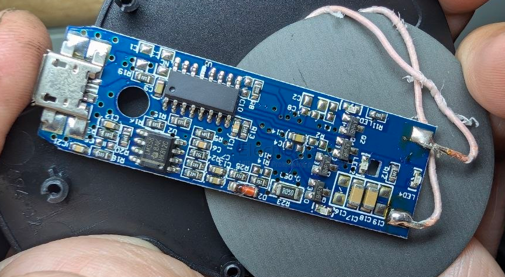
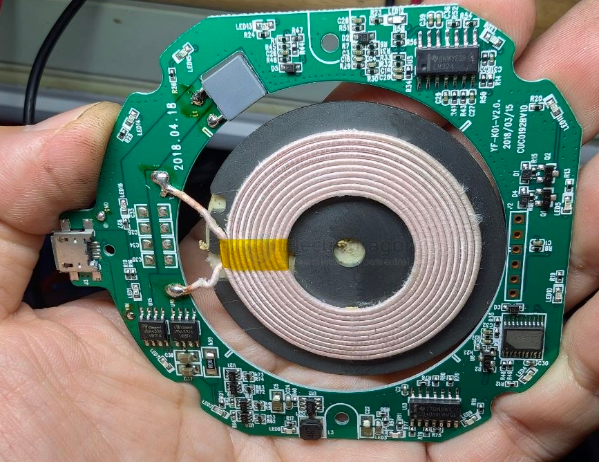
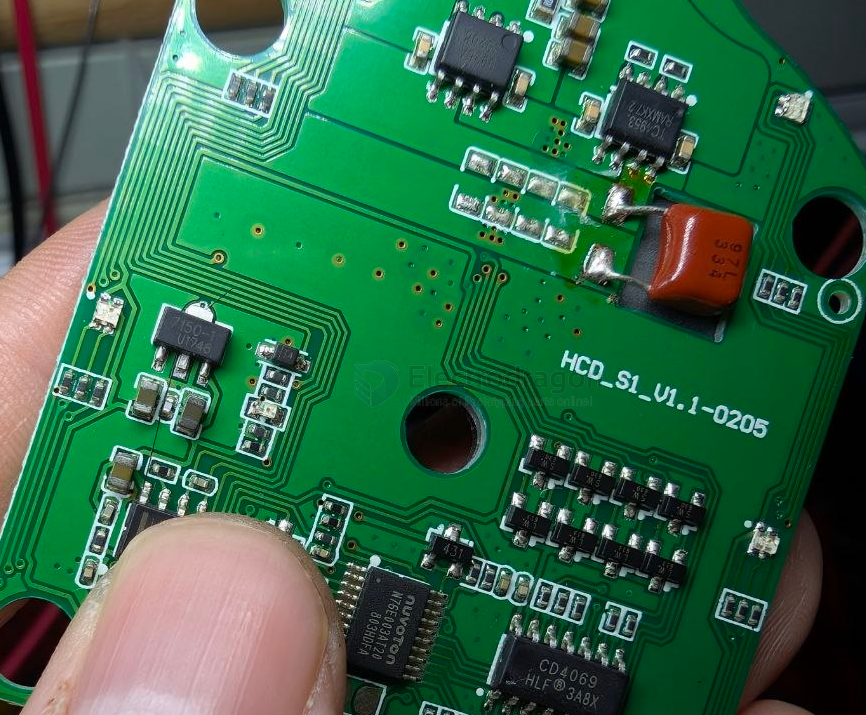
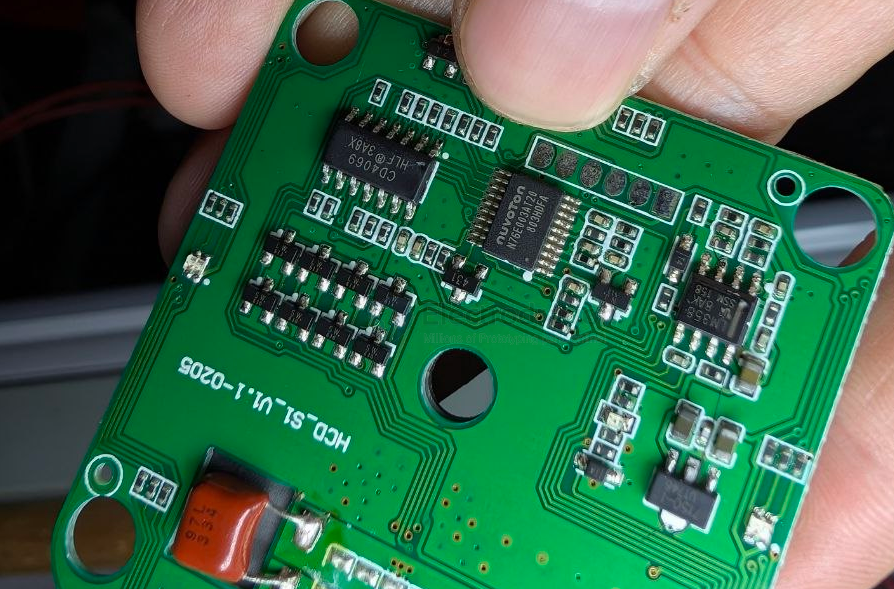
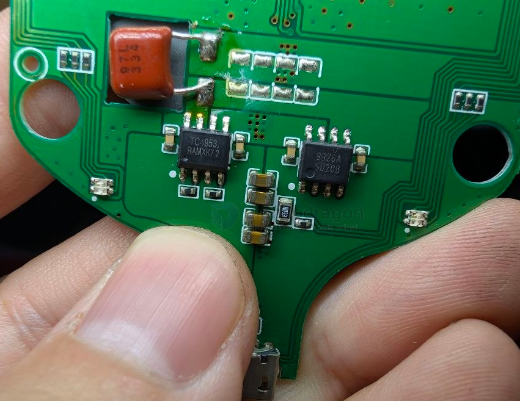
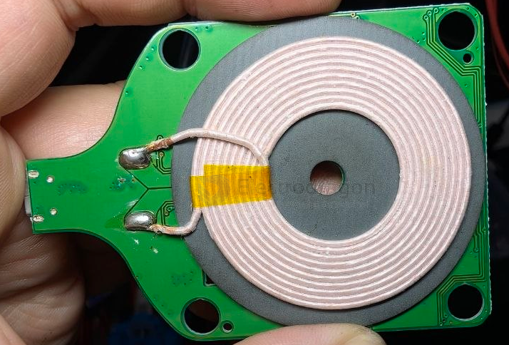
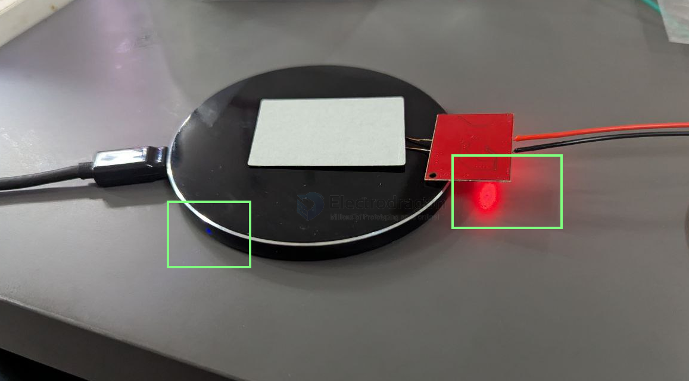
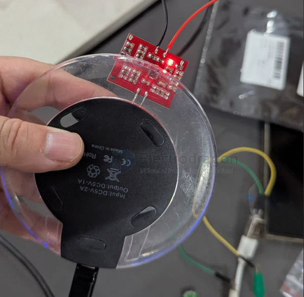
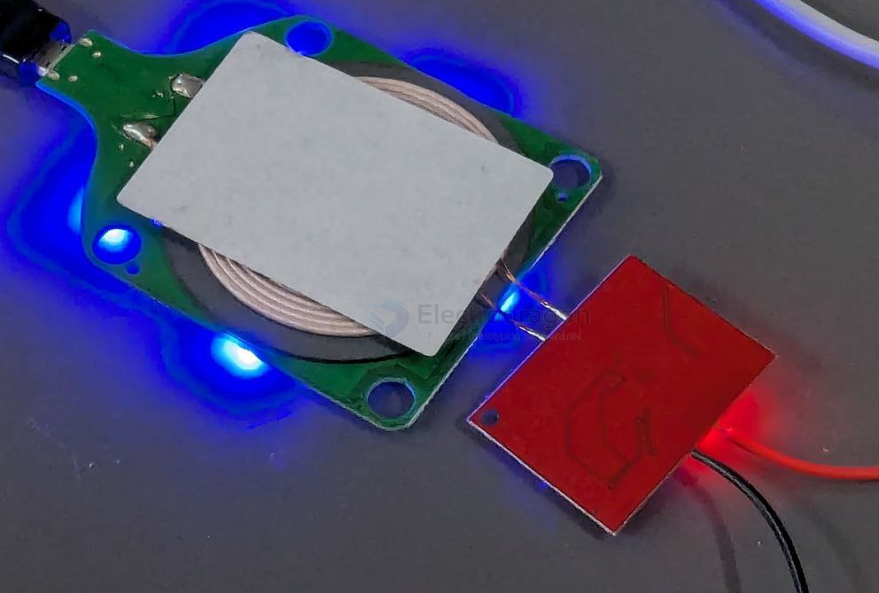

# power-wireless-TX-dat

- [[power-wireless-protocols-dat]] - [[power-wireless-dat]] - [[power-wireless-TX-dat]] - [[power-wireless-RX-dat]]

## build 

### build 5 

- [[bland-dat]] - [[chip-cn-dat]] - [[power-wireless-tx-dat]]

### build 4 

### build 3 

- [[LM324-dat]] - [[CD4069-dat]]

- [[VBA4338-dat]] - [[VBA3316-dat]] - [[VBsemi-dat]] - [[mosfet-dat]]

### build 2 

- [[BQ500212-dat]] - [[ti-power-wireless-dat]]

- [[power-wireless-TX-dat]] - [[TPS40200-dat]] - [[TPS28225-dat]] - [[TI-mosfet-driver-dat]] - [[mosfet-dat]] - [[mosfet-driver-dat]]

### build 1 

- [[UWM-dat]] - [[HT71xx-dat]] - [[chip-cn-dat]]

- [[TC4953-dat]] - [[fuman-dat]] - [[mosfet-dat]]

- [[CD40xx-dat]]

- [[N76E003-dat]] - [[nuvoton-dat]] - [[power-wireless-TX-dat]]

- [[LM358-dat]] - [[power-wireless-TX-dat]]

LW SW == [[transistor-dat]]

9926 == [[mosfet-dat]]

## transmitter demo 

## ref 

