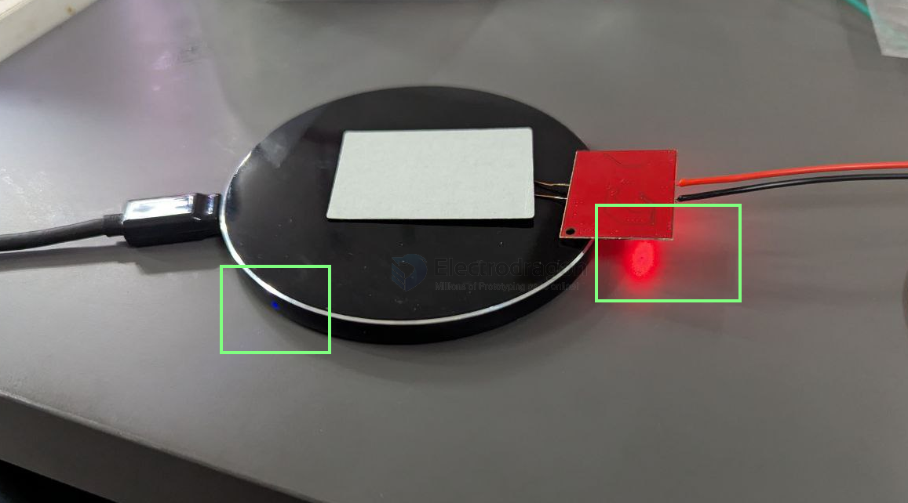
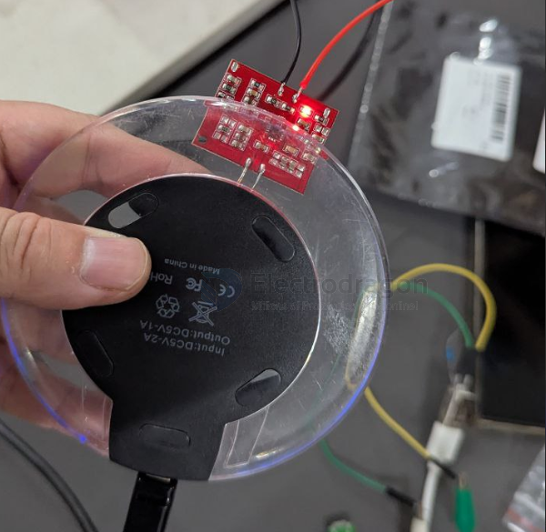
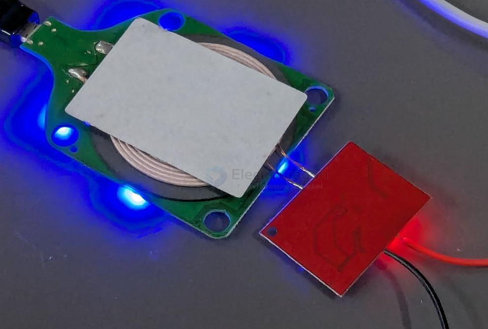
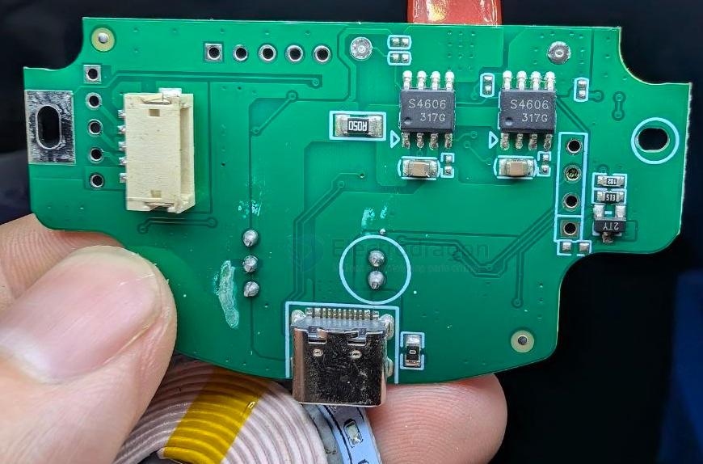
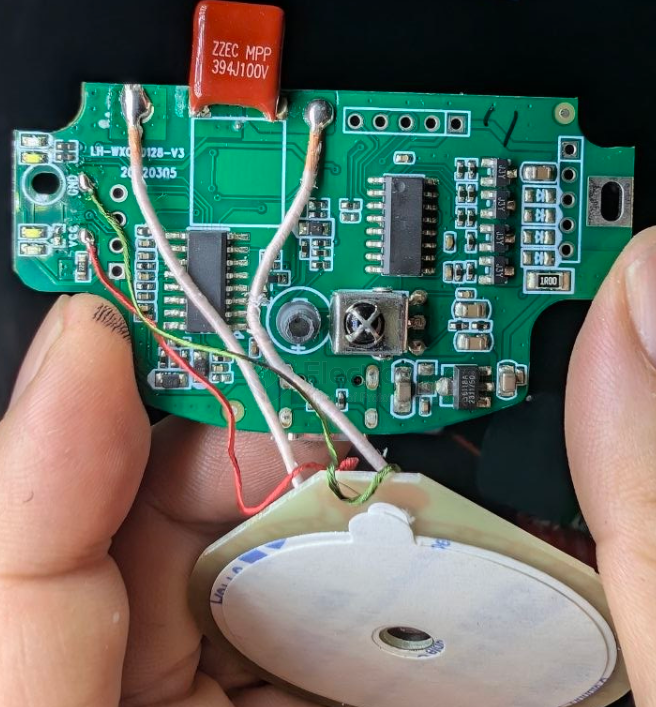

# power-wireless-dat

- [[OPM1167-dat]] - [[OPM1168-dat]]

- [[BQ51013-dat]] - [[BQ51050-dat]] - [[TI-power-dat]]

- [[fuman-dat]] - [[XPM7305-dat]] - [[power-wireless-dat]]

## standards 

- WPC-5W 

- [[QI-dat]] - [[QI-wireless-charge-dat]]

- [[WPC-1.2-dat]] 

- [[fast-charge-protocols-dat]]

## transmitter 

## build 

### build 1 

- [[mosfet-dat]] == A4606 

- [[microne-dat]] - [[ME6118-dat]]

## ref 

- [[USB-dat]]

- [[wireless-charge]]