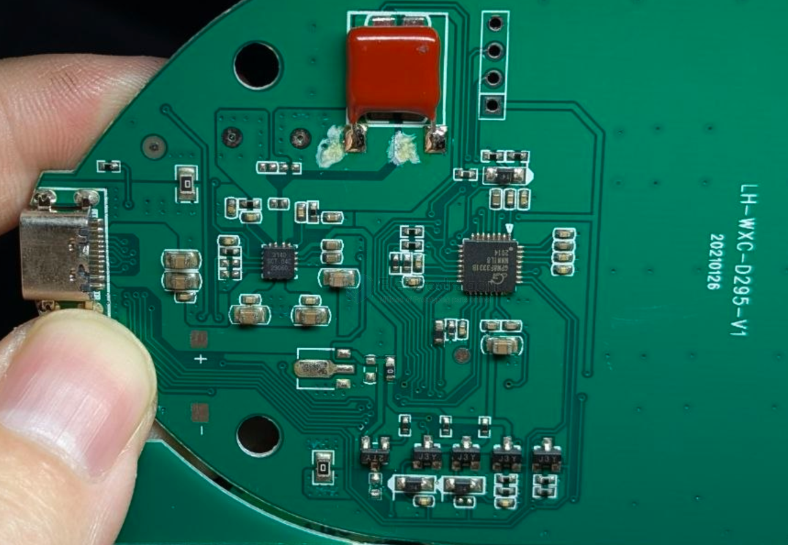
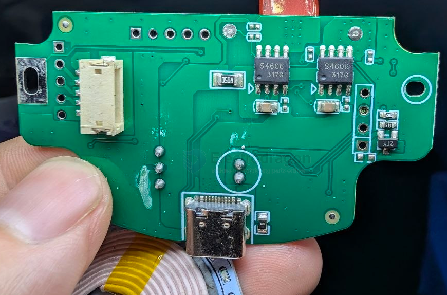
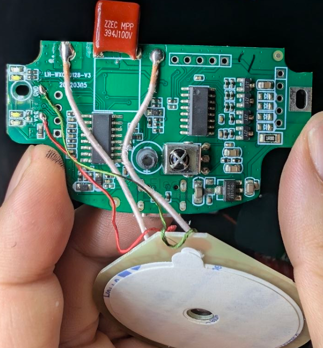

# power-wireless-dat

- [[power-wireless-protocols-dat]] - [[power-wireless-dat]] - [[power-wireless-TX-dat]] - [[power-wireless-RX-dat]]

- [[power-wireless-dat]] - [[TI-power-wireless-dat]]

## board and chip 

- [[OPM1167-dat]] - [[OPM1168-dat]]

- [[BQ51013-dat]] - [[BQ51050-dat]] - [[TI-power-dat]]

- [[fuman-dat]] - [[XPM7305-dat]] - [[power-wireless-dat]]

- [[IP6806-dat]] - [[IP6808-dat]] - [[injoinic-dat]] - [[power-wireless-dat]]

- [[IP6826-dat]] - [[IP5328-dat]] - [[power-wireless-dat]] - [[power-bank-dat]]

- [[power-wireless-protocols-dat]] - [[power-wireless-dat]] - [[power-wireless-TX-dat]] - [[power-wireless-RX-dat]]

## chip 

- [[WPINNO-dat]] - [[WP8006-dat]] - [[WP9005-dat]] - [[power-wireless-dat]]

## build 

### build 2 

3140 SCT 04C

- [[GPM8FD3331B-dat]] - [[generalplus-dat]] - [[power-wireless-dat]]

### build 1 

- [[mosfet-dat]] == A4606 

- [[microne-dat]] - [[ME6118-dat]]

## ref 

- [[USB-dat]]

- [[wireless-charge]]