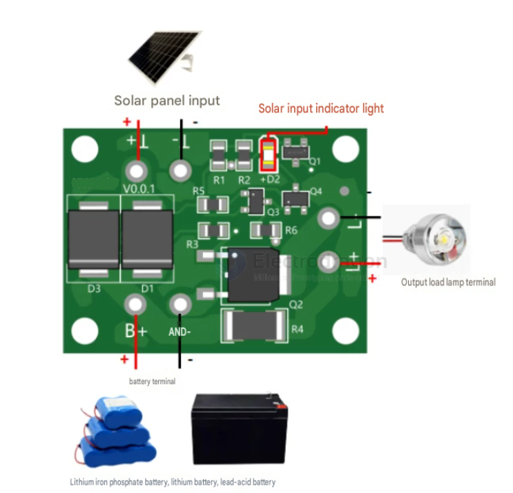
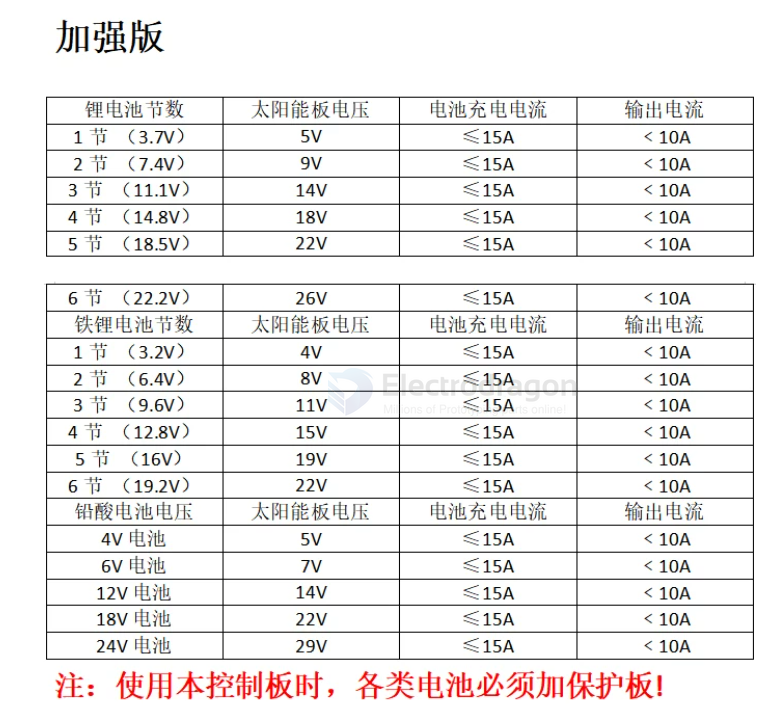
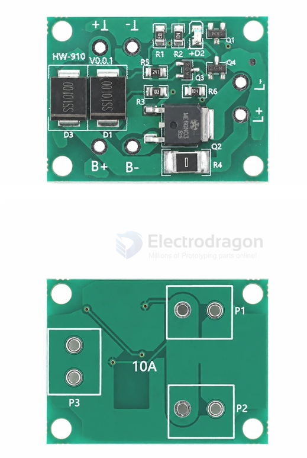

# solar-driver-dat

VIN == 3-24V控制板加强版

功能说明

自动：白天太阳能给电池充电，晚上电池给负载供电。输出电池电压，可通过外接限流电阻匹配所使用的灯。支持锂电池，磷酸铁锂电池，铅酸电池。

适用场合：太阳能草坪灯、太阳能庭院柱头灯、太阳能灯串、太阳能壁灯及其他使用太阳能的用电做充电和光敏控制。

铁锂、锂电、铅酸：太阳能控制板自适应所有容量，自带保护电路的电池。

## ref 

