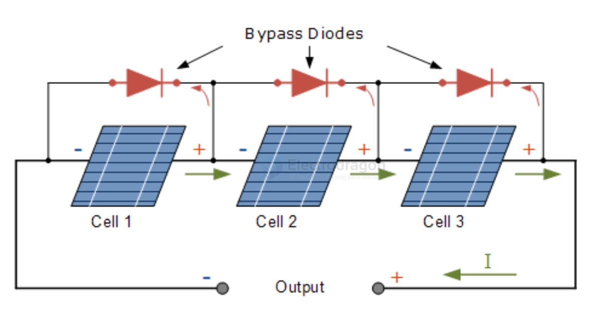

# solar-panel-wiring-dat.md

## basic diode bypass protection 

you will need following accessories to connect the solar panel to your controller or battery:

- [[diode-dat]] - [[1N4007-dat]] 

- [[cable-dat]]

## solar panel parallel wiring 

**Solar panels can also be connected in parallel.** 

If the primary goal of a series connection is to **"boost voltage,"** the main purpose of a parallel connection is to **"increase current" (which in turn increases total power).**

Thinking of each solar panel as an individual battery, connecting them in parallel changes their electrical characteristics as follows:

---

### 1. Electrical Rules of Parallel Connection

*   **Current (A) Adds Up:** The total current is the sum of the currents of all individual panels.
*   **Voltage (V) Stays the Same:** The total voltage remains equal to the voltage of a single panel (assuming all panels have identical specifications).

> **Formulas:**
> V_total = V1 = V2 = ... = Vn
> I_total = I1 + I2 + ... + In

For example, if you have **two 18V 5A solar panels**:
*   **In Parallel:** The voltage remains **18V**, but the total current becomes **10A**. The total power is still 18V * 10A = 180W.
*   **Wiring Method:** Connect all the **positive (+)** terminals together, and connect all the **negative (-)** terminals together. Finally, run one main positive wire and one main negative wire to your controller. This is typically done using Y-branch MC4 connectors.

---

### 2. Key Advantages of Parallel Connection

*   **Excellent Shade Tolerance:** This is the biggest advantage of a parallel setup! In a series connection, if one panel is shaded, it bottlenecks the entire string. In a parallel setup, however, **each panel operates independently**. If one panel gets covered by tree branches or debris, its output will drop, but the other panels will continue producing full power without being affected.
*   **Safer, Low-Voltage System:** Parallel connections keep the system voltage low. For DIYers, RVs, or camping setups (which often use 12V or 24V battery banks), maintaining a low voltage (around 18V to 22V) is highly safe to handle and minimizes the risk of dangerous high-voltage DC arcing.

---

### 3. ⚠️ Critical Pitfalls to Avoid

While parallel connections are highly resilient to shade, they place heavier demands on your wiring and equipment:

*   **Thicker Wires Required (Higher Line Loss):** Because a parallel setup multiplies the current, line loss increases significantly. Higher current generates more heat in the wires. To prevent losing valuable energy as heat, parallel systems require **much thicker cables**, and the distance between the solar panels and the controller should be kept as short as possible.
*   **Voltages Must Match:** The solar panels connected in parallel **must have identical or nearly identical voltages**. If you parallel an 18V panel with a 36V panel, the higher-voltage panel will back-feed current into the lower-voltage panel, severely tanking efficiency and potentially damaging the lower-voltage panel.
*   **Controller Current Limits:** When choosing a charge controller (PWM or MPPT), you must check its **"Max Rated Charge Current"** rather than just its voltage limits. If your parallel panels output a total of 30A, you need a controller rated for at least 30A (ideally 40A to leave a safety margin); otherwise, it will trigger overload protection or burn out.
*   **Fuses are Recommended for 3+ Panels:** If you are connecting 3 or more panels in parallel, a short circuit in one panel can cause the current from all the other panels to rush into the damaged one. To prevent fire hazards, it is highly recommended to install an inline fuse or a blocking diode on the positive line of each individual panel.

## solar panel series wiring 

You can think of each solar panel as an individual AA battery. When you connect them in series, their electrical characteristics change as follows:

---

### 1. Electrical Rules of Series Connection

*   **Voltage (V) Adds Up:** The total voltage is the sum of the voltages of each individual panel.
*   **Current (A) Stays the Same:** The total current remains equal to the current of a single panel (assuming all panels are identical).

> **Formulas:**
> V_total = V1 + V2 + ... + Vn
> I_total = I1 = I2 = ... = In

For example, if you have **two 18V 5A solar panels**:
*   **In Series:** The voltage becomes **36V**, while the current remains **5A**. The total power is 36V * 5A = 180W.
*   **Wiring Method:** Connect the **positive (+)** terminal of the first panel to the **negative (-)** terminal of the second panel. The remaining negative terminal of the first panel and the positive terminal of the second panel will then connect to your controller.

---

### 2. Key Advantages of Boosting Voltage via Series Connection

*   **Reduced Line Loss (Higher Efficiency):** Power loss in wires is proportional to the square of the current. By increasing the voltage and keeping the current low, you significantly reduce energy loss as heat, allowing you to use thinner wires over longer distances.
*   **Easier to Trigger Controller Charging:** Advanced controllers, like MPPT (Maximum Power Point Tracking) controllers, typically require the solar array voltage to be a few volts higher than the battery voltage (usually 2V to 5V higher) to begin charging. Boosting the voltage via series connection helps the system hit that startup threshold much earlier in the morning or during overcast days.

---

### 3. ⚠️ Critical Pitfalls to Avoid

While connecting panels in series is straightforward, there are two crucial pitfalls that can drastically drop efficiency or even damage your gear:

*   **The "Weakest Link" Effect (Barrel Philosophy):** The total current of a series string is bottlenecked by the **lowest current panel** in that string. If you connect a 5A panel in series with a 2A panel, the entire system's current is forced down to 2A. Furthermore, **if even one panel is partially shaded by a tree branch or debris, the output of the entire string drops drastically.** Because of this, panels in a series string should always have identical specs, face the same direction, and share the same angle.
*   **Never Exceed the Controller's Maximum Input Voltage (Voc):** When a solar panel is uncovered but disconnected from a load, its voltage hits a peak called Open-Circuit Voltage (Voc). When calculating your total series voltage, **you must add up the Voc values of the panels**. Ensure this total sum stays safely below the "Max DC Input Voltage" listed on your solar charge controller or inverter, otherwise, a bright sunny day could permanently fry your equipment.

## ref 

