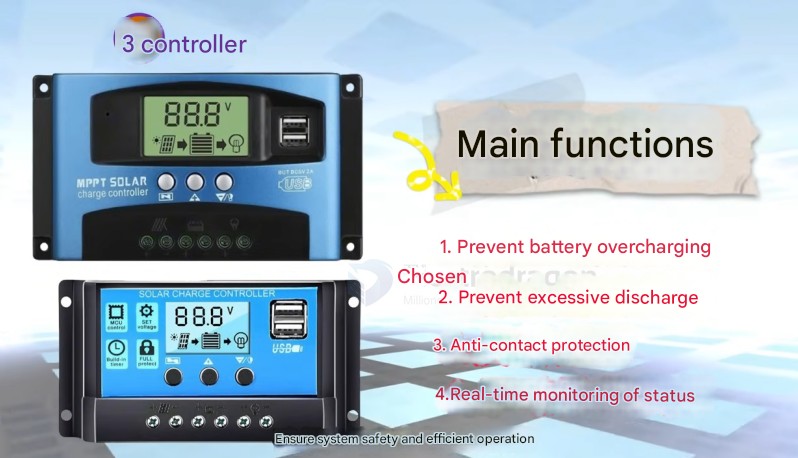

# solar-charge-controller-dat

#### 3. Solar Charge Controllers

The controller manages the charging process from the solar panel to the battery.

## Functions:

*   Prevents battery overcharging and over-discharging.
*   Provides reverse connection protection.
*   Ensures safe and efficient system operation.
*   Some offer USB charging ports.

## Charge Types:

*   **PWM (Pulse Width Modulation) Controller:** Uses pulse width modulation to adjust charging voltage and current. Advantages include lower price and mature technology. Disadvantages include lower efficiency when lighting conditions vary greatly or when the battery is near full charge.

*   **MPPT (Maximum Power Point Tracking) Controller:** Adjusts the solar panel's working voltage in real-time to maintain maximum power output, improving charging efficiency, especially with varying light conditions and over a wider voltage range. They are generally more expensive, but prices have become more accessible.

- [[MPPT-dat]]

## Selection Criteria:

*   **Voltage:** Match the system voltage (12V, 24V, 48V).
*   **Maximum Output Current:** Ensure it can handle the system's maximum input power (e.g., 10A, 20A, 50A).
*   **Charging Mode:** Choose between PWM or MPPT.
*   **Display:** A display for monitoring battery voltage, charging current, status, and total charge is beneficial.
*   **Scalability:** Consider future system expansion.

## app 

- [[power-storage-dat]]

## ref 

- [[solar-power-dat]]